### JOBSHEET XII
### Graph

### Mohammad Izamul Fikri Fahmi
### TI-1f
### 17
### 2141720171

#### 1. Tujuan Praktikum
Setelah melakukan praktikum ini, mahasiswa mampu:
1. memahami model graph;
2. membuat dan mendeklarasikan struktur algoritma graph;
3. menerapkan algoritma dasar graph dalam beberapa studi kasus.

#### 2. Praktikum
#### 2.1 Implementasi Graph menggunakan Linked List
#### 2.1.1 Tahapan Percobaan
**Waktu percobaan (30 menit)**
Pada percobaan ini akan diimplementasikan Graph menggunakan Linked Lists untuk
merepresentasikan graph adjacency. Silakan lakukan langkah-langkah praktikum sebagai berikut.
1. Buatlah class Node, dan class Linked Lists sesuai dengan praktikum Double Linked Lists.

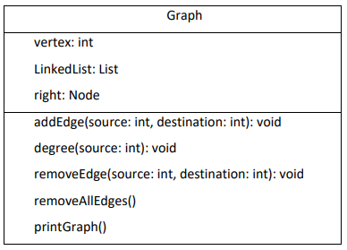

2. Tambahkan class Graph yang akan menyimpan method-method dalam graph dan juga
method main().

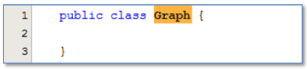

3. Di dalam class Graph, tambahkan atribut vertex bertipe integer dan list[] bertipe LinkedList.

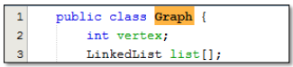

4. Tambahkan konstruktor default untuk menginisialisasi variabel vertex dan menambahkan
perulangan untuk jumlah vertex sesuai dengan jumlah length array yang telah ditentukan.

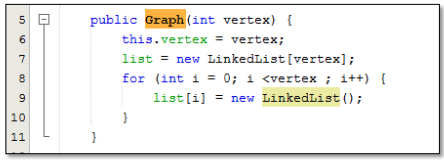

5. Tambahkan method addEdge(). Jika yang akan dibuat adalah graph berarah, maka yang
dijalankan hanya baris pertama saja. Jika graph tidak berarah yang dijalankan semua baris
pada method addEdge().

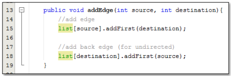

6. Tambahkan method degree() untuk menampilkan jumlah derajat lintasan pada suatu vertex.
Di dalam metode ini juga dibedakan manakah statement yang digunakan untuk graph berarah
atau graph tidak berarah. Eksekusi hanya sesuai kebutuhan saja.

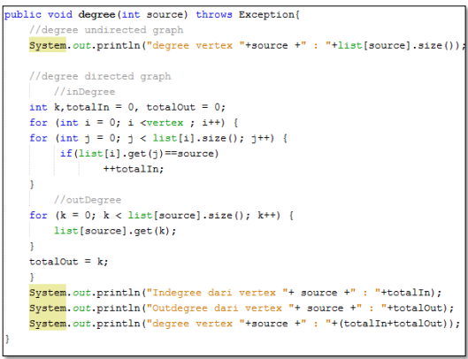

7. Tambahkan method removeEdge(). Method ini akan menghapus lintasan ada suatu graph.
Oleh karena itu, dibutuhkan 2 parameter untuk menghapus lintasan yaitu source dan
destination.

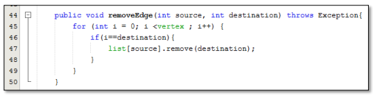

8. Tambahkan method removeAllEdges() untuk menghapus semua vertex yang ada di dalam
graph.

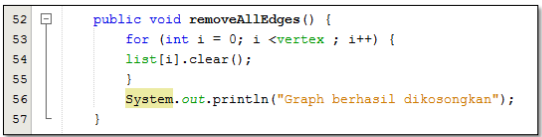

9. Tambahkan method printGraph() untuk mencatak graph ter-update.

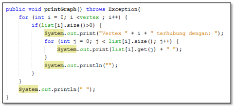

10. Compile dan jalankan method main() dalam class Graph untuk menambahkan beberapa edge
pada graph, kemudian tampilkan. Setelah itu keluarkan hasilnya menggunakan pemanggilan
method main(). Keterangan: degree harus disesuaikan dengan jenis graph yang telah dibuat
(directed/undirected).

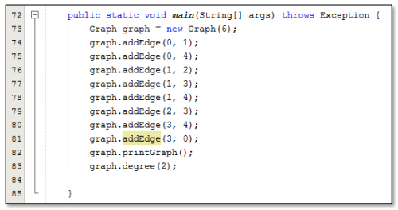

11. Amati hasil running tersebut.
12. Tambahkan pemanggilan method removeEdge() sesuai potongan code di bawah ini pada method main(). Kemudian tampilkan graph tersebut.

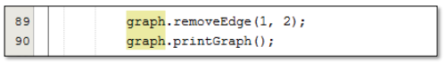

13. Amati hasil running tersebut.
14. Uji coba penghapusan lintasan yang lain! Amati hasilnya!.

##### Kode Program Node dan DoubleLinkedList sama dengan kode program minggu ke 12

##### Kode Program Graph.java
```java
public class Graph {
    int vertex;
    DoubleLinkedLists list[];

    public Graph(int vertex) {
        this.vertex = vertex;
        list = new DoubleLinkedLists[vertex];
        for (int i = 0; i < vertex; i++) {
            list[i] = new DoubleLinkedLists();
        }
    }

    public void addEdge(int source, int destination) {
        //add edge
        list[source].addFirst(destination);

        //add back edge (for undirected)
        list[destination].addFirst(source);
    }

    public void degree(int source) throws Exception {
        //degree undirected graph
        System.out.println("degree vertex " + source + " : " + list[source].size());

        //degree directed graph
            //inDegree
        int k, totalIn = 0, totalOut = 0;
        for (int i = 0; i < vertex; i++) {
            for (int j = 0; j < list[i].size(); j++) {
                if(list[i].get(j) == source)
                ++totalIn;
            }
            //outDegree
            for (k = 0; k < list[source].size(); k++) {
                list[source].get(k);
            }
            totalOut = k;
        }
        System.out.println("Indegree dari vertex " + source + " : " +totalIn);
        System.out.println("Outdegree dari vertex " + source + " : " +totalOut);
        System.out.println("Degree vertex " + source + " : " +(totalIn + totalOut));
    }
    
    public void removeEdge(int source, int destination) throws Exception {
        for (int i = 0; i < vertex; i++) {
            if(i==destination) {
                list[source].remove(destination);
            }
        }
    }

    public void removeAllEdges() {
        for (int i = 0; i < vertex; i++) {
            list[i].clear();
        }
        System.out.println("Graph berhasil dikosongkan");
    }

    public void printGraph() throws Exception {
        for (int i = 0; i < vertex; i++) {
            if(list[i].size() > 0 ) {
                System.out.print("Vertex " + i + " terhubung dengan : ");
                for(int j = 0; j < list[i].size(); j++) {
                    System.out.print(list[i].get(j) + " ");
                }
                System.out.println("");
            }
        }
        System.out.println(" "); 
    }
}
```

##### Kode Program GraphMain.java Langkah ke 11
```java
public class GraphMain {
    public static void main(String[] args) throws Exception {
        Graph graph = new Graph(6);
        graph.addEdge(0, 1);
        graph.addEdge(0, 4);
        graph.addEdge(1, 2);
        graph.addEdge(1, 3);
        graph.addEdge(1, 4);
        graph.addEdge(2, 3);
        graph.addEdge(3, 4);
        graph.addEdge(3, 0);
        graph.printGraph();
        graph.degree(2);
    }
}
```

##### Kode Tambahan pada main Langkah ke 12
```java
// tambahan langkah 12
        graph.removeEdge(1, 2);
        graph.printGraph();
```

##### Kode Tambahana pada main Langkah ke 14
```java
        // tambahan langkah 14
        graph.removeEdge(3, 2);
        graph.printGraph();
```

#### 2.1.2 Verifikasi Hasil Percobaan
Verifikasi hasil kompilasi kode program Anda dengan gambar berikut ini.

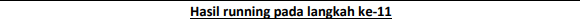

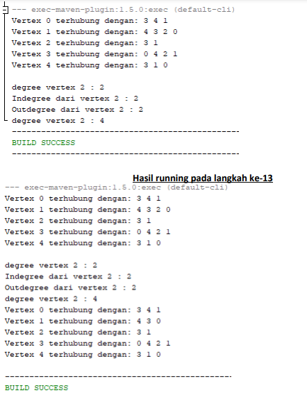

##### Hasil running langkah 11
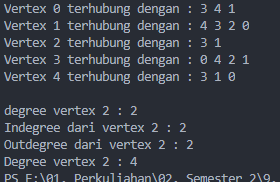

##### Hasil running langkah 12
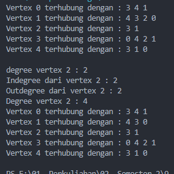

##### Hasil running langkah 14
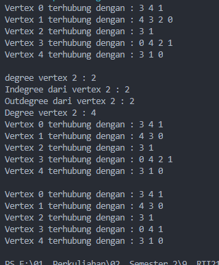


#### 2.1.3 Pertanyaan Percobaan
1. Sebutkan beberapa jenis (minimal 3) algoritma yang menggunakan dasar Graph, dan apakah
kegunaan algoritma-algoritma tersebut?

Jawab :

- Algoritma Djikstra untuk mencari lintasan terpendek pada graph terbobot.
- Algortima Kruskal untuk menentukan pohon perentangan terbobot minimum.
- ALgortima Greedy untuk mencari nilai maksimal sementara.
- Algoritma Floyd untuk menentukan adanya jalur pada graf.

2. Pada class Graph terdapat array bertipe LinkedList, yaitu LinkedList list[]. Apakah tujuan
pembuatan variabel tersebut ?

Jawab : 

Untuk pemanggilan fungsi pada Linkedlist, disini saya menggunakan class doublelinkedlist, jadi untuk keperluan pemanggilan fungsi pada doublelinkedlist dan untuk mengisi list yang berupada vertex pada linked list tersebut.

3. Apakah alasan pemanggilan method addFirst() untuk menambahkan data, bukan method add jenis lain pada linked list ketika digunakan pada method addEdge pada class Graph?

Jawab : 

Agar vertex dapat dikenalkan pada koneksinya, maka digunakanlah addFirst().

4. Bagaimana cara mendeteksi prev pointer pada saat akan melakukan penghapusan suatu edge pada graph ?

Jawab : 

Dengan melakukan perulangan yang mana i kurang dari vertex, dan dalam tiap perulangan dilakukan pengecekan apakah if sama dengan destination, jika iya maka akan dilakukan penghapusan pada suatu edge, pada i yang bernilai sama dengan destination, pada list[source] dan memanggil fungsi remove dengan nilai parameter destination, sebagai fungsi penghapusan edge.

5. Kenapa pada praktikum 2.1.1 langkah ke-12 untuk menghapus path yang bukan merupakan lintasan pertama kali menghasilkan output yang salah ? Bagaimana solusinya ?

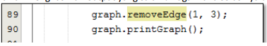

Jawab : 

pada saat melakukan penghapusan, baik di lintasan pertama atau yang lain, menghasilkan output yang benar, jadi tidak diperlukan solusi lagi. dikarenakan data vertex mengalamai perubahan lintasan sehingga tidak terjadi error.

#### 2.2 Implementasi Graph menggunakan Matriks
Kegiatan praktikum 2 merupakan implementasi Graph dengan Matriks. Silakan lakukan langkahlangkah percobaan praktikum berikut ini, kemudian verifikasi hasilnya. Setelah itu jawablah
pertanyaan terkait percobaan yang telah Anda lakukan.

#### 2.2.1 Tahapan Percobaan
**Waktu percobaan: 30 menit**
Pada praktikum 2.2 ini akan diimplementasikan Graph menggunakan matriks untuk
merepresentasikan graph adjacency. Silakan lakukan langkah-langkah praktikum sebagai berikut.
1. Uji coba graph bagian 2.2 menggunakan array 2 dimensi sebagai representasi graph. Buatlah class graphArray yang didalamnya terdapat variabel vertices dan array twoD_array!.

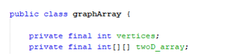

2. Buatlah konstruktor graphArray sebagai berikut!

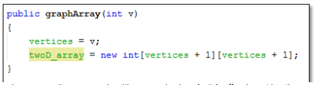

3. Untuk membuat suatu lintasan maka dibuat method makeEdge() sebagai berikut. Untuk menampilkan suatu lintasan diperlukan pembuatan method getEdge() berikut.

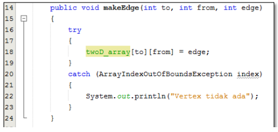

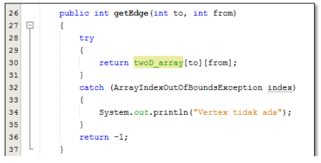

4. Kemudian buatlah method main() seperti berikut ini.

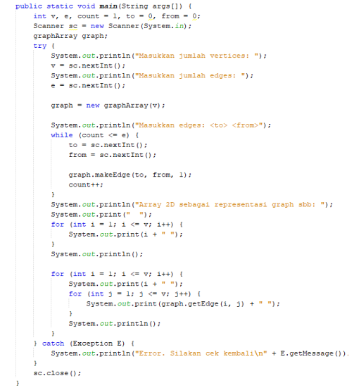

5. Jalankan class graphArray dan amati hasilnya!.

#### Kode Program GraphArray.java
```java
public class GraphArray {
    private final int vertices;
    private final int[][] twoD_array;

    public GraphArray(int v) {
        vertices = v;
        twoD_array = new int[vertices + 1][vertices +1];
    }

    public void makeEdge(int to, int from, int edge) {
        try {
            twoD_array[to][from] = edge;
        }
        catch (ArrayIndexOutOfBoundsException index) {
            System.out.println("Vertex tidak ada");
        }
    }

    public int getEdge(int to, int from) {
        try{
            return twoD_array[to][from];
        }
        catch (ArrayIndexOutOfBoundsException index)
        {
            System.out.println("Vertex tidak ada");
        }
        return -1;
    }
}

```

#### Kode Program GraphArrayMain.java
```java
import java.util.Scanner;

public class GraphArrayMain {
    public static void main(String[] args) {
        int v, e, count = 1, to = 0, from = 0;
        Scanner sc = new Scanner(System.in);
        GraphArray graph;
        try {
            System.out.println("Masukkan jumlah vertices : ");
            v = sc.nextInt();
            System.out.println("Masukkan jumlah edges : ");
            e = sc.nextInt();

            graph = new GraphArray(v);
            System.out.println("Masukkan edges : <to> <from>");
            while (count <= e) {
                to = sc.nextInt();
                from = sc.nextInt();

                graph.makeEdge(to, from, 1);
                count++;
            }
            System.out.println("Array 2D sebagai representasi graph sbb : ");
            System.out.print("  " );
            for (int i = 1; i <= v; i++) {
                System.out.print(i + " ");
            }
            System.out.println();

            for(int i  = 1; i <= v; i++) {
                System.out.print(i + " ");
                for (int j = 1; j <= v; j++) {
                    System.out.print(graph.getEdge(i, j) + " ");
                }
                System.out.println();
            }
        } catch (Exception E) {
            System.out.println("Error. Silahkan cek kembali\n" + E.getMessage());
        }
        sc.close();
    }
}
```

#### 2.2.2 Verifikasi Hasil Percobaan
Verifikasi hasil kompilasi kode program Anda dengan gambar berikut ini.

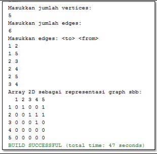

#### Hasil Running

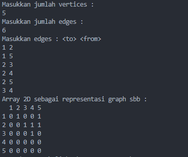

#### 2.2.3 Pertanyaan Percobaan
1. Apakah perbedaan degree/derajat pada directed dan undirected graph?

Jawab :

degreeIn dan degreeOut pada directed memiliki perbedaan, sedangkan pada undirected tidak,
Maksudnya, jadi pada directed misal A ke B memiliki bobot 7, belum tentu B ke A, memiliki bobot 7 juga,
namun jika pada undirected, bobot dari degreeIn dan out nya sama.

2. Pada implementasi graph menggunakan adjacency matriks. Kenapa jumlah vertices harus ditambahkan dengan 1 pada indeks array berikut?

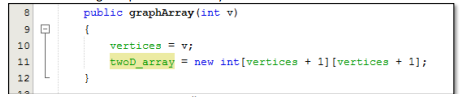

Jawab :

Dikarenakan, indeks dari array dimulai dari 0, jadi perlu ditambahkan 1, biar mulainya dari 1.

3. Apakah kegunaan method getEdge() ?

Jawab :

Untuk menampilkan suatu lintasan yang diperlukan.

4. Termasuk jenis graph apakah uji coba pada praktikum 2.2?

Jawab :

Graph Directed.

5. Mengapa pada method main harus menggunakan try-catch Exception ?

Jawab :

Untuk menangani proses error yang terjadi.


#### 3. Tugas Praktikum
1. Ubahlah lintasan pada praktikum 2.1 menjadi inputan!

Jawab :

#### Kode Program Main
```java
import java.util.Scanner;

public class GraphMain {
    public static void main(String[] args) throws Exception {
        Scanner sc = new Scanner(System.in);
        System.out.print("Masukkan Vertex          : ");
        int vertex = sc.nextInt();
        Graph graph = new Graph(vertex);
        System.out.print("Masukkan Edge            : ");
        int edge = sc.nextInt();
        System.out.println("+-----------------------------+");


        // Tugas nomor 1
        int source, destination;
        for (int i = 0; i < edge; i++) {
            System.out.print("Masukkan Source      : ");
            source = sc.nextInt();
            System.out.print("Masukkan Destination : ");
            destination = sc.nextInt();
            graph.addEdge(source, destination);
        }
        // graph.addEdge(0, 1);
        // graph.addEdge(0, 4);
        // graph.addEdge(1, 2);
        // graph.addEdge(1, 3);
        // graph.addEdge(1, 4);
        // graph.addEdge(2, 3);
        // graph.addEdge(3, 4);
        // graph.addEdge(3, 0);
        graph.printGraph();
        graph.degree(2);

        // tambahan langkah 12
        graph.removeEdge(1, 2);
        graph.printGraph();

        // tambahan langkah 14
        graph.removeEdge(3, 2);
        graph.printGraph();
        sc.close();
    }
}
```

#### Hasil Running
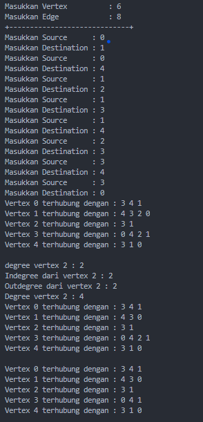

2. Tambahkan method graphType dengan tipe boolean yang akan membedakan graph termasuk directed atau undirected graph. Kemudian update seluruh method yang berelasi dengan method graphType tersebut (hanya menjalankan statement sesuai dengan jenis graph) pada praktikum 2.1

Jawab :

#### Kode Program graphType()
```java
// Tugas nomor 2
    boolean graphType(int source, int destination){
        list[source].addFirst(destination);
        return true; // bernilai directed
    }
```

#### Kode Program Main
```java
import java.util.Scanner;

public class GraphMain {
    public static void main(String[] args) throws Exception {
        Scanner sc = new Scanner(System.in);
        System.out.print("Masukkan Vertex          : ");
        int vertex = sc.nextInt();
        Graph graph = new Graph(vertex);
        System.out.print("Masukkan Edge            : ");
        int edge = sc.nextInt();

        int source, destination;
        // untuk tugas nomor 2
        int pil;
        do {
            System.out.println("1 Untuk Directed | 2 Untuk Undirected");
            System.out.print(": ");
            pil = sc.nextInt();

            if(pil == 1) { // untuk directed
                for (int i = 0; i < edge; i++) {
                    System.out.print("Masukkan Source      : ");
                    source = sc.nextInt();
                    System.out.print("Masukkan Destination : ");
                    destination = sc.nextInt();
                    graph.graphType(source, destination);
                }
                graph.printGraph();

            } else if (pil == 2) { // untuk undirected
                for (int i = 0; i < edge; i++) {
                    System.out.print("Masukkan Source      : ");
                    source = sc.nextInt();
                    System.out.print("Masukkan Destination : ");
                    destination = sc.nextInt();
                    graph.addEdge(source, destination);
                }
                graph.printGraph();
            }
        } while (pil!=1 && pil!=2);
        System.out.println("+-----------------------------+");
    }
}
```

#### Hasil Running Directed
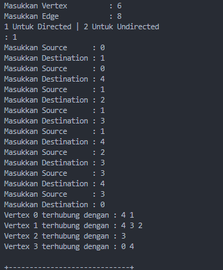

#### Hasil Running unDirected
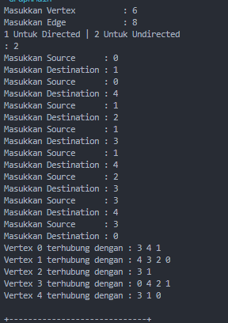

3. Modifikasi method removeEdge() pada praktikum 2.1 agar tidak menghasilkan output yang salah untuk path selain path pertama kali!

Jawab :

pada saat melakukan penghapusan, baik di lintasan pertama atau yang lain, menghasilkan output yang benar, jadi tidak diperlukan solusi lagi. dikarenakan data vertex mengalamai perubahan lintasan sehingga tidak terjadi error.

4. Ubahlah tipe data vertex pada seluruh graph pada praktikum 2.1 dan 2.2 dari Integer menjadi tipe generic agar dapat menerima semua tipe data dasar Java! Misalnya setiap vertex yang awalnya berupa angka 0,1,2,3, dst. selanjutnya ubah menjadi suatu nama daerah seperti Gresik, Bandung, Yogya, Malang, dst.

Jawab : 

#### Untuk Praktikum 2.1

##### Kode Program Graph.java
```java
public class Graph <T> {
    T[] vertex;
    DoubleLinkedLists list[];

    public Graph(T[] vertex) {
        this.vertex = vertex;
        list = new DoubleLinkedLists[vertex.length];
        for (int i = 0; i < vertex.length; i++) {
            list[i] = new DoubleLinkedLists();
        }
    }

    public void addEdge(int source, int destination) {
        //add edge
        list[source].addFirst(destination);

        //add back edge (for undirected)
        list[destination].addFirst(source);
    }

    public void degree(int source) throws Exception {
        //degree undirected graph
        System.out.println("degree vertex " + vertex[source] + " : " + list[source].size());

        //degree directed graph
            //inDegree
        int k, totalIn = 0, totalOut = 0;
        for (int i = 0; i < vertex.length; i++) {
            for (int j = 0; j < list[i].size(); j++) {
                if(list[i].get(j) == source)
                ++totalIn;
            }
            //outDegree
            for (k = 0; k < list[source].size(); k++) {
                list[source].get(k);
            }
            totalOut = k;
        }
        System.out.println("Indegree dari vertex " + vertex[source] + " : " +totalIn);
        System.out.println("Outdegree dari vertex " + vertex[source] + " : " +totalOut);
        System.out.println("Degree vertex " + vertex[source] + " : " +(totalIn + totalOut));
    }
    
    public void removeEdge(int source, int destination) throws Exception {
        for (int i = 0; i < vertex.length; i++) {
            if(i==destination) {
                list[source].remove(destination);
            }
        }
    }

    public void removeAllEdges() {
        for (int i = 0; i < vertex.length; i++) {
            list[i].clear();
        }
        System.out.println("Graph berhasil dikosongkan");
    }

    public void printGraph() throws Exception {
        for (int i = 0; i < vertex.length; i++) {
            if(list[i].size() > 0 ) {
                System.out.print("Vertex " + vertex[i] + " terhubung dengan : ");
                for(int j = 0; j < list[i].size(); j++) {
                    System.out.print(vertex[list[i].get(j)] + " ");
                }
                System.out.println("");
            }
        }
        System.out.println(" "); 
    }


    // Tugas nomor 2
    boolean graphType(int source, int destination){
        list[source].addFirst(destination);
        return true; // bernilai directed
    }
}
```

##### Kode Program GraphMain.java
```java
import java.util.Scanner;

public class GraphMain {
    public static void main(String[] args) throws Exception {
        Scanner sc = new Scanner(System.in);
        System.out.print("Masukkan Vertex          : ");
        String[] vertex = new String[sc.nextInt()];
        sc.nextLine();

        for (int i = 0; i < vertex.length; i++) {
            System.out.print("Masukkan data vertex ke-" + i + " : ");
            vertex[i] = sc.nextLine();
        }

        Graph<String> graph = new Graph<String>(vertex);


        System.out.print("Masukkan Edge            : ");
        int edge = sc.nextInt();

        // int source, destination;
        // untuk tugas nomor 2
        int pil;
        do {
            System.out.println("1 Untuk Directed | 2 Untuk Undirected");
            System.out.print(": ");
            pil = sc.nextInt();

            System.out.println("Masukkan Edge: <from> <to>");
            if(pil == 1) { // untuk directed
                for (int i = 0; i < edge; i++) {
                    // System.out.print("Masukkan Source      : ");
                    // source = sc.nextInt();
                    // System.out.print("Masukkan Destination : ");
                    // destination = sc.nextInt();
                    graph.graphType(sc.nextInt(), sc.nextInt());
                }
                graph.printGraph();

            } else if (pil == 2) { // untuk undirected
                for (int i = 0; i < edge; i++) {
                    // System.out.print("Masukkan Source      : ");
                    // source = sc.nextInt();
                    // System.out.print("Masukkan Destination : ");
                    // destination = sc.nextInt();
                    graph.addEdge(sc.nextInt(), sc.nextInt());
                }
                graph.printGraph();
            }
        } while (pil!=1 && pil!=2);
        System.out.println("+-----------------------------+");


        // Tugas nomor 1
        // int source, destination;
        // for (int i = 0; i < edge; i++) {
        //     System.out.print("Masukkan Source      : ");
        //     source = sc.nextInt();
        //     System.out.print("Masukkan Destination : ");
        //     destination = sc.nextInt();
        //     graph.addEdge(source, destination);
        // }
        // graph.addEdge(0, 1);
        // graph.addEdge(0, 4);
        // graph.addEdge(1, 2);
        // graph.addEdge(1, 3);
        // graph.addEdge(1, 4);
        // graph.addEdge(2, 3);
        // graph.addEdge(3, 4);
        // graph.addEdge(3, 0);
        // graph.printGraph();
        // graph.degree(2);

        // // tambahan langkah 12
        // graph.removeEdge(1, 2);
        // graph.printGraph();

        // // tambahan langkah 14
        // graph.removeEdge(3, 2);
        // graph.printGraph();
        sc.close();
    }
}
```

##### Hasil Running
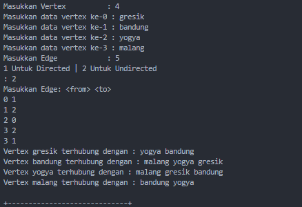

#### Untuk Praktikum 2.2

##### Kode Program GraphArray.java
```java
public class GraphArray <T> {
    private final T[] vertices;
    private final int[][] twoD_array;

    public GraphArray(T[] v) {
        vertices = v;
        twoD_array = new int[vertices.length + 1][vertices.length +1];
    }

    public void makeEdge(int to, int from, int edge) {
        try {
            twoD_array[to][from] = edge;
        }
        catch (ArrayIndexOutOfBoundsException index) {
            System.out.println("Vertex tidak ada");
        }
    }

    public int getEdge(int to, int from) {
        try{
            return twoD_array[to][from];
        }
        catch (ArrayIndexOutOfBoundsException index)
        {
            System.out.println("Vertex tidak ada");
        }
        return -1;
    }
}
```

##### Kode Program GraphArrayMain.java
```java
import java.util.Scanner;

public class GraphArrayMain {
    public static void main(String[] args) {
        int v, e, count = 1, to = 0, from = 0;
        Scanner sc = new Scanner(System.in);
        GraphArray<String> graph;
        try {
            System.out.print("Masukkan Jumlah Vertices: ");
            v = sc.nextInt();
            System.out.print("Masukkan Jumlah Edges: ");
            e = sc.nextInt();
            
            String[] vertex = new String[v + 1]; // Tipe data disesuaikan dengan data yang akan disimpan dalam Graph
            sc.nextLine();
            for (int i = 1; i <= v; i++) {
                System.out.print("Masukkan data vertex ke-" + i + " : ");
                vertex[i] = sc.nextLine();
            }
            graph = new GraphArray<String>(vertex);
            
            System.out.println("Masukkan Edge: <to> <from>");
            while (count <= e) {
                to = sc.nextInt();
                from = sc.nextInt();
                graph.makeEdge(to, from, 1);
                count++;
            }
            System.out.println("Array 2D sebagai representasi graph sbb: ");
            System.out.print(" \t");
            for (int i = 1; i <= v; i++) {
                System.out.print(vertex[i] + " ");
            }
            System.out.println();
            
            for (int i = 1; i <= v; i++) {
                System.out.print(vertex[i] + "\t");
                for (int j = 1; j <= v; j++) {
                    System.out.print(graph.getEdge(i, j) + "\t");
                }
                System.out.println();
            }
        } catch (Exception E) {
            System.out.println("Error, Silahkan cek kembali\n" + E.getMessage());
        }
        sc.close(); 
    }
}
```

##### Hasil Running
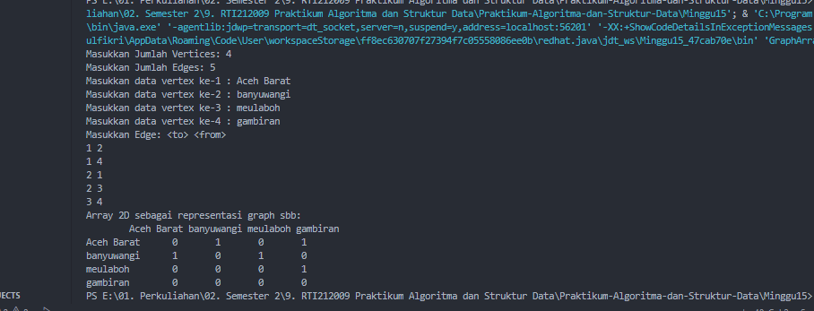


####               ------------  Terimakasih  -------------