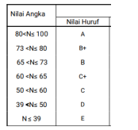

## JOBSHEET 1
<hr>

### Nama : Mohammad Izamul Fikri Fahmi
#### Kelas : 1F-TI
#### Absen : 17
#### NIM : 2141720171
#### __1. Praktikum Pemilihan__
#### __Pertanyaan__
Buatlah program untuk menghitung nilai akhir dari mahasiswa dengan ketentuan 20% nilai tugas, 35% nilai UTS dan 45% nilai UAS. Setiap nilai yang dimasukkan mempunyai batas nilai 0 ‐ 100. Ketika nilai akhir sudah didapatkan selanjutnya lakukan konversi nilai dengan ketentuang sebagai berikut:



Jika Nilai Huruf yang didapatkan adalah A,B+,B+C+,C maka LULUS, jika nilai huruf D dan E maka TIDAK LULUS. 
-	Input dari program berupa komponen nilai tugas, UTS, UAS
-	Output dari program berupa hasil nilai akhir, nilai huruf, dan keterangan LULUS/TIDAK LULUS


#### Kode Program

``` Java
//Nama : Mohammad Izamul Fikri Fahmi
//Kelas : 1F
//Absen : 17
//NIM : 2141720171
import java.util.Scanner;
public class pemilihan {
    public static void main(String[] args) {
        Scanner sc= new Scanner(System.in);
        int tugas, uts, uas;
        double lastValue;
        String letterValue, status;

        System.out.println("*----------------------------*");
        System.out.println("Program Menghitung Nilai Akhir");
        System.out.println("==============================");
        System.out.print("Masukkan Nilai Tugas : ");
        tugas = sc.nextInt();
        System.out.print("Masukkan Nilai UTS   : ");
        uts = sc.nextInt();
        System.out.print("Masukkan Nilai Uas   : ");
        uas = sc.nextInt();
        System.out.println("==============================");
        System.out.println("==============================");
        lastValue = (double) (tugas*0.2)+(uts*0.35)+(uas*0.45);

        //pemilihan
        if(lastValue > 80 && lastValue <= 100){
            letterValue = "A";
            System.out.println("nilai akhir          : "+lastValue);
            System.out.println("Nilai Huruf          : "+letterValue);
            status = "SELAMAT LULUS";
        } else if (lastValue > 73 && lastValue <= 80){
            letterValue = "B+";
            System.out.println("nilai akhir          : "+lastValue);
            System.out.println("Nilai Huruf          : "+letterValue);
            status = "SELAMAT LULUS";
        } else if (lastValue > 65 && lastValue <= 73){
            letterValue = "B";
            System.out.println("nilai akhir          : "+lastValue);
            System.out.println("Nilai Huruf          : "+letterValue);
            status = "SELAMAT LULUS";
        } else if (lastValue > 60 && lastValue <= 65){
            letterValue = "C+";
            System.out.println("nilai akhir          : "+lastValue);
            System.out.println("Nilai Huruf          : "+letterValue);
            status = "SELAMAT LULUS";
        } else if (lastValue > 50 && lastValue <= 60){
            letterValue = "C";
            System.out.println("nilai akhir          : "+lastValue);
            System.out.println("Nilai Huruf          : "+letterValue);
            status = "SELAMAT LULUS";
        } else if (lastValue > 39 && lastValue <= 50){
            letterValue = "D";
            System.out.println("nilai akhir          : "+lastValue);
            System.out.println("Nilai Huruf          : "+letterValue);
            status = "TIDAK LULUS";
        } else if (lastValue <= 39){
            letterValue = "E";
            System.out.println("nilai akhir          : "+lastValue);
            System.out.println("Nilai Huruf          : "+letterValue);
            status = "TIDAK LULUS";
        } else {
            System.out.println("Input Yang Anda Masukkan Mungkin Salah");
            status = "TIDAK DIKETAHUI";
        }
        System.out.println("==============================");
        System.out.println(status);
        sc.close();
    }
}
```
#### Hasil Run

##### Untuk yang lulus


##### Untuk yang tidak


##### Untuk yang tidak sesuai


#### __2. Praktikum Perulangan__
#### __Pertanyaan__

Buatlah program yang dapat menampilkan nama hari dari senin hingga minggu secara berulang dengan jumlah hari sebesar n, dengan n = 2 digit terakhir NIM anda.
*bila n<10 maka tambahkan 10 (n+=10)
Contoh:
- Input NIM: 2041720010 maka n=10

OUTPUT : senin selasa rabu kamis jumat sabtu minggu senin
selasa rabu
Contoh 2:
- Input NIM: 2041720002 maka n=12

OUTPUT : senin selasa rabu kamis jumat sabtu minggu senin
selasa rabu kamis jumat


#### Kode Program

``` java
//Nama : Mohammad Izamul Fikri Fahmi
//Kelas : 1F
//Absen : 17
//NIM : 2141720171
import java.util.Scanner;
public class perulangan {
    public static void main(String[] args) {
    Scanner sc = new Scanner(System.in);
    int nim, n;
    
    System.out.print("Masukkan NIM : ");
    nim = sc.nextInt();
    System.out.println("====================");

    n = nim - 2041720000;
    if (n < 10){
        n += 10;
    }
    System.out.println("n : "+n);
    System.out.println("====================");

    for (int i=0; i<n;i++){
        int cekHari = i % 7;
        if(cekHari==0){
            System.out.print("Minggu");
        } else if (cekHari==1){
            System.out.print(" Senin");
        } else if (cekHari==2){
            System.out.print(" Selasa");
        } else if (cekHari==3){
            System.out.print(" Rabu");
        } else if (cekHari==4){
            System.out.print(" kamis");
        }  else if (cekHari==5){
            System.out.print(" Jumat");
        }  else if (cekHari==6){
            System.out.print(" Sabtu ");
        } else {
            System.out.println();
        }
    }
    sc.close();
    }
    
}

```

#### Hasil Run

##### Untuk n > 10


##### Untuk n < 10


#### __3. Praktikum array__
#### __Pertanyaan__

RoyalGarden adalah toko bunga yang memiliki banyak cabang. Setiap hari Stock Bunga dan
bunga-bunga yang dijual selalu dicatat dengan rincian seperti berikut ini:
Baris = Cabang Toko, Kolom = Stock bunga pada hari x


Rincian Harga Aglonema =75.000 , Keladi = 50.000, Alocasia =60.000, Mawar =10.000.
Bantulah RoyalGarden dengan membuatkan program yang dapat menghitung :

-  Jumlah Stock berdasarkan jenis bunganya di seluruh Cabang

- Jika terdapat informasi tambahan berupa pengurangan stock karena bunga tersebut
mati pada cabang RoyalGarden 1. Dengan rincian Aglonema -1, Keladi -2, Alocasia -0,
Mawar -5. Maka berapakah total pendapatan dari RoyalGarden 1 jika semua Bunga
Terjual Habis


#### Kode Program
``` java
//Nama : Mohammad Izamul Fikri Fahmi
//Kelas : 1F
//Absen : 17
//NIM : 2141720171
public class array {
    public static void main(String[] args) {
        int[][] royalGarden = {{10,5,15,7},{6,11,9,12},{2,10,10,5},{5,7,12,9}};
        int aglonema = royalGarden[0][0] + royalGarden[0][1] + royalGarden[0][2] + royalGarden[0][3];
        int keladi =  royalGarden[1][0] + royalGarden[1][1] + royalGarden[1][2] + royalGarden[1][3];
        int alocasia =  royalGarden[2][0] + royalGarden[2][1] + royalGarden[2][2] + royalGarden[2][3];
        int mawar =   royalGarden[3][0] + royalGarden[3][1] + royalGarden[3][2] + royalGarden[3][3];

        //menghitung stok
        System.out.println("A. JUMLAH STOK JENIS BUNGA DI SELURUH CABANG");
        System.out.println("Jumlah Stok Aglonema    : "+aglonema);
        System.out.println("Jumlah Stok Keladi      : "+keladi);
        System.out.println("Jumlah Stok Alocasia    ; "+alocasia);
        System.out.println("Jumlah Stok Mawar       : "+mawar);

        //menghitung total pendapatan royal garden 1
        long total = (((royalGarden[0][0]-1)*75000)+((royalGarden[0][1]-2)*50000)+((royalGarden[0][2])*60000)+((royalGarden[0][3]-5)*10000));
        System.out.println("\nB. JUMLAH TOTAL PENDAPATAN ROYAL GARDEN 1");
        System.out.println("Total Pendapatan        : "+total);

    }
}

```

#### Hasil Run


#### __4. Praktikum fungsi__
#### __Pertanyaan__

1.	Buatlah fungsi untuk menampilkan array stock bunga sesuai tabel yang terdapat pada pertanyaan praktikum bagian 2.4.
2.	Buatlah fungsi untuk pada pertanyaan bagian 2.4 untuk mengetahui jumlah Stock berdasarkan jenis bunganya di seluruh Cabang.


#### Kode Program
``` java
//Nama : Mohammad Izamul Fikri Fahmi
//Kelas : 1F
//Absen : 17
//NIM : 2141720171
public class fungsi {
    static int[][] royalGarden = {{10,5,15,7},{6,11,9,12},{2,10,10,5},{5,7,12,9}};

    //data royalgarden1
    public static void royalGarden1(){
        int aglonema = royalGarden[0][0];
        int keladi = royalGarden[0][1];
        int alocasia = royalGarden[0][2];
        int mawar = royalGarden[0][3];

        //menampilkannya
        System.out.println("--STOK BUNGA DI ROYAL GARDEN 1--");
        System.out.println("Stok Aglonema   : "+aglonema);
        System.out.println("Stok Keladi     : "+keladi);
        System.out.println("Stok Alocasia   : "+alocasia);
        System.out.println("Stok Mawar      : "+mawar);
    }
    //data royal garden2
    public static void royalGarden2(){
      int aglonema = royalGarden[1][0];
      int keladi = royalGarden[1][1];
      int alocasia = royalGarden[1][2];
      int mawar = royalGarden[1][3];

      //menampilkannya
      System.out.println("\n--STOK BUNGA DI ROYAL GARDEN 2--");
      System.out.println("Stok Aglonema   : "+aglonema);
      System.out.println("Stok Keladi     : "+keladi);
      System.out.println("Stok Alocasia   : "+alocasia);
      System.out.println("Stok Mawar      : "+mawar);
  }
  //data royal garden3
  public static void royalGarden3(){
    int aglonema = royalGarden[2][0];
    int keladi = royalGarden[2][1];
    int alocasia = royalGarden[2][2];
    int mawar = royalGarden[2][3];

    //menampilkannya
    System.out.println("\n--STOK BUNGA DI ROYAL GARDEN 3--");
    System.out.println("Stok Aglonema   : "+aglonema);
    System.out.println("Stok Keladi     : "+keladi);
    System.out.println("Stok Alocasia   : "+alocasia);
    System.out.println("Stok Mawar      : "+mawar);
  }
  //data royal garden4
  public static void royalGarden4(){
    int aglonema = royalGarden[3][0];
    int keladi = royalGarden[3][1];
    int alocasia = royalGarden[3][2];
    int mawar = royalGarden[3][3];

    //menampilkannya
    System.out.println("\n--STOK BUNGA DI ROYAL GARDEN 4--");
    System.out.println("Stok Aglonema   : "+aglonema);
    System.out.println("Stok Keladi     : "+keladi);
    System.out.println("Stok Alocasia   : "+alocasia);
    System.out.println("Stok Mawar      : "+mawar);
  }
  //stok bunga di seluruh cabang
  public static void totalStok(){
        int aglonema = royalGarden[0][0] + royalGarden[0][1] + royalGarden[0][2] + royalGarden[0][3];
        int keladi =  royalGarden[1][0] + royalGarden[1][1] + royalGarden[1][2] + royalGarden[1][3];
        int alocasia =  royalGarden[2][0] + royalGarden[2][1] + royalGarden[2][2] + royalGarden[2][3];
        int mawar =   royalGarden[3][0] + royalGarden[3][1] + royalGarden[3][2] + royalGarden[3][3];

        //menampilkan
        System.out.println("Stok Aglonema   : "+aglonema);
        System.out.println("Stok Keladi     : "+keladi);
        System.out.println("Stok Alocasia   : "+alocasia);
        System.out.println("Stok Mawar      : "+mawar);
  }
    public static void main(String[] args) {
      royalGarden1();
      royalGarden2();
      royalGarden3();
      royalGarden4();

      System.out.println("\n=============================\n");
      System.out.println("TOTAL STOK SETIAP BUNGA SEMUA CABANG");
      totalStok();
    }
}

```

#### Hasil Run


### __Tugas__

1.	Sebuah jasa cuci pakaian Smile Laundry memiliki aturan biaya seperti berikut ini:
- Tarif untuk setiap 1kg pakaian adalah Rp. 4.500, –
 - Jika customer mencucikan baju lebih dari 10 kg maka : customer akan mendapatkan diskon 5%. 
Pada hari ini laundy tersebut hanya memiliki 4 customer yaitu Ani, Budi, Bina, dan Cita. Ani membawa 4kg pakaian, budi membawa 15kg pakaian, Bina membawa 6kg, dan terakir Cita membawa 11kg. 
Berapakah pendapat Smile laundry pada hari itu? Buatlah programnya!

#### Kode Program

``` java
//Nama : Mohammad Izamul Fikri Fahmi
//Kelas : 1F
//Absen : 17
//NIM : 2141720171
public class tugas1 {
    static int[] customer = {4,15,6,11};
    static int total;

    //menghitung masing masing
    public static int menghiitungbagian(int j){
        int hitung = customer[j] * 4500;
        if(customer[j]>10){
            hitung -= hitung * 0.05;
        }
        return hitung;
    }

    public static void main(String[] args) {
        System.out.println("*--PRROGRAM MENGHITUNG PENDAPATAN SMILE LAUNDRY--*");
        System.out.println("===================================");
        for (int i = 0;i<customer.length;i++){
            if(i==0){
                System.out.println("Biaya Ani            : Rp."+menghiitungbagian(i));
                total+=menghiitungbagian(i);
            } else if (i==1){
                System.out.println("Biaya Budi           : Rp."+menghiitungbagian(i));
                total+=menghiitungbagian(i);
            } else if (i==2){   
                System.out.println("Biaya Bina           : Rp."+menghiitungbagian(i));
                total+=menghiitungbagian(i);
            } else {
                System.out.println("Biaya Cita           : Rp."+menghiitungbagian(i));
                total+=menghiitungbagian(i);    
            }
        }
        System.out.println("_________________________________");
        System.out.printf("Total Pendapatan     : Rp.%d",total);

    }
}
```

#### Hasil Run


