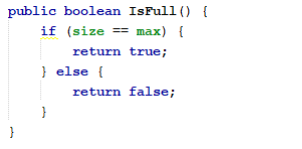
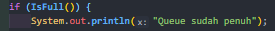
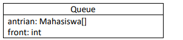

### Jobsheet VIII <p> QUEUE
#### 8.1 Tujuan Praktikum

Setelah melakukan materi praktikum ini, mahasiswa mampu:
1. Mengenal struktur data Queue
2. Membuat dan mendeklarasikan struktur data Queue
3. Menerapkan algoritma Queue dengan menggunakan array

#### 8.2 Praktikum 1

**Waktu percobaan : 45 menit**
Pada percobaan ini, kita akan mengimplementasikan penggunaan class Queue.

#### 8.2.1 Langkah-langkah Percobaan

1. Perhatikan Diagram Class Queue berikut ini: <p>
 <p>
Berdasarkan diagram class tersebut, akan dibuat program class Queue dalam Java.<p>

2. Buat package dengan nama **Praktikum1**, kemudian buat class baru dengan nama **Queue**.
3. Tambahkan atribut-atribut Queue sesuai diagram class, kemudian tambahkan pula
konstruktornya seperti gambar berikut ini. <p>
 <p>

4. Buat method IsEmpty bertipe boolean yang digunakan untuk mengecek apakah queue kosong. <p>


5. Buat method IsFull bertipe boolean yang digunakan untuk mengecek apakah queue sudah penuh <p>


6. Buat method peek bertipe void untuk menampilkan elemen queue pada posisi paling depan. <p>


7. Buat method print bertipe void untuk menampilkan seluruh elemen pada queue mulai dari posisi
front sampai dengan posisi rear. <p>


8. Buat method clear bertipe void untuk menghapus semua elemen pada queue. <p>


9. Buat method Enqueue bertipe void untuk menambahkan isi queue dengan parameter dt yang
bertipe integer <p>


10. Buat method Dequeue bertipe int untuk mengeluarkan data pada queue di posisi belakang <p>


11. Selanjutnya, buat class baru dengan nama QueueMain tetap pada package Praktikum1. Buat
method menu bertipe void untuk memilih menu program pada saat dijalankan. <p>


12. Buat fungsi main, kemudian deklarasikan Scanner dengan nama sc.

13. Buat variabel n untuk menampung masukan berupa jumlah maksimal elemen yang dapat
disimpan pada queue.<p>


14. Lakukan instansiasi objek Queue dengan nama Q dengan mengirimkan parameter n sebagai
kapasitas elemen queue <p>


15. Deklarasikan variabel dengan nama pilih bertipe integer untuk menampung pilih menu dari
pengguna.
16. Lakukan perulangan menggunakan do-while untuk menjalankan program secara terus menerus
sesuai masukan yang diberikan. Di dalam perulangan tersebut, terdapat pemilihan kondisi
menggunakan switch-case untuk menjalankan operasi queue sesuai dengan masukan pengguna. <p>


17. Compile dan jalankan class QueueMain, kemudian amati hasilnya.

##### Kode Progran Queue.java
```java
package Praktikum1;
/* 
@autho izamul fikri
*/
class Queue {

    int[] data;
    int front;
    int rear;
    int size;
    int max;
    
    public Queue(int n) {
        max = n;
        data = new int[max];
        size = 0;
        front = rear = -1;
    }
    
    public boolean IsEmpty() {
        if (size == 0) {
            return true;
        } else {
            return false;
        }
    }
    
    public boolean IsFUll() {
        if (size == max) {
            return true;
        } else {
            return false;
        }
    }
    
    public void  peek() {
        if (!IsEmpty()) {
            System.out.println("Elemen terdepan: " + data[front]);
        } else {
            System.out.println("Queue masih kosong");
        }
    }

    public void print() {
        if (IsEmpty()) {
            System.out.println("Queue masih kosong");
        } else {
            int i = front;
            while (i != rear) {
                System.out.println(data[i] + " ");
                i = (i + 1) % max;
            }
            System.out.println(data[i] + " ");
            System.out.println("Jumlah elemen = " + size);
        }
    }

    public void clear() {
        if (!IsEmpty()) {
            front = rear - -1;
            size = 0;
            System.out.println("Queue berhasil dikosongkan");
        } else {
            System.out.println("Queue masih kosong");
        }
    }

    public void Enqueue(int dt) {
        if (IsFUll()) {
            System.out.println("Queue sudah penuh");
        } else {
            if (IsEmpty()) {
                front = rear = 0;
            } else {
                if (rear == max - 1) {
                    rear = 0;          
                } else {
                rear++;
                }
        }
        data[rear] = dt;
        size++;
        }
    }

    public int Dequeue() {
        int dt = 0;
        if (IsEmpty()) {
            System.out.println("Queue masih kosong");
        } else {
            dt = data[front];
            size--;
            if (IsEmpty()) {
                front = rear = -1;
            } else {
                if (front == max -1) {
                    front = 0;
                } else {
                    front++;
                }
            }
        }
        return dt;
    }
}

```
##### Kode Program QueueMain.java
```java
package Praktikum1;
import java.util.Scanner;

class QueueMain {

    public static void menu(){
        System.out.println("Masukkan operasi yang diinginkan : ");
        System.out.println("1. Enqueue");
        System.out.println("2. Dequeue");
        System.out.println("3. Print");
        System.out.println("4. Peek");
        System.out.println("5. Clear");
        System.out.println("--------------------------");
    }
    public static void main(String[] args) {
        Scanner sc = new Scanner(System.in);

        System.out.print("Masukkan kapasitas queue : ");
        int n = sc.nextInt();

        Queue Q = new Queue(n);
        int pilih;
            do {
                menu();
                pilih = sc.nextInt();
                switch (pilih) {
                    case 1:
                        System.out.print("Masukkan data baru : ");
                        int dataMasuk = sc.nextInt();
                        Q.Enqueue(dataMasuk);
                        break;
                    case 2:
                        int dataKeluar = Q.Dequeue();
                        if (dataKeluar != 0) {
                            System.out.println("Data yang dikeluarkan : " + dataKeluar);
                            break;
                        }
                    case 3:
                        Q.print();
                        break;
                    case 4:
                        Q.peek();
                        break;
                    case 5:
                        Q.clear();
                        break;
                }
            } while (pilih == 1 || pilih == 2 || pilih == 3 || pilih == 4 || pilih == 5);
    }
}
```
#### 8.2.2 Verifikasi Hasil Percobaan
Samakan hasil compile kode program Anda dengan gambar berikut ini. <p>


##### Hasil percobaan


Hasil sudah sesuai

#### 8.2.3 Pertanyaan
1. Pada konstruktor, mengapa nilai awal atribut front dan rear bernilai -1, sementara atribut size
bernilai 0? <p>
jawab : <p>
Karena nilai awal dari front dan rear adalah 0, maka nilai atributnya diberi nilai default -1. Berbeda dengan size yang mana nilai awalnya dimulai dari 1 dan 0 adalah kondisi dimana size tidak memiliki nilai atau isi.


2. Pada method Enqueue, jelaskan maksud dan kegunaan dari potongan kode berikut!
<p>
 <p>
jawab: <p>
bila rear berada pada max-1 atau index terakhir dari array, maka jika akan ditambahkan data baru, akan ditempatkan pada index 0.

3. Pada method Dequeue, jelaskan maksud dan kegunaan dari potongan kode berikut! <p>
<p>
jawab : <p>
bila front berada pada max-1 atau index terakhir dari array, maka pengambilan data akan terjadi di index 0 atau front = 0.

4. Pada method print, mengapa pada proses perulangan variabel i tidak dimulai dari 0 (int i=0),
melainkan int i=front?<p>
jawab :<p>
Karena pada queue data terdepan tidak selalu berada di index pertama, melainkan berada pada penunjuk indez front.
5. Perhatikan kembali method print, jelaskan maksud dari potongan kode berikut! <p>
<p>
jawab :<p>
maksudnya, nilai i(front) jika tidak berposisi sebagai rear, maka akan dilakukan
penambahan pada variable tersebut lalu akan dimodulus dengan nilai max atau kapasitas dari Queue
tersebut. Gunanya untuk mencegah melakukan print melebihi max itu sendiri, sehingga dilakukan modulus ke max

6. Tunjukkan potongan kode program yang merupakan queue overflow!<p>
jawab : <p>


7. Pada saat terjadi queue overflow dan queue underflow, program tersebut tetap dapat berjalan
dan hanya menampilkan teks informasi. Lakukan modifikasi program sehingga pada saat terjadi
queue overflow dan queue underflow, program dihentikan!<p>
jawab : <p>
Baris kode yang berubah pada queue
```java
 public int Enqueue(int dt) { // merubah yang semula void menajadi int untuk kondisi penghentian program soal no 7
        if (IsFull()) {
            System.out.println("Queue sudah penuh");
            return 1; // untuk menghentikan program ketika mendapat kondisi overflow
        } else {
            if (IsEmpty()) {
                front = rear = 0;
            } else {
                if (rear == max - 1) {
                    rear = 0;          
                } else {
                rear++;
                }
        }
        data[rear] = dt;
        size++;
        }
        return 0;
    }

    public int Dequeue() {
        int dt = 0;
        if (IsEmpty()) {
            System.out.println("Queue masih kosong");
            return 0; // untuk menghentikan progra ketika mendapat kondisi underflow
        } else {
            dt = data[front];
            size--;
            if (IsEmpty()) {
                front = rear = -1;
            } else {
                if (front == max -1) {
                    front = 0;
                } else {
                    front++;
                }
            }
        }
        return dt;
    }
```
Baris kode yang berubah di Queue main
```java
 case 1:
                        System.out.print("Masukkan data baru : ");
                        int dataMasuk = sc.nextInt();
                        int overflow = Q.Enqueue(dataMasuk);
                        if (overflow == 1) {
                            System.out.println("Program Berhenti");
                            return;
                        }
                        break;
                    case 2:
                        int dataKeluar = Q.Dequeue();
                        if (dataKeluar != 0) {
                            System.out.println("Data yang dikeluarkan : " + dataKeluar);
                            break;
                        } else if (dataKeluar == 0) {
                            System.out.println("Program Berhenti");
                            return;
                        }
```

Hasil run jika overflow<p>
 <p>
Hasil run jika underflow<p>


Dengan memanfaatkan return untuk menghentikan program jika mendapatkan kondisi underflow atau overflow, program dapat dihentikan dan tidak hanya menampilkan pesan saja.

#### 8.3 Praktikum 2
Waktu percobaan : 45 menit
Pada percobaan ini, kita akan membuat program yang mengilustrasikan teller di bank dalam
melayani nasabah.

#### 8.3.1 Langkah-langkah Percobaan
1. Perhatikan Diagram Class berikut ini <p>


Berdasarkan diagram class tersebut, akan dibuat program class Nasabah dalam Java.

2. Buat package dengan nama Praktikum2, kemudian buat class baru dengan nama Nasabah.
3. Tambahkan atribut-atribut Nasabah seperti pada Class Diagram, kemudian tambahkan pula
konstruktornya seperti gambar berikut ini. <p>


4. Salin kode program class Queue pada Praktikum 1 untuk digunakan kembali pada Praktikum 2
ini. Karena pada Praktikum 1, data yang disimpan pada queue hanya berupa array bertipe
integer, sedangkan pada Praktikum 2 data yang digunakan adalah object, maka perlu dilakukan
modifikasi pada class Queue tersebut.
5. Lakukan modifikasi pada class Queue dengan mengubah tipe int[] data menjadi Nasabah[] data
karena pada kasus ini data yang akan disimpan pada queue berupa object Nasabah. Modifikasi
perlu dilakukan pada atribut, method Enqueue, dan method Dequeue. <p>


Baris program Nasabah dt = new Nasabah(); akan ditandai sebagai error, untuk mengatasinya,
tambahkan konstruktor default di dalam class Nasabah.<p>


6. Karena satu elemen queue terdiri dari beberapa informasi (norek, nama, alamat, umur, dan
saldo), maka ketika mencetak data juga perlu ditampilkan semua informasi tersebut, sehingga
meodifikasi perlu dilakukan pada method peek dan method print. <p>


7. Selanjutnya, buat class baru dengan nama QueueMain tetap pada package Praktikum2. Buat
method menu untuk mengakomodasi pilihan menu dari masukan pengguna <p>


8. Buat fungsi main, deklarasikan Scanner dengan nama sc
9. Buat variabel max untuk menampung kapasitas elemen pada queue. Kemudian lakukan
instansiasi objek queue dengan nama antri dan nilai parameternya adalah variabel jumlah.<p>


10. Deklarasikan variabel dengan nama pilih bertipe integer untuk menampung pilih menu dari
pengguna.
11. Tambahkan kode berikut untuk melakukan perulangan menu sesuai dengan masukan yang
diberikan oleh pengguna. <p>


12. Compile dan jalankan class QueueMain, kemudian amati hasilnya.

Kode program Nasabah.java
```java
package Praktikum2;

public class Nasabah {
    String norek, nama, alamat;
    int umur;
    double saldo;

    Nasabah(){
        
    }

    Nasabah(String norek, String nama, String alamat, int umur, double saldo){
        this.norek = norek;
        this.nama = nama;
        this.alamat = alamat;
        this.umur = umur;
        this.saldo = saldo;
    }
}
```

Kode program Queue.java
```java
package Praktikum2;
/* 
@author izamul fikri
*/
class Queue {

    Nasabah[] data;
    int front;
    int rear;
    int size;
    int max;
    
    public Queue(int n) {
        max = n;
        data = new Nasabah[max];
        size = 0;
        front = rear = -1;
    }
    
    public boolean IsEmpty() {
        if (size == 0) {
            return true;
        } else {
            return false;
        }
    }
    
    public boolean IsFull() {
        if (size == max) {
            return true;
        } else {
            return false;
        }
    }
    
    public void  peek() {
        if (!IsEmpty()) {
            System.out.println("Elemen terdepan: " + data[front].norek + " " + data[front].nama + " " + data[front].alamat + " " + data[front].umur + " " + data[front].saldo);
        } else {
            System.out.println("Queue masih kosong");
        }
    }

    public void print() {
        if (IsEmpty()) {
            System.out.println("Queue masih kosong");
        } else {
            int i = front;
            while (i != rear) {
                System.out.println(data[i].norek + " " + data[i].nama + " " + data[i].alamat + " " + data[i].umur + " " + data[i].saldo);
                i = (i + 1) % max;
            }
            System.out.println(data[i].norek + " " + data[i].nama + " " + data[i].alamat + " " + data[i].umur + " " + data[i].saldo);
            System.out.println("Jumlah elemen = " + size);
        }
    }

    public void clear() {
        if (!IsEmpty()) {
            front = rear - -1;
            size = 0;
            System.out.println("Queue berhasil dikosongkan");
        } else {
            System.out.println("Queue masih kosong");
        }
    }

    public void Enqueue(Nasabah dt) {
        if (IsFull()) {
            System.out.println("Queue sudah penuh");
        } else {
            if (IsEmpty()) {
                front = rear = 0;
            } else {
                if (rear == max - 1) {
                    rear = 0;          
                } else {
                rear++;
                }
        }
        data[rear] = dt;
        size++;
        }
    }

    public Nasabah Dequeue() {
        Nasabah dt = new Nasabah();
        if (IsEmpty()) {
            System.out.println("Queue masih kosong");
        } else {
            dt = data[front];
            size--;
            if (IsEmpty()) {
                front = rear = -1;
            } else {
                if (front == max -1) {
                    front = 0;
                } else {
                    front++;
                }
            }
        }
        return dt;
    }
}
```
Kode program QueueMain.java
```java
package Praktikum2;
import java.util.Scanner;
public class QueueMain {

    public static void menu() {
        System.out.println("Pilih Menu: ");
        System.out.println("1. Antrian baru");
        System.out.println("2. Antrian keluar");
        System.out.println("3. Cek Antrian terdepan");
        System.out.println("4. Cek Semua Antrian");
        System.out.println("---------------------------");
    }
    public static void main(String[] args) {
        Scanner sc = new Scanner(System.in);

        System.out.print("Masukkan kapasitas queue: ");
        int Jumlah = sc.nextInt();
        Queue antri = new Queue(Jumlah);

        int pilih;
        do {
            menu();
            pilih = sc.nextInt();
            sc.nextLine();
            switch(pilih) {
                case 1:
                System.out.print("No Rekening : ");
                String norek = sc.nextLine();
                System.out.print("Nama        : ");
                String nama = sc.nextLine();
                System.out.print("Alamat      : ");
                String alamat = sc.nextLine();
                System.out.print("Umur        : ");
                int umur = sc.nextInt();
                System.out.print("Saldo       : ");
                double saldo = sc.nextDouble();
                Nasabah nb = new Nasabah(norek, nama, alamat, umur, saldo);
                sc.nextLine();
                antri.Enqueue(nb);
                break;

                case 2:
                Nasabah data = antri.Dequeue();
                 if(!"".equals(data.norek) && !"".equals(data.nama) && !"".equals(data.alamat) && !"".equals(data.alamat) && data.umur != 0 && data.saldo !=0) {
                    System.out.println("Antrian yang keluar: " + data.norek + " " + data.nama + " " + data.alamat + " " + data.umur + " " + data.saldo);
                break;
                }

                case 3:
                    antri.peek();
                    break;
                
                case 4:
                antri.print();
                    break;
                }

            } while (pilih == 1 || pilih == 2 || pilih == 3 || pilih == 4);
    }
}
```
#### 8.3.2 Verifikasi Hasil Percobaan
Samakan hasil compile kode program Anda dengan gambar berikut ini. <p>
<p>
Hasil run program <p>
 <p>
Hasil sudah sesuai


#### 8.3.3 Pertanyaan
1. Pada class QueueMain, jelaskan fungsi IF pada potongan kode program berikut! <p>
<p>
jawab : <p>
IF dalam potongan kode tersebut digunakan untuk mengecek apakah dalam objek data terdapat isi atau tidak, makanya disitu menggunakan equals dengan "". jika tidak sama dengan isi kosong maka data ditampilkan, namun jika isi data tersebut == "" . maka data tidak diprint.

2. Lakukan modifikasi program dengan menambahkan method baru bernama peekRear pada class
Queue yang digunakan untuk mengecek antrian yang berada di posisi belakang! Tambahkan pula
daftar menu 5. Cek Antrian paling belakang pada class QueueMain sehingga method peekRear
dapat dipanggil!<p>
jawab : <p>
Kode program yang ditambahkan dalam queue
```java
public void peekRear() {
        if(!IsEmpty()){
            System.out.println("Antrian posisi paling belakang : " + data[rear].norek + " " + data[rear].nama + " " + data[rear].alamat + " " + data[rear].umur + " " + data[rear].saldo);
        } else {
            System.out.println("Antrian masih kosong");
        }
    }
```
Kode program main terbaru
```java
 case 1:
                System.out.print("No Rekening : ");
                String norek = sc.nextLine();
                System.out.print("Nama        : ");
                String nama = sc.nextLine();
                System.out.print("Alamat      : ");
                String alamat = sc.nextLine();
                System.out.print("Umur        : ");
                int umur = sc.nextInt();
                System.out.print("Saldo       : ");
                double saldo = sc.nextDouble();
                Nasabah nb = new Nasabah(norek, nama, alamat, umur, saldo);
                sc.nextLine();
                antri.Enqueue(nb);
                break;

                case 2:
                Nasabah data = antri.Dequeue();
                if(!"".equals(data.norek) && !"".equals(data.nama) && !"".equals(data.alamat) && !"".equals(data.alamat) && data.umur != 0 && data.saldo !=0) {
                    System.out.println("Antrian yang keluar: " + data.norek + " " + data.nama + " " + data.alamat + " " + data.umur + " " + data.saldo);
                break;
                }

                case 3:
                    antri.peek();
                    break;
                
                case 4:
                antri.print();
                    break;

                case 5:
                antri.peekRear();
                break;
                }
```

Hasil compile program <p>

#### 8.4 Tugas
1. Tambahkan dua method berikut ke dalam class Queue pada Praktikum 1:<p>
a. Method peekPosition(data: int) : void
Untuk menampilkan posisi dari sebuah data di dalam queue, misalnya dengan mengirimkan
data tertentu, akan diketahui posisi (indeks) data tersebut berada di urutan ke berapa <p>
b. Method peekAt(position: int) : void
Untuk menampilkan data yang berada pada posisi (indeks) tertentu
Sesuaikan daftar menu yang terdapat pada class QueueMain sehingga kedua method tersebut
dapat dipanggil!

Kode program tambahan pada Queue
```java
 // untuk menampilkan posisi indek suatu data
    public void peekPosition(int dt) {
        if (IsEmpty()) {
            System.out.println("Data Masih Kosong");
        } else {
            int i = front;
            while (i != rear) {
                if (data[i]==dt) {
                    System.out.println("Data berada di indeks : "+i);
                }
                i = (i + 1) % max;
            }
            if (data[i] == dt) {
                System.out.println("Data berada di indeks : "+i);
            } else {
                System.out.println("Data tidak ada  ");
            }
        }
    }

    // untuk mengetahui suatu data denga indeks
    public void peekAt(int position) {
        if (IsEmpty()){
            System.out.println("Data masih kosong");
        } else {
            int i = front;
            if(i==position) {
                System.out.println(data[i] + " pada indeks : " + i);
                return;
            }
            while (i != rear) {
                if (i==position){
                    System.out.println(data[i] + " pada indeks : " + i);
                    return;
                }
                i = (i + 1) % max;
            }
            if (i == position){
                System.out.println(data[i] + " pada indeks : " + i);
                return;
            } else {
                System.out.println("Data tidak ditemukan");
            }
        }
    }
```

Kode program tambahan pada main
```java
public static void menu(){
        System.out.println("Masukkan operasi yang diinginkan : ");
        System.out.println("1. Enqueue");
        System.out.println("2. Dequeue");
        System.out.println("3. Print");
        System.out.println("4. Peek");
        System.out.println("5. Clear");
        System.out.println("6. peekPosition");
        System.out.println("7. peekAt");
        System.out.println("--------------------------");
    }
    public static void main(String[] args) {
        Scanner sc = new Scanner(System.in);

        System.out.print("Masukkan kapasitas queue : ");
        int n = sc.nextInt();

        Queue Q = new Queue(n);
        int pilih;
            do {
                menu();
                pilih = sc.nextInt();
                switch (pilih) {
                    case 1:
                        System.out.print("Masukkan data baru : ");
                        int dataMasuk = sc.nextInt();
                        int overflow = Q.Enqueue(dataMasuk);
                        if (overflow == 1) {
                            System.out.println("Program Berhenti");
                            return;
                        }
                        break;
                    case 2:
                        int dataKeluar = Q.Dequeue();
                        if (dataKeluar != 0) {
                            System.out.println("Data yang dikeluarkan : " + dataKeluar);
                            break;
                        } else if (dataKeluar == 0) {
                            System.out.println("Program Berhenti");
                            return;
                        }
                    case 3:
                        Q.print();
                        break;
                    case 4:
                        Q.peek();
                        break;
                    case 5:
                        Q.clear();
                        break;
                    case 6:
                        System.out.print("Masukkan data : ");
                        int dt = sc.nextInt();
                        Q.peekPosition(dt);
                        break;
                    case 7:
                    System.out.print("Masukkan indeks : ");
                    int idx = sc.nextInt();
                    Q.peekAt(idx);
                    break;
                }
            } while (pilih == 1 || pilih == 2 || pilih == 3 || pilih == 4 || pilih == 5 || pilih == 6 || pilih == 7);
    }
```

Hasil Running yang A <p>
<p>


Hasil Running yang B <p>


2. Buatlah program antrian untuk mengilustasikan mahasiswa yang sedang meminta tanda tangan
KRS pada dosen DPA di kampus. Ketika seorang mahasiswa akan mengantri, maka dia harus
menuliskan terlebih dulu NIM, nama, absen, dan IPK seperti yang digambarkan pada Class
diagram berikut: <p>


Class diagram Queue digambarkan sebagai berikut: <p>



Keterangan:
- Method create(), isEmpty(), isFull(), enqueue(), dequeue() dan print(), kegunaannya sama seperti
yang telah dibuat pada Praktikum
- Method peek(): digunakan untuk menampilkan data Mahasiswa yang berada di posisi antrian
paling depan
- Method peekRear(): digunakan untuk menampilkan data Mahasiswa yang berada di posisi antrian
paling belakang
- Method peekPosition(): digunakan untuk menampilkan posisi antrian ke berapa, seorang
Mahasiswa berada. Pengecekan dilakukan berdasarkan NIM
- Method printMahasiswa(): digunakan untuk menampilkan data mahasiswa pada suatu posisi
tertentu dalam antrian

Kode Program Mahasisa.java
```java
package Tugas2;

public class Mahasiswa {
    String nim, nama;
    int absen;
    double ipk;

    Mahasiswa() {
        
    }

    Mahasiswa(String nm, String nma, int ab, double pk){
        this.nim = nm;
        this.nama = nma;
        this.absen = ab;
        this.ipk = pk;
    }
}
```

Kode Program Queue.java
```java
package Tugas2;

public class Queue {
    Mahasiswa[] antrian;
    int front;
    int rear;
    int size;
    int max;

    public Queue(int n) {
        max = n;
        antrian = new Mahasiswa[max];
        size = 0;
        front = rear = -1;
    }

    public boolean IsEmpty() {
        if (size == 0) {
            return true;
        } else {
            return false;
        }
    }
    
    public boolean IsFull() {
        if (size == max) {
            return true;
        } else {
            return false;
        }
    }

    public void Enqueue(Mahasiswa antri) {
        if (IsFull()) {
            System.out.println("Queue sudah penuh");
        } else {
            if (IsEmpty()) {
                front = rear = 0;
            } else {
                if (rear == max - 1) {
                    rear = 0;          
                } else {
                rear++;
                }
        }
        antrian[rear] = antri;
        size++;
        }
    }

    public Mahasiswa Dequeue() {
        Mahasiswa antri = new Mahasiswa();
        if (IsEmpty()) {
            System.out.println("Queue masih kosong");
        } else {
            antri = antrian[front];
            size--;
            if (IsEmpty()) {
                front = rear = -1;
            } else {
                if (front == max -1) {
                    front = 0;
                } else {
                    front++;
                }
            }
        }
        return antri;
    }

    public void print() {
        if (IsEmpty()) {
            System.out.println("Queue masih kosong");
        } else {
            int i = front;
            while (i != rear) {
                System.out.println(antrian[i].nim + " " + antrian[i].nama + " " + antrian[i].absen + " " + antrian[i].ipk);
                i = (i + 1) % max;
            }
            System.out.println(antrian[i].nim + " " + antrian[i].nama + " " + antrian[i].absen + " " + antrian[i].ipk);
            System.out.println("Jumlah elemen = " + size);
        }
    }

    public void peek() {
        if (IsEmpty()) {
            System.out.println("Data Mahasiswa Kosong");
        } else {
            System.out.println("nim   : " + antrian[front].nim);
            System.out.println("nama  : " + antrian[front].nama);
            System.out.println("absen : " + antrian[front].absen);
            System.out.println("ipk   : " + antrian[front].ipk);
        }
    }

    public void peekRear() {
        if (IsEmpty()) {
            System.out.println("Data Mahasiswa Kosong");
        } else {
            System.out.println("nim   : " + antrian[rear].nim);
            System.out.println("nama  : " + antrian[rear].nama);
            System.out.println("absen : " + antrian[rear].absen);
            System.out.println("ipk   : " + antrian[rear].ipk);
        }
    }

    public void peekPosition(String nm) {
        if (IsEmpty()) {
            System.out.println("Data Masih Kosong");
        } else {
            int i = front;
            if (antrian[i].nim.equals(nm)) {
                System.out.println("Data berada di indeks : "+i);
                return;
            }
            while (i != rear) {
                if (antrian[i].nim.equals(nm)) {
                    System.out.println("Data berada di indeks : "+i);
                    return;
                }
                i = (i + 1) % max;
            }
            if (antrian[i].nim.equals(nm)) {
                System.out.println("Data berada di indeks : "+i);
            } else {
                System.out.println("Data tidak ada  ");
            }
        }
    }

    public void printMahasiswa(int posisi) {
        if (IsEmpty()){
            System.out.println("Data masih kosong");
        } else {
            int i = front;
            if(i == posisi) {
            System.out.println("nim   : " + antrian[i].nim);
            System.out.println("nama  : " + antrian[i].nama);
            System.out.println("absen : " + antrian[i].absen);
            System.out.println("ipk   : " + antrian[i].ipk);
                return;
            }
            while (i != rear) {
                if (i == posisi){
            System.out.println("nim   : " + antrian[i].nim);
            System.out.println("nama  : " + antrian[i].nama);
            System.out.println("absen : " + antrian[i].absen);
            System.out.println("ipk   : " + antrian[i].ipk);
                    return;
                }
                i = (i + 1) % max;
            }
            if (i == posisi){
            System.out.println("nim   : " + antrian[i].nim);
            System.out.println("nama  : " + antrian[i].nama);
            System.out.println("absen : " + antrian[i].absen);
            System.out.println("ipk   : " + antrian[i].ipk);
                return;
            } else {
                System.out.println("Data tidak ditemukan");
            }
        }
    }
}
```

Kode Program QueueMain.java
```java
package Tugas2;
import java.util.Scanner;
public class QueueMain {
    public static void menu() {
        System.out.println("Pilih Menu: ");
        System.out.println("1. Antrian");
        System.out.println("2. Antrian keluar");
        System.out.println("3. Cek Semua Antrian");
        System.out.println("4. Cek Antrian terdepan");
        System.out.println("5. Cek Antrian terbelakang");
        System.out.println("6. Cek Antrian Dengan NIM");
        System.out.println("7. Cek Data Antrian Dengan Indeks");
        System.out.println("---------------------------");
    }

    public static void main(String[] args) {
        Scanner sc = new Scanner(System.in);

        System.out.print("Masukkan kapasitas queue: ");
        int Jumlah = sc.nextInt();
        Queue antri = new Queue(Jumlah);

        int pilih;
        do {
            menu();
            pilih = sc.nextInt();
            sc.nextLine();
            switch(pilih) {
                case 1:
                System.out.print("NIM         : ");
                String nim = sc.nextLine();
                System.out.print("Nama        : ");
                String nama = sc.nextLine();
                System.out.print("Absen       : ");
                int absen = sc.nextInt();
                System.out.print("IPK         : ");
                double ipk = sc.nextDouble();
                Mahasiswa nb = new Mahasiswa(nim, nama, absen, ipk);
                sc.nextLine();
                antri.Enqueue(nb);
                break;

                case 2:
                Mahasiswa data = antri.Dequeue();
                if(!"".equals(data.nim) && !"".equals(data.nama) && data.absen != 0 && data.ipk != 0) {
                    System.out.println("Antrian yang keluar: " + data.nim + " " + data.nama + " " + data.absen + " " + data.ipk);
                break;
                }

                case 3:
                    antri.print();
                    break;
                
                case 4:
                antri.peek();
                    break;

                case 5:
                antri.peekRear();
                break;
                

                case 6:
                System.out.print("Masukkan NIM : ");
                String dt = sc.nextLine();
                antri.peekPosition(dt);
                break;

                case 7:
                System.out.print("Masukkan indeks : ");
                int idx = sc.nextInt();
                antri.printMahasiswa(idx);
                break;
            }
                

            } while (pilih == 1 || pilih == 2 || pilih == 3 || pilih == 4 || pilih == 5 || pilih == 6 || pilih == 7);
}
}
```

Hasil Run : <p>
Antrian<p>
<p>
 <p>

Keluar dan Menampilkan <p>
 <p>

terdepan dan belakang <p>
 <p>

dengan nim dan indeks <p>
