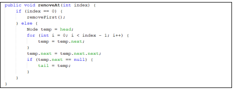
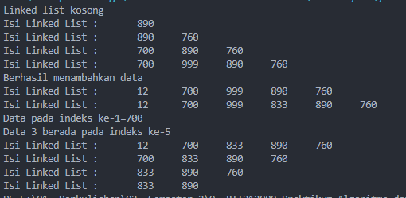

### JOBSHEET IX <p> LINKED LIST

#### Nama : Mohammad Izamul Fikri Fahmi <p> Kelas : TI-1F <p> Absen : 17 <p> NIM : 2141720171

#### 1. Tujuan Praktikum
Setelah melakukan materi praktikum ini, mahasiswa mampu:
1. Membuat struktur data linked list
2. Membuat linked list pada program
3. Membedakan permasalahan apa yang dapat diselesaikan menggunakan linked list
#### 2. Praktikum
#### 2.1 Pembuatan Single Linked List
Waktu percobaan : 30 menit
Didalam praktikum ini, kita akan mempraktekkan bagaimana membuat Single Linked List dengan
representasi data berupa Node, pengaksesan linked list dan metode penambahan data.
1. Pada Project StrukturData yang sudah dibuat pada Minggu sebelumnya, buat package dengan
nama minggu11
2. Tambahkan class-class berikut: <p>
 <p>

3. Implementasi class Node <p>
 <p>

4. Tambahkan atribut pada class SingleLinkedList <p>
 <p>

5. Sebagai langkah berikutnya, akan diimplementasikan method-method yang terdapat pada
SingleLinkedList.
6. Tambahkan method isEmpty().<p>


7. Implementasi method untuk mencetak dengan menggunakan proses traverse. <p>


8. Implementasikan method addFirst().<p>


9. Implementasikan method addLast(). <p>


10. Implementasikan method insertAfter, untuk memasukkan node yang memiliki data input setelah node yang memiliki data key.<p>


11. Tambahkan method penambahan node pada indeks tertentu.<p>


12. Pada class SLLMain, buatlah fungsi main, kemudian buat object dari class SingleLinkedList. <p>


13. Tambahkan Method penambahan data dan pencetakan data di setiap penambahannya agar
terlihat perubahannya. <p>


##### Hasil Koding langkah di atas :
1. Node.java
```java
public class Node {
    int data;
    Node next;

    public Node(int nilai, Node berikutnya) {
        this.data = nilai;
        this.next = berikutnya;
    }
}
```
2. SingleLinkedList.java
```java
public class SingleLinkedList {

    Node head; // posisi awal linked list
    Node tail; // posisi akhir linked list

    public boolean isEmpty() {
        return head == null;
    }

    public void print() {
        if (!isEmpty()) {
            Node tmp = head;
            System.out.print("Isi Linked List :\t");
            while (tmp != null) {
                System.out.print(tmp.data + "\t");
                tmp = tmp.next;
            } 
            System.out.println("");
        } else {
            System.out.println("Linked list kosong");
        }
    }

    public void addFirst(int input) {
        Node ndInput = new Node(input, null);
        if(isEmpty()) { // jika linked list kosong
            head = ndInput; //head dan tail sama dengan node input
            tail = ndInput;
        } else {
            ndInput.next = head;
            head = ndInput;
        }
    }

    public void addLast(int input) {
        Node ndInput = new Node(input, null);
        if (isEmpty()) {
            head = ndInput; // head dan tail sama dengan node input
            tail = ndInput;
        } else {
            tail.next = ndInput;
            tail = ndInput;
        }
    }

    public void insertAfter(int key, int input) {
        Node ndInput = new Node(input, null);
        Node temp = head;
        do {
            if (temp.data == key) {
                ndInput.next = temp.next;
                temp.next = ndInput;
                if(ndInput.next==null) tail = ndInput;
                break;
            }
            temp = temp.next;
        } while (temp != null);
    }
    
    public void inserAt(int index, int input) {
        if (index < 0) {
            System.out.println("indeks salah");
        } else if (index == 0) {
            addFirst(input);
        } else {
            Node temp = head;
            for (int i = 0; i < index -1 ; i++) {
                temp = temp.next;
            }
            temp.next = new Node(input, temp.next);
            if(temp.next.next==null) tail = temp.next;
        }
    }
}
```
3. SLLMain.java
```java
public class SLLMain {
    public static void main(String[] args) {
        SingleLinkedList singLL = new SingleLinkedList();
        singLL.print();
        singLL.addFirst(890);
        singLL.print();
        singLL.addLast(760);
        singLL.print();
        singLL.addFirst(700);
        singLL.print();
        singLL.insertAfter(700, 999);
        singLL.print();
        singLL.inserAt(3, 833);
        singLL.print();
    }
}
```

#### 2.1.1 Verifikasi Hasil Percobaan
Cocokkan hasil compile kode program anda dengan gambar berikut ini.<p>
 <p>

##### Hasil compile kode program


Sudah sesuai

#### 2.1.2 Pertanyaan
1. Mengapa hasil compile kode program di baris pertama menghasilkan “Linked List Kosong”?

jawab :

Karena ketika dipanggil method print, linked list di cek apakah kosong atau tidak dengan membandingkan head dengan null pada method isEmpty, dan karena memang linked list kosong, maka tidak memenuhi syarat if pada method print sehingga menampilkan apa yang ada dalam else yaitu "linked List Kosong"

2. Pada step 10, jelaskan kegunaan kode berikut <p>


jawab :

sebelum mengeksekusi kode program tersebut dipastikan dahulu apakah temp.data sama dengan key, jika iya maka ndInput.next akan diberikan nilai dari temp.next dan kemudia temp.next akan menampung nilai dari ndInput.

3. Perhatikan class SingleLinkedList, pada method insertAt Jelaskan kegunaan kode berikut <p>


jawab :

pada kode program tersebut dilakukan pengecekan apakah temp.next.next bernilai null/tidak ada, jika iya maka akan diberikan nilai kepada tail yaitu satu kali next pada temp, yaitu temp.next

#### 2.2 Modifikasi Elemen pada Single Linked List
Waktu percobaan : 30 menit
Didalam praktikum ini, kita akan mempraktekkan bagaimana mengakses elemen, mendapatkan
indeks dan melakukan penghapusan data pada Single Linked List.: 
#### 2.2.1 Langkah-langkah Percobaan
1. Implementasikan method untuk mengakses data dan indeks pada linked list
2. Tambahkan method untuk mendapatkan data pada indeks tertentu pada class Single Linked List <p>


3. Implementasikan method indexOf.<p>


4. Tambahkan method removeFirst pada class SingleLinkedList <p>


5. Tambahkan method untuk menghapus data pada bagian belakang pada class
SingleLinkedList <p>


6. Sebagai langkah berikutnya, akan diimplementasikan method remove <p>


7. Implementasi method untuk menghapus node dengan menggunakan index. <p>


8. Kemudian, coba lakukan pengaksesan dan penghapusan data di method main pada class 
SLLMain dengan menambahkan kode berikut <p>


9. Method SLLMain menjadi: <p>


10. Jalankan class SLLMain  

##### Hasil Koding langkah di atas :
1. Node2.java
```java
public class Node2 {
    int data;
    Node2 next;

    public Node2(int nilai, Node2 berikutnya) {
        this.data = nilai;
        this.next = berikutnya;
    }
}
```
2. SingleLinkedList2.java
```java
public class SingleLinkedList2 {

    Node2 head; // posisi awal linked list
    Node2 tail; // posisi akhir linked list

    public boolean isEmpty() {
        return head == null;
    }

    public void print() {
        if (!isEmpty()) {
            Node2 tmp = head;
            System.out.print("Isi Linked List :\t");
            while (tmp != null) {
                System.out.print(tmp.data + "\t");
                tmp = tmp.next;
            } 
            System.out.println("");
        } else {
            System.out.println("Linked list kosong");
        }
    }

    public void addFirst(int input) {
        Node2 ndInput = new Node2(input, null);
        if(isEmpty()) { // jika linked list kosong
            head = ndInput; //head dan tail sama dengan node2 input
            tail = ndInput;
        } else {
            ndInput.next = head;
            head = ndInput;
        }
    }

    public void addLast(int input) {
        Node2 ndInput = new Node2(input, null);
        if (isEmpty()) {
            head = ndInput; // head dan tail sama dengan node2 input
            tail = ndInput;
        } else {
            tail.next = ndInput;
            tail = ndInput;
        }
    }

    public void insertAfter(int key, int input) {
        Node2 ndInput = new Node2(input, null);
        Node2 temp = head;
        do {
            if (temp.data == key) {
                ndInput.next = temp.next;
                temp.next = ndInput;
                if(ndInput.next==null) tail = ndInput;
                break;
            }
            temp = temp.next;
        } while (temp != null);
    }
    
    public void inserAt(int index, int input) {
        if (index < 0) {
            System.out.println("indeks salah");
        } else if (index == 0) {
            addFirst(input);
        } else {
            Node2 temp = head;
            for (int i = 0; i < index -1 ; i++) {
                temp = temp.next;
            }
            temp.next = new Node2(input, temp.next);
            if(temp.next.next==null) tail = temp.next;
        }
    }

    public int getData(int index) {
        Node2 tmp = head;
        for (int i = 0; i < index; i++) {
            tmp = tmp.next;
        }
        return tmp.data;
    }

    public int indexOf(int key) {
        Node2 tmp = head;
        int index = 0;
        while (tmp!=null && tmp.data != key) {
            tmp = tmp.next;
            index++;
        }
        if (tmp == null) {
            return -1;
        } else {
            return index;
        }
    }

    public void removeFirst() {
        if (isEmpty()) {
            System.out.println("Linked List Masih Kosong, tidak dapat dihapus");
        } else if (head == tail) {
            head = tail = null;
        } else {
            head = head.next;
        }
    }

    public void removeLast() {
        if (isEmpty()) {
            System.out.println("Linked List Masing kosong tidak dapat dihapus");
        } else if (head == tail) {
            head = tail = null;
        } else {
            Node2 temp = head;
            while (temp.next != tail) {
                temp = temp.next;
            }
            temp.next = null;
            tail = temp;
        }
    }

    public void remove(int key) {
        if (isEmpty()) {
            System.out.println("Linked List Masih Kosong, tidak dapat dihapus");
        } else {
            Node2 temp = head;
            while (temp != null) {
                if ((temp.data == key) && (temp == head)) {
                    this.removeFirst();
                    break;
                } else if (temp.next.data == key) {
                    temp.next = temp.next.next;
                    if (temp.next == null) {
                        tail = temp;
                    }
                    break;
                }
                temp = temp.next;
            }
        }
    }
    
    public void removeAt(int index) {
        if (index == 0) {
            removeFirst();
        } else {
            Node2 temp = head;
            for (int i = 0; i < index - 1; i++) {
                temp = temp.next;
            }
            temp.next = temp.next.next;
            if (temp.next == null) {
                tail = temp;
            }
        }
    }
}
```
3. SLLMain2.java
```java
public class SLLMain2 {
    public static void main(String[] args) {
        SingleLinkedList2 singLL = new SingleLinkedList2();
        singLL.print();
        singLL.addFirst(890);
        singLL.print();
        singLL.addLast(760);
        singLL.print();
        singLL.addFirst(700);
        singLL.print();
        singLL.insertAfter(700, 999);
        singLL.print();
        singLL.inserAt(3, 833);
        singLL.print();

        System.out.println("Data pada indeks ke-1="+singLL.getData(1));
        System.out.println("Data 3 berada pada indeks ke-" +singLL.indexOf(760));

        singLL.remove(999);
        singLL.print();
        singLL.removeAt(0);
        singLL.print();
        singLL.removeFirst();
        singLL.print();
        singLL.removeLast();
        singLL.print();
    }
}
```

#### 2.2.2 Verifikasi Hasil Percobaan
Cocokkan hasil compile kode program anda dengan gambar berikut ini.<p>


##### Hasil compile progam


Sudah sesuai dengan contoh

#### 2.2.3 Pertanyaan
1. Mengapa digunakan keyword break pada fungsi remove? Jelaskan!

jawab :

Agar ketika suatu program sudah memenuhi persyaratan pada program yang ada dalam method remove, maka akan dilakuan break agar berhenti. karena penghapusan sudah selesai, jadi perulangan harus dihentikan.

2. Jelaskan kegunaan kode dibawah pada method remove<p>


jawab :

else if akan mengecek apakah temp.next.data equals atau sama dengan nilai key, jika iya maka, nlai temp.next akan diisi dengan nilai temp.mext.next.

3. Apa saja nilai kembalian yang dapat dikembalikan pada method indexOf? Jelaskan maksud
masing-masing kembalian tersebut!

jawab :

dalam method indexOf dilakukan dahulu deklarasi index dengan nilai 0, dan akan dilakuakn sebuah perulangan while yang mana itu akan mempengaruhi nilai dari index, dan kemudia akan memasuki pemilihan if else, jika  tmp == null, maka akan mereturn -1, namun jika tidak terpenuhi syarat tersebut maka akan meretrun nilai dari index tadi, tergantung berapa kali inrement yang terjadi.

#### 3. Tugas
Waktu pengerjaan : 50 menit

1. Buat method insertBefore untuk menambahkan node sebelum keyword yang diinginkan

jawab :

##### Kode program masing masing class :
- NodeTugas1.java
```java
public class NodeTugas1 {
    int data;
    NodeTugas1 next;

    public NodeTugas1(int nilai, NodeTugas1 berikutnya) {
        this.data = nilai;
        this.next = berikutnya;
    }
}
```
- SingleLinkedListTugas1.java
```java
public class SingleLinkedListTugas1 {

    NodeTugas1 head; // posisi awal linked list
    NodeTugas1 tail; // posisi akhir linked list

    public boolean isEmpty() {
        return head == null;
    }

    public void print() {
        if (!isEmpty()) {
            NodeTugas1 tmp = head;
            System.out.print("Isi Linked List :\t");
            while (tmp != null) {
                System.out.print(tmp.data + "\t");
                tmp = tmp.next;
            } 
            System.out.println("");
        } else {
            System.out.println("Linked list kosong");
        }
    }

    public void addFirst(int input) {
        NodeTugas1 ndInput = new NodeTugas1(input, null);
        if(isEmpty()) { // jika linked list kosong
            head = ndInput; //head dan tail sama dengan nodeTugas1 input
            tail = ndInput;
        } else {
            ndInput.next = head;
            head = ndInput;
        }
    }

    public void addLast(int input) {
        NodeTugas1 ndInput = new NodeTugas1(input, null);
        if (isEmpty()) {
            head = ndInput; // head dan tail sama dengan nodeTugas1 input
            tail = ndInput;
        } else {
            tail.next = ndInput;
            tail = ndInput;
        }
    }

    public void insertAfter(int key, int input) {
        NodeTugas1 ndInput = new NodeTugas1(input, null);
        NodeTugas1 temp = head;
        do {
            if (temp.data == key) {
                ndInput.next = temp.next;
                temp.next = ndInput;
                if(ndInput.next==null) tail = ndInput;
                break;
            }
            temp = temp.next;
        } while (temp != null);
    }

    public void insertBefore(int key, int input) {
        NodeTugas1 ndInput = new NodeTugas1(input, null);
        NodeTugas1 temp = head;
        while (temp != null) {
            if ((temp.data == key) && (temp == head)) {
                this.addFirst(input);
                System.out.println("Berhasil menambahkan data");
                // maksudnya jika insert dilakukan pada awal linked list maka akan dipanggila method addfirst
                break;
            } else if (temp.next.data == key) {
                ndInput.next = temp.next;
                temp.next = ndInput;
                System.out.println("Berhasil menambahkan data");
                break;
            }
            temp = temp.next;
        }
    }
    
    public void inserAt(int index, int input) {
        if (index < 0) {
            System.out.println("indeks salah");
        } else if (index == 0) {
            addFirst(input);
        } else {
            NodeTugas1 temp = head;
            for (int i = 0; i < index -1 ; i++) {
                temp = temp.next;
            }
            temp.next = new NodeTugas1(input, temp.next);
            if(temp.next.next==null) tail = temp.next;
        }
    }

    public int getData(int index) {
        NodeTugas1 tmp = head;
        for (int i = 0; i < index; i++) {
            tmp = tmp.next;
        }
        return tmp.data;
    }

    public int indexOf(int key) {
        NodeTugas1 tmp = head;
        int index = 0;
        while (tmp!=null && tmp.data != key) {
            tmp = tmp.next;
            index++;
        }
        if (tmp == null) {
            return -1;
        } else {
            return index;
        }
    }

    public void removeFirst() {
        if (isEmpty()) {
            System.out.println("Linked List Masih Kosong, tidak dapat dihapus");
        } else if (head == tail) {
            head = tail = null;
        } else {
            head = head.next;
        }
    }

    public void removeLast() {
        if (isEmpty()) {
            System.out.println("Linked List Masing kosong tidak dapat dihapus");
        } else if (head == tail) {
            head = tail = null;
        } else {
            NodeTugas1 temp = head;
            while (temp.next != tail) {
                temp = temp.next;
            }
            temp.next = null;
            tail = temp;
        }
    }

    public void remove(int key) {
        if (isEmpty()) {
            System.out.println("Linked List Masih Kosong, tidak dapat dihapus");
        } else {
            NodeTugas1 temp = head;
            while (temp != null) {
                if ((temp.data == key) && (temp == head)) {
                    this.removeFirst();
                    break;
                } else if (temp.next.data == key) {
                    temp.next = temp.next.next;
                    if (temp.next == null) {
                        tail = temp;
                    }
                    break;
                }
                temp = temp.next;
            }
        }
    }
    
    public void removeAt(int index) {
        if (index == 0) {
            removeFirst();
        } else {
            NodeTugas1 temp = head;
            for (int i = 0; i < index - 1; i++) {
                temp = temp.next;
            }
            temp.next = temp.next.next;
            if (temp.next == null) {
                tail = temp;
            }
        }
    }
}
```
- SLLMainTugas1.java
```java
public class SLLMainTugas1 {
    public static void main(String[] args) {
        SingleLinkedListTugas1 singLL = new SingleLinkedListTugas1();
        singLL.print();
        singLL.addFirst(890);
        singLL.print();
        singLL.addLast(760);
        singLL.print();
        singLL.addFirst(700);
        singLL.print();
        singLL.insertAfter(700, 999);
        singLL.print();
        singLL.insertBefore(700, 12);
        singLL.print();
        singLL.inserAt(3, 833);
        singLL.print();

        System.out.println("Data pada indeks ke-1="+singLL.getData(1));
        System.out.println("Data 3 berada pada indeks ke-" +singLL.indexOf(760));

        singLL.remove(999);
        singLL.print();
        singLL.removeAt(0);
        singLL.print();
        singLL.removeFirst();
        singLL.print();
        singLL.removeLast();
        singLL.print();
    }
}
```

##### hasil compile


2. Implementasikan ilustrasi Linked List Berikut. Gunakan 4 macam penambahan data yang telah
dipelajari sebelumnya untuk menginputkan data. <p>


##### Kode Program (dengan menegdit tipe data linked list dengan char)
 - NodeTugas2.java
 ```java
 public class NodeTugas2 {
    char data;
    NodeTugas2 next;

    public NodeTugas2(char nilai, NodeTugas2 berikutnya) {
        this.data = nilai;
        this.next = berikutnya;
    }
}
 ```
 - SingleLinkedListTugas2.java
 ```java
 public class SingleLinkedListTugas2 {

    NodeTugas2 head; // posisi awal linked list
    NodeTugas2 tail; // posisi akhir linked list

    public boolean isEmpty() {
        return head == null;
    }

    public void print() {
        if (!isEmpty()) {
            NodeTugas2 tmp = head;
            System.out.print("Isi Linked List :\t");
            while (tmp != null) {
                System.out.print(tmp.data + "\t");
                tmp = tmp.next;
            } 
            System.out.println("");
        } else {
            System.out.println("Linked list kosong");
        }
    }

    public void addFirst(char input) {
        NodeTugas2 ndInput = new NodeTugas2(input, null);
        if(isEmpty()) { // jika linked list kosong
            head = ndInput; //head dan tail sama dengan nodeTugas2 input
            tail = ndInput;
        } else {
            ndInput.next = head;
            head = ndInput;
        }
    }

    public void addLast(char input) {
        NodeTugas2 ndInput = new NodeTugas2(input, null);
        if (isEmpty()) {
            head = ndInput; // head dan tail sama dengan nodeTugas2 input
            tail = ndInput;
        } else {
            tail.next = ndInput;
            tail = ndInput;
        }
    }

    public void insertAfter(char key, char input) {
        NodeTugas2 ndInput = new NodeTugas2(input, null);
        NodeTugas2 temp = head;
        do {
            if (temp.data == key) {
                ndInput.next = temp.next;
                temp.next = ndInput;
                if(ndInput.next==null) tail = ndInput;
                break;
            }
            temp = temp.next;
        } while (temp != null);
    }

    public void insertBefore(char key, char input) {
        NodeTugas2 ndInput = new NodeTugas2(input, null);
        NodeTugas2 temp = head;
        while (temp != null) {
            if ((temp.data == key) && (temp == head)) {
                this.addFirst(input);
                System.out.println("Berhasil menambahkan data");
                // maksudnya jika insert dilakukan pada awal linked list maka akan dipanggila method addfirst
                break;
            } else if (temp.next.data == key) {
                ndInput.next = temp.next;
                temp.next = ndInput;
                System.out.println("Berhasil menambahkan data");
                break;
            }
            temp = temp.next;
        }
    }
    
    public void inserAt(int index, char input) {
        if (index < 0) {
            System.out.println("indeks salah");
        } else if (index == 0) {
            addFirst(input);
        } else {
            NodeTugas2 temp = head;
            for (int i = 0; i < index -1 ; i++) {
                temp = temp.next;
            }
            temp.next = new NodeTugas2(input, temp.next);
            if(temp.next.next==null) tail = temp.next;
        }
    }

    public int getData(int index) {
        NodeTugas2 tmp = head;
        for (int i = 0; i < index; i++) {
            tmp = tmp.next;
        }
        return tmp.data;
    }

    public int indexOf(char key) {
        NodeTugas2 tmp = head;
        int index = 0;
        while (tmp!=null && tmp.data != key) {
            tmp = tmp.next;
            index++;
        }
        if (tmp == null) {
            return -1;
        } else {
            return index;
        }
    }

    public void removeFirst() {
        if (isEmpty()) {
            System.out.println("Linked List Masih Kosong, tidak dapat dihapus");
        } else if (head == tail) {
            head = tail = null;
        } else {
            head = head.next;
        }
    }

    public void removeLast() {
        if (isEmpty()) {
            System.out.println("Linked List Masing kosong tidak dapat dihapus");
        } else if (head == tail) {
            head = tail = null;
        } else {
            NodeTugas2 temp = head;
            while (temp.next != tail) {
                temp = temp.next;
            }
            temp.next = null;
            tail = temp;
        }
    }

    public void remove(char key) {
        if (isEmpty()) {
            System.out.println("Linked List Masih Kosong, tidak dapat dihapus");
        } else {
            NodeTugas2 temp = head;
            while (temp != null) {
                if ((temp.data == key) && (temp == head)) {
                    this.removeFirst();
                    break;
                } else if (temp.next.data == key) {
                    temp.next = temp.next.next;
                    if (temp.next == null) {
                        tail = temp;
                    }
                    break;
                }
                temp = temp.next;
            }
        }
    }
    
    public void removeAt(int index) {
        if (index == 0) {
            removeFirst();
        } else {
            NodeTugas2 temp = head;
            for (int i = 0; i < index - 1; i++) {
                temp = temp.next;
            }
            temp.next = temp.next.next;
            if (temp.next == null) {
                tail = temp;
            }
        }
    }
}
 ```
 - SLLMainTugas2.java
 ```java
 public class SLLMainTugas2 {
    public static void main(String[] args) {
        SingleLinkedListTugas2 singLL = new SingleLinkedListTugas2();
        
        singLL.addFirst('a');
        singLL.print();
        singLL.addLast('e');
        singLL.print();
        singLL.inserAt(1, 'b');
        singLL.print();
        singLL.insertAfter('b', 'c');
        singLL.print();
        singLL.insertBefore('e', 'd');
        singLL.print();
    }
}

 ```

##### Hasil Compile


3. Buatlah Implementasi Stack berikut menggunakan Single Linked List <p>


##### Kode program
- NodeTugas3.java
```java
public class NodeTugas3 {
    String data;
    NodeTugas3 next;

    public NodeTugas3(String data, NodeTugas3 berikutnya) {
        this.data = data;
        this.next = berikutnya;
    }
}
```
- SLLTugas3.java
```java
public class SSLTugas3 {
    NodeTugas3 head;
    NodeTugas3 tail;

    public boolean isEmpty() {
        return head == null;
    }

    public void print() {
        if (!isEmpty()) {
            NodeTugas3 tmp = head;
            System.out.println("");
            while (tmp != null) {
                System.out.println(tmp.data);
                tmp = tmp.next;
            }
            System.out.println();
        } else {
            System.out.println("Stack Masih Kosong");
        }
    }

    public void peek() {
        if (!isEmpty()) {
            NodeTugas3 tmp = head;

            System.out.println("Isi Stack Teratas = " + tmp.data);

        } else {
            System.out.println("Stack Masih Kosong");
        }
    }

    public void pushFirst(String input) {
        NodeTugas3 ndInput = new NodeTugas3(input, null);
        if (isEmpty()) {//jika linked list kosong
            head = ndInput;//head dan tail sama dengan node input
            tail = ndInput;
        } else {
            ndInput.next = head;
            head = ndInput;
        }
    }
}
```
- MainTugas3.java
```java
public class MainTugas3 {
    public static void main(String[] args) {
        SSLTugas3 singLL = new SSLTugas3();
        singLL.pushFirst("Bahasa");
        singLL.print();
        singLL.pushFirst("Android");
        singLL.print();
        singLL.pushFirst("Komputer");
        singLL.print();
        singLL.pushFirst("Basis Data");
        singLL.print();
        singLL.pushFirst("Matematika");
        singLL.print();
        singLL.pushFirst("Algoritma");
        singLL.print();
        singLL.pushFirst("Statistika");
        singLL.print();
        singLL.pushFirst("Multimedia"); 
        System.out.println("Isi stack : ");
        singLL.print();
        singLL.peek();
    }
}
```
-SLLTugas3.java
```java
public class SSLTugas3 {
    NodeTugas3 head;
    NodeTugas3 tail;

    public boolean isEmpty() {
        return head == null;
    }

    public void print() {
        if (!isEmpty()) {
            NodeTugas3 tmp = head;
            System.out.println("");
            while (tmp != null) {
                System.out.println(tmp.data);
                tmp = tmp.next;
            }
            System.out.println();
        } else {
            System.out.println("Stack Masih Kosong");
        }
    }

    public void peek() {
        if (!isEmpty()) {
            NodeTugas3 tmp = head;

            System.out.println("Isi Stack Teratas = " + tmp.data);

        } else {
            System.out.println("Stack Masih Kosong");
        }
    }

    public void pushFirst(String input) {
        NodeTugas3 ndInput = new NodeTugas3(input, null);
        if (isEmpty()) {//jika linked list kosong
            head = ndInput;//head dan tail sama dengan node input
            tail = ndInput;
        } else {
            ndInput.next = head;
            head = ndInput;
        }
    }
}
```
- MainTugas3.java
```java
public class MainTugas3 {
    public static void main(String[] args) {
        SSLTugas3 sll = new SSLTugas3();
        sll.pushFirst("Bahasa");
        sll.print();
        sll.pushFirst("Android");
        sll.print();
        sll.pushFirst("Komputer");
        sll.print();
        sll.pushFirst("Basis Data");
        sll.print();
        sll.pushFirst("Matematika");
        sll.print();
        sll.pushFirst("Algoritma");
        sll.print();
        sll.pushFirst("Statistika");
        sll.print();
        sll.pushFirst("Multimedia"); 
        System.out.println("Isi stack : ");
        sll.print();
        sll.peek();
    }
}
```
##### Hasil Compile


4. Buatlah implementasi program antrian untuk mengilustrasikan mahasiswa yang sedang meminta tanda tangan KRS pada dosen DPA di kampus pada tugas jobsheet 8 menggunakan LinkedList. 

##### Kode Program
- MainTugas4.java
```java
package Tugas4;
import java.util.Scanner;
public class MainTugas4 {
    public static void main(String[] args) {

        System.out.println("+----------------------------------+");
        System.out.println("|    Antrian KRS Mahasiswa SSL     |");
        System.out.println("+----------------------------------+");

        SLLTugas4 sll = new SLLTugas4();
        Scanner sc = new Scanner(System.in);
        Scanner in = new Scanner(System.in);
        char pilih;
        int menu;
        do {
            System.out.println("Pilihan Menu");
            System.out.println("1. Tambah Data");
            System.out.println("2. Hapus Data Terakhir");
            System.out.println("3. Lihat Antrian Paling Depan");
            System.out.println("4. Lihat Antrian Paling Belakang");
            System.out.println("5. Mencari Data Mahasiswa Melalui Index");
            System.out.println("6. Mencari Data Mahasiswa Melalui NIM");
            System.out.println("7. Tampilkan Data");
            System.out.println("8. Keluar");
            System.out.print("Masukkan opsi (1-8) : ");
            menu = sc.nextInt();
            System.out.println("");
            if (menu < 1 || menu > 8) {
                System.out.println("Masukkan Pilihan Menu Yang Benar!");
            }

            switch (menu) {
                case 1: {
                    do {
                        System.out.print("NIM Mahasiswa     : ");
                        String nim = in.nextLine();
                        System.out.print("Nama Mahasiswa    : ");
                        String nama = in.nextLine();
                        System.out.print("No Absen Mahasiwa : ");
                        int absen = in.nextInt();
                        System.out.print("Nilai IPK         : ");
                        double ipk = sc.nextDouble();
                        System.out.print("Apakah anda ingin menambah data baru?(y/n) : ");
                        pilih = sc.next().charAt(0);
                        sll.tambahData(nim, nama, absen, ipk);
                        System.out.println("");
                        in.nextLine();
                    } while (pilih == 'y' || pilih == 'Y');
                }
                break;
                case 2: {
                    sll.remove();
                    System.out.println("");
                }
                break;
                case 3: {
                    sll.antrianDepan();
                    System.out.println("");
                }
                break;
                case 4: {
                    sll.antrianBelakang();
                    System.out.println("");
                }
                break;
                case 5: {
                    System.out.print("Masukkan Index Pada Data Yang Dicari : ");
                    int idx = sc.nextInt();
                    sll.cariIndex(idx);
                    System.out.println("");
                }
                break;
                case 6: {
                    System.out.print("Masukkan NIM Yang Ingin Dicari : ");
                    String nim = in.nextLine();
                    sll.cariNim(nim);
                    System.out.println("");
                }
                break;
                case 7: {
                    sll.print();
                    System.out.println("");
                }
            }
        } while (menu > 0 && menu < 8);
        System.out.println("Terimakasih....");
    }
}
```
- NodeTugas4.java
```java
package Tugas4;
public class NodeTugas4 {
    
    String nim, nama;
    int absen;
    double ipk;
    NodeTugas4 next;

    NodeTugas4(String nm, String nma, int ab, double pk, NodeTugas4 berikutnya){
        this.nim = nm;
        this.nama = nma;
        this.absen = ab;
        this.ipk = pk;
        this.next = berikutnya;
    }
}

```
- SLLTugas4.java
```java
package Tugas4;
public class SLLTugas4 {
    
    NodeTugas4 head;
    NodeTugas4 tail;

    public boolean isEmpty() {
        return head == null;
    }

    public void print() {
        if(!isEmpty()) {
            NodeTugas4 tmp = head;
            int urut = 0;
            System.out.println("List : ");
            while (tmp != null) {
                System.out.println("Mahasiswa ke-"+urut);
                System.out.println("nim   : " + tmp.nim);
                System.out.println("nama  : " + tmp.nama);
                System.out.println("absen : " + tmp.absen);
                System.out.println("ipk   : " + tmp.ipk);
                tmp = tmp.next;
                urut++;
            }
        } else {
            System.out.println("List Masih Kosong");
        }
    }

    public void antrianDepan() {
        if(!isEmpty()) {
            NodeTugas4 tmp = head;
            System.out.println("- Antrian Terdepan -");
            System.out.println("nim   : " + tmp.nim);
            System.out.println("nama  : " + tmp.nama);
            System.out.println("absen : " + tmp.absen);
            System.out.println("ipk   : " + tmp.ipk);
        } else {
            System.out.println("Antrian Terdepan Masih Kosong");
        }
    }

    public void antrianBelakang() {
        if(!isEmpty()) {
            NodeTugas4 tmp = head;
            while (tmp!=null) {
                if(tmp==tail){
                    System.out.println("- Antrian Terbelakang -");
                    System.out.println("nim   : " + tmp.nim);
                    System.out.println("nama  : " + tmp.nama);
                    System.out.println("absen : " + tmp.absen);
                    System.out.println("ipk   : " + tmp.ipk);
                }
                tmp = tmp.next;
            } 
        } else {
                System.out.println("Antrian Terbelakang Masih Kosong");
        }
    }

    public void tambahData(String nim, String nama, int absen, double ipk) {
        NodeTugas4 ndInput = new NodeTugas4(nim, nama, absen, ipk, null);
        if (isEmpty()) {
            head = ndInput;
            tail = ndInput;
        } else {
            tail.next = ndInput;
            tail = ndInput;
        }
        System.out.println("Data berhasil ditambahkan");
    }

    public void cariIndex(int idx) {
        if(isEmpty()) {
            System.out.println("List masih kosong");
        } else {
            NodeTugas4 tmp = head;
            for (int i = 0; i < idx; i++) {
                tmp = tmp.next;
            }
            System.out.println("Data pada index ke : " + idx);
            System.out.println("nim   : " + tmp.nim);
            System.out.println("nama  : " + tmp.nama);
            System.out.println("absen : " + tmp.absen);
            System.out.println("ipk   : " + tmp.ipk);
        }
    }

    public void cariNim(String key) {
        NodeTugas4 tmp = head;
        int idx = 0;
        while (tmp != null && (!(tmp.nim.equals(key)))) {
            tmp = tmp.next;
            idx++;
        }
        if (tmp == null) {
            System.out.println("List masih kosong");
        } else {
            System.out.println("Data pada index ke : " + idx);
            System.out.println("nim   : " + tmp.nim);
            System.out.println("nama  : " + tmp.nama);
            System.out.println("absen : " + tmp.absen);
            System.out.println("ipk   : " + tmp.ipk);
        }
    }

        public void remove() {
            if (isEmpty()) {
                System.out.println("List masih kosong, tidak ada data yang dapat dihapus");
            } else if (head == tail) {
                head = tail = null;
                System.out.println("Berhasil Dihapus");
            } else {
                NodeTugas4 temp = head;
                while(temp.next != tail) {
                    temp = temp.next;
                }
                temp.next = null;
                tail = temp;
                System.out.println("Berhasil Dihapus");
            }
        }
    
}
```
##### Hasil Compile


5. Implementasikan Queue pada antrian mahasiswa dengan menggunakan konsep LinkedList!

##### Kode Program
- NodeTugas5.java
```java
package Tugas5;
public class NodeTugas5 {
    
    String nim, nama;
    int absen;
    double ipk;
    NodeTugas5 next;

    NodeTugas5(String nm, String nma, int ab, double pk, NodeTugas5 berikutnya){
        this.nim = nm;
        this.nama = nma;
        this.absen = ab;
        this.ipk = pk;
        this.next = berikutnya;
    }
}
```
- SLLTugas5.java
```java
package Tugas5;
public class SLLTugas5 {
    
    NodeTugas5 front;
    NodeTugas5 rear;

    public boolean isEmpty() {
        return front == null;
    }

    public void print() {
        if(!isEmpty()) {
            NodeTugas5 tmp = front;
            int urut = 0;
            System.out.println("List : ");
            while (tmp != null) {
                System.out.println("Mahasiswa ke-"+urut);
                System.out.println("nim   : " + tmp.nim);
                System.out.println("nama  : " + tmp.nama);
                System.out.println("absen : " + tmp.absen);
                System.out.println("ipk   : " + tmp.ipk);
                tmp = tmp.next;
                urut++;
            }
        } else {
            System.out.println("List Masih Kosong");
        }
    }

    public void peek() {
        if(!isEmpty()) {
            NodeTugas5 tmp = front;
            System.out.println("- Antrian Terdepan -");
            System.out.println("nim   : " + tmp.nim);
            System.out.println("nama  : " + tmp.nama);
            System.out.println("absen : " + tmp.absen);
            System.out.println("ipk   : " + tmp.ipk);
        } else {
            System.out.println("Antrian Terdepan Masih Kosong");
        }
    }

    public void peekRear() {
        if(!isEmpty()) {
            NodeTugas5 tmp = front;
            while (tmp!=null) {
                if(tmp==rear){
                    System.out.println("- Antrian Terbelakang -");
                    System.out.println("nim   : " + tmp.nim);
                    System.out.println("nama  : " + tmp.nama);
                    System.out.println("absen : " + tmp.absen);
                    System.out.println("ipk   : " + tmp.ipk);
                }
                tmp = tmp.next;
            } 
        } else {
                System.out.println("Antrian Terbelakang Masih Kosong");
        }
    }

    public void Enqueue(String nim, String nama, int absen, double ipk) {
        NodeTugas5 ndInput = new NodeTugas5(nim, nama, absen, ipk, null);
        if (isEmpty()) {
            front = ndInput;
            rear = ndInput;
        } else {
            rear.next = ndInput;
            rear = ndInput;
        }
        System.out.println("Data berhasil ditambahkan");
    }

    public void Dequeue() {
        if (isEmpty()) {
            System.out.println("List Masih kosong tidak dapat dihapus");
        } else if (front == rear){
            front = rear = null;
        } else {
            front = front.next;
            System.out.println("Dequeue Berhasil");
        }
    }

    public void peekAt(int idx) {
        if(isEmpty()) {
            System.out.println("List masih kosong");
        } else {
            NodeTugas5 tmp = front;
            for (int i = 0; i < idx; i++) {
                tmp = tmp.next;
            }
            System.out.println("Data pada index ke : " + idx);
            System.out.println("nim   : " + tmp.nim);
            System.out.println("nama  : " + tmp.nama);
            System.out.println("absen : " + tmp.absen);
            System.out.println("ipk   : " + tmp.ipk);
        }
    }

    public void peekPosition(String key) {
        NodeTugas5 tmp = front;
        int idx = 0;
        while (tmp != null && (!(tmp.nim.equals(key)))) {
            tmp = tmp.next;
            idx++;
        }
        if (tmp == null) {
            System.out.println("List masih kosong");
        } else {
            System.out.println("Data pada index ke : " + idx);
            System.out.println("nim   : " + tmp.nim);
            System.out.println("nama  : " + tmp.nama);
            System.out.println("absen : " + tmp.absen);
            System.out.println("ipk   : " + tmp.ipk);
        }
    }

        public void clear(int jmlh) {
            if (!isEmpty()) {
                front = rear = null;
                jmlh = 0;
                System.out.println("List berhasil dikosongkan");
            } else {
                System.out.println("List masih kosong");
            }
        }
    
}
```
- MainTugas5.java
```java
package Tugas5;
import java.util.Scanner;
public class MainTugas5 {
    public static void main(String[] args) {

        System.out.println("+----------------------------------+");
        System.out.println("| Antrian KRS Mahasiswa SSL (Queue)|");
        System.out.println("+----------------------------------+");

        SLLTugas5 sll = new SLLTugas5();
        Scanner sc = new Scanner(System.in);
        Scanner in = new Scanner(System.in);
        int menu, jmlh;
        int i = 0;
        System.out.print("Masukkan jumlah nasabah : ");
        jmlh = sc.nextInt();
        System.out.println("");
        do {
            System.out.println("Pilihan Menu");
            System.out.println("1. Tambah Data (Enqueue)");
            System.out.println("2. Hapus Data Terakhir (Dequeue)");
            System.out.println("3. Lihat Antrian Paling Depan (Peek)");
            System.out.println("4. Lihat Antrian Paling Belakang (Peek Rear)");
            System.out.println("5. Mencari Data Mahasiswa Melalui Index");
            System.out.println("6. Mencari Data Mahasiswa Melalui NIM");
            System.out.println("7. Tampilkan Data (print");
            System.out.println("8. Kosongkan semua (clear)");
            System.out.println("9. Keluar");
            System.out.print("Masukkan opsi (1-9) : ");
            menu = sc.nextInt();
            System.out.println("");
            if (menu < 1 || menu > 9) {
                System.out.println("Masukkan Pilihan Menu Yang Benar!");
            }

            switch (menu) {
                case 1: {
                    do {
                        if (i == jmlh) {
                            System.out.println("Data sudah penuh");
                            continue;
                        }
                        System.out.print("NIM Mahasiswa     : ");
                        String nim = in.nextLine();
                        System.out.print("Nama Mahasiswa    : ");
                        String nama = in.nextLine();
                        System.out.print("No Absen Mahasiwa : ");
                        int absen = in.nextInt();
                        System.out.print("Nilai IPK         : ");
                        double ipk = sc.nextDouble();
                        sll.Enqueue(nim, nama, absen, ipk);
                        System.out.println("");
                        in.nextLine();
                        i++;
                    } while (i < jmlh);
                }
                break;
                case 2: {
                    sll.Dequeue();
                    System.out.println("");
                }
                break;
                case 3: {
                    sll.peek();
                    System.out.println("");
                }
                break;
                case 4: {
                    sll.peekRear();
                    System.out.println("");
                }
                break;
                case 5: {
                    System.out.print("Masukkan Index Pada Data Yang Dicari : ");
                    int idx = sc.nextInt();
                    sll.peekAt(idx);
                    System.out.println("");
                }
                break;
                case 6: {
                    System.out.print("Masukkan NIM Yang Ingin Dicari : ");
                    String nim = in.nextLine();
                    sll.peekPosition(nim);
                    System.out.println("");
                }
                break;
                case 7: {
                    sll.print();
                    System.out.println("");
                }
                break;
                case 8: {
                    sll.clear(jmlh);
                    System.out.println("");
                }
                break;
            }
        } while (menu > 0 && menu < 9);
        System.out.println("Terimakasih....");
    }
}
```

##### Hasil Compile


