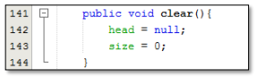

### JOBSHEET <P> Double Linked Lists

### Mohammad Izamul FIkri Fahmi <p> TI-1F <p> 17/2141720171

#### 12.1 Tujuan Praktikum
Setelah melakukan praktikum ini, mahasiswa mampu:
1. memahami algoritma double linked lists;
2. membuat dan mendeklarasikan struktur algoritma double linked lists;
3. menerapkan algoritma double linked lists dalam beberapa study case.

#### 12.2 Kegiatan Praktikum 1
#### 12.2.1 Percobaan 1
Pada percobaan 1 ini akan dibuat class Node dan class DoubleLinkedLists yang didalamnya
terdapat operasi-operasi untuk menambahkan data dengan beberapa cara (dari bagian depan linked
list, belakang ataupun indeks tertentu pada linked list).
1. Perhatikan diagram class Node dan class DoublelinkedLists di bawah ini! Diagram class ini yang
selanjutnya akan dibuat sebagai acuan dalam membuat kode program DoubleLinkedLists.


2. Buat paket baru dengan nama doublelinkedlists
3. Buat class di dalam paket tersebut dengan nama Node


4. Di dalam class tersebut, deklarasikan atribut sesuai dengan diagram class di atas.


5. Selanjutnya tambahkan konstruktor default pada class Node sesuai diagram di atas.


6. Buatlah sebuah class baru bernama DoubleLinkedLists pada package yang sama dengan node
seperti gambar berikut:


7. Pada class DoubleLinkedLists tersebut, deklarasikan atribut sesuai dengan diagram class di atas.


8. Selajuntnya, buat konstruktor pada class DoubleLinkedLists sesuai gambar berikut.


9. Buat method isEmpty(). Method ini digunakan untuk memastikan kondisi linked list kosong.


10. Kemudian, buat method addFirst(). Method ini akan menjalankan penambahan data di bagian
depan linked list.


11. Selain itu pembuatan method addLast() akan menambahkan data pada bagian belakang linked
list.


12. Untuk menambakan data pada posisi yang telah ditentukan dengan indeks, dapat dibuat dengan
method add(int item, int index)


13. Jumlah data yang ada di dalam linked lists akan diperbarui secara otomatis,sehingga dapat dibuat
method size() untuk mendapatkan nilai dari size.


14. Selanjutnya dibuat method clear() untuk menghapus semua isi linked lists, sehingga linked lists
dalam kondisi kosong.



15. Untuk mencetak isi dari linked lists dibuat method print(). Method ini akan mencetak isi linked
lists berapapun size-nya. Jika kosong akan dimunculkan suatu pemberitahuan bahwa linked lists
dalam kondisi kosong.


16. Selanjutya dibuat class Main DoubleLinkedListsMain untuk mengeksekusi semua method yang
ada pada class DoubleLinkedLists.


17. Pada main class pada langkah 16 di atas buatlah object dari class DoubleLinkedLists kemudian
eksekusi potongan program berikut ini.


#### Kode Program Node.java
```java
package doublelinkedlists;

public class Node {
    int data;
    Node prev, next;

    Node(Node prev, int data, Node next) {
        this.prev = prev;
        this.data = data;
        this.next = next;
    }
}
```
#### Kode Program DoubleLinkedLists.java
```java
package doublelinkedlists;

public class DoubleLinkedLists {
    Node head;
    int size;

    public DoubleLinkedLists() {
        head = null;
        size = 0;
    }

    public boolean isEmpty() {
        return head == null;
    }

    public void addFirst(int item) {
        if(isEmpty()) {
            head = new Node(null, item, null);
        } else {
            Node newNode = new Node(null, item, head);
            head.prev = newNode;
            head = newNode;
        }
        size++;
    }

    public void addLast(int item) {
        if (isEmpty()) {
            addFirst(item);
        } else {
            Node current = head;
            while (current.next != null) {
                current = current.next;
            }
            Node newNode = new Node(current, item, null);
            current.next = newNode;
            size++;
        }
    }

    public void add(int item, int index) throws Exception {
        if (isEmpty()) {
            addFirst(item);
        } else if (index < 0 || index > size) {
            throw new Exception("Nilai indeks di luar batas");
        } else {
            Node current = head;
            int i = 0;
            while (i < index) {
                current = current.next;
                i++;            
            }
            if (current.prev == null) {
                Node newNode = new Node(null, item, current);
                current.prev = newNode;
                head = newNode;
            } else {
                Node newNode = new Node(current.prev, item, current);
                newNode.prev = current.prev;
                newNode.next = current;
                current.prev.next = newNode;
                current.prev = newNode;
            }
        }
        size++;
    }

    public int size  () {
        return size;
    }

    public void clear() {
        head = null;
        size = 0;
    }

    public void print() {
        if (!isEmpty()) {
            Node tmp = head;
            while (tmp != null) {
                System.out.print(tmp.data+"\t");
                tmp = tmp.next;
            }
            System.out.println("\nberhasil diisi");
        } else {
            System.out.println("Linked Lists Kosong");
        }
    }
}
```
#### Kode Program DoubleLInkedlListsMain.java
```java
package doublelinkedlists;

public class DoubleLinkedListsMain {
    public static void main(String[] args) throws Exception {
        DoubleLinkedLists dll = new DoubleLinkedLists();
        dll.print();
        System.out.println("Size : "+dll.size());
        System.out.println("===================================");
        dll.addFirst(3);
        dll.addLast(4);
        dll.addFirst(7);
        dll.print();
        System.out.println("Size : "+dll.size());
        System.out.println("===================================");
        dll.add(40,1);
        dll.print();
        System.out.println("Size : "+dll.size());
        System.out.println("===================================");
        dll.clear();
        dll.print();
        System.out.println("Size : "+dll.size());
    }
}
```

#### 12.2.2 Verifikasi Hasil Percobaan 
Verifikasi hasil kompilasi kode program Anda dengan gambar berikut ini.


#### Hasil Kompilasi Kode Program 


#### 12.2.3 Pertanyaan Percobaan
1. Jelaskan perbedaan antara single linked list dengan double linked lists!

Jawab :

Yang menjadi pembeda adalah Single Linked List hanya memiliki satu pointer saja yang mana pointer tersebut mengarah pada node selanjutnya, Sedangkan pada Double Linked List ada dua pointer yaitu yang pointer menunjuk pada sebelumnya node dan satunya menunjuk pada node selanjutnya.

2. Perhatikan class Node, didalamnya terdapat atribut next dan prev. Untuk apakah atribut tersebut?

Jawab :

Seperti namanya Double Linked List, jadi atribut next dan prev adalah sebagai pointer, yang mana next sebagai pointer untuk node setelahnya/selanjutnya, sedangkan prev adalah untuk menunjuk node sebelumnya.

3. Perhatikan konstruktor pada class DoubleLinkedLists. Apa kegunaan inisialisasi atribut head dan
size seperti pada gambar berikut ini?


Jawab :

Jadi ketika proses inisialisasi Double Linked list, kondisi awal Double Linked List akan bernilai kosong atau null. Seperti pada kode program tersebut yang mana head akan bermilai null, dan size dari DLL bernilai 0.

4. Pada method addFirst(), kenapa dalam pembuatan object dari konstruktor class Node prev
dianggap sama dengan null?


Jawab :

Karena DLL memiliki dua pointer, maka itu juga berarti pada kondisi head, head memiliki prev yang menunjuk pada null, selayaknya tail yang memiliki next yang menunjuk pada null, jadi ketika melakukan method addFirst(), maka akan menjadi head baru, dan prev dari item tersebut menunjuk pada null.

5. Perhatikan pada method addFirst(). Apakah arti statement head.prev = newNode ?

Jawab :

Untuk memberikan nilai pada pada head.prev yang sebelumnya null, menjadi newNode, dan kemudian si newNode ini akan menjadi head baru.

6. Perhatikan isi method addLast(), apa arti dari pembuatan object Node dengan mengisikan
parameter prev dengan current, dan next dengan null?


Jawab :

jadi untuk item saat ini berada atau current, akan menjadi nilai prev data baru yang akan ditambahkan, jadinya data baru yang ditambahkan pada last, akan menjadi tail baru, dan tail sebelumnya jadi prev item baru.

#### 12.3 Kegiatan Praktikum 2
#### 12.3.1 Tahapan Percobaan
Pada praktikum 2 ini akan dibuat beberapa method untuk menghapus isi LinkedLists pada
class DoubleLinkedLists. Penghapusan dilakukan dalam tiga cara di bagian paling depan, paling
belakang, dan sesuai indeks yang ditentukan pada linkedLists. Method tambahan tersebut akan
ditambahkan sesuai pada diagram class berikut ini.


1. Buatlah method removeFirst() di dalam class DoubleLinkedLists.


2. Tambahkan method removeLast() di dalam class DoubleLinkedLists.


3. Tambahkan pula method remove(int index) pada class DoubleLinkedLists dan amati hasilnya.


4. Untuk mengeksekusi method yang baru saja dibuat, tambahkan potongan kode program
berikut pada main class.


#### Kode Program DoubleLinkedLists.java
```java
   public void removeFirst() throws Exception {
        if (isEmpty()) {
            throw new Exception("Linked List Masih Kosong, Tidak Dapat Dihapus");
        } else if (size == 1) {
            removeLast();
        } else {
            head = head.next;
            head.prev = null;
            size--;
        }
    }

    public void removeLast() throws Exception {
        if (isEmpty()) {
            throw new Exception("Linked List Masih Kosong Tidak Dapat Dihapus");
        } else if (head.next == null) {
            head = null;
            size--;
            return;
        }
        Node2 current = head;
        while (current.next.next != null) {
            current = current.next;
        }
        current.next = null;
        size--;
    }

    public void remove(int index) throws Exception {
        if (isEmpty() || index >= size) {
            throw new Exception("Nilai indeks di luar batas");
        } else if (index == 0) {
            removeFirst();
        } else {
            Node2 current = head;
            int i = 0;
            while (i < index) {
                current = current.next;
                i++;
            }
            if (current.next = null) {
                current.prev.next = null;
            } else if (current.prev == null) {
                current = current.next;
                current.prev = null;
                head = current;
            } else {
                current.prev.next = current.next;
                current.next.prev = current.prev;
            }
            size--;
        }
    }
```

#### Kode Program DoubleLInkedListsMain.java
```java
        dll.addLast(50);
        dll.addLast(40);
        dll.addLast(10);
        dll.addLast(20);
        dll.print();
        System.out.println("Size : " + dll.size());
        System.out.println("===================================");
        dll.removeFirst();
        dll.print();
        System.out.println("Size : " + dll.size());
        System.out.println("===================================");
        dll.removeLast();
        dll.print();
        System.out.println("Size : " + dll.size());
        System.out.println("===================================");
        dll.remove(1);
        dll.print();
        System.out.println("Size : " + dll.size());
```

#### 12.3.2 Verifikasi Hasil Percobaan
Verifikasi hasil kompilasi kode program Anda dengan gambar berikut ini.


#### Hasil Kompilasi Kode Program


#### 12.3.3 Pertanyaan Percobaan
1. Apakah maksud statement berikut pada method removeFirst()?


Jawab :

Jadi ketika proses penghapusan adalah dengan cara mengskip data yang dihapus, maka ketika dilakukan removeFirst, yang terjadi adalah tidak mengganggap nilai head yang lama, dan menggantikannya dengan head.next dan akan menjadi head baru, dan nilai prev akan bernilai null.

2. Bagaimana cara mendeteksi posisi data ada pada bagian akhir pada method removeLast()?

Jawab :

Yang dilakukan pertama adalah mengecek apakah data kosong, jika iya maka tidak akan bisa melakukan penghapusan dan akan menampilkan pesan, kemudian mengecek apakah data hanya berisi head, jika iya maka head akan diberi nilai null, dan kemudia jika dua syarat tadi tidak terpenuhi,
maka akan dilakukan pemberian nilai current dengan head, kemudian dilakukan perulangan dengan while untuk mengecek apakah nilai current.next.next != null, jika memenuhi syarat tersebut, maka current akan diinisialisasi dengan current.next terus sampai syarat perulangan while berhenti, kemudian jika sudah, maka nilai dari current.next akan diganti menjadi null.
dan setiap proses penghapusan, akan menjadikan nilai size--.

3. Jelaskan alasan potongan kode program di bawah ini tidak cocok untuk perintah remove!


Jawab :

Potongan tersebut lebih cocok untuk menghapus first, karena tmp menampung data head.next, serta kemudian head.next yang menunjuk pada tmp.next, selanjutnya tmp.next.prevnya diberi nilai head, yang ini ini membingungkan dan tidak jelas, jadi kurang cocok jika untuk remove.


4. Jelaskan fungsi kode program berikut ini pada fungsi remove!


Jawab :

Pointer next pada current sebelumnya akan menunjuk pada current.next/data selanjutnya, kemudian pointer pprev/sebelumnya pada current next/selanjutnya akan menunjuk pada current sebelumnya.

#### 12.4 Kegiatan Praktikum 3
#### 12.4.1 Tahapan Percobaan
Pada praktikum 3 ini dilakukan uji coba untuk mengambil data pada linked list dalam 3
kondisi, yaitu mengambil data paling awal, paling akhir dan data pada indeks tertentu dalam
linked list. Method mengambil data dinamakan dengan get. Ada 3 method get yang dibuat pada
praktikum ini sesuai dengan diagram class DoubleLinkedLists.


1. Buatlah method getFirst() di dalam class DoubleLinkedLists untuk mendapatkan data pa


2. Selanjutnya, buatlah method getLast() untuk mendapat data pada akhir linked lists.


3. Method get(int index) di buat untuk mendapatkan data pada indeks tertentu


4. Pada main class tambahkan potongan program berikut dan amati hasilnya!


#### Kode DoubleLinkedLists.java modifikasi
```java
package doublelinkedlists;

public class DoubleLinkedLists2 {
    Node2 head;
    int size;

    public DoubleLinkedLists2() {
        head = null;
        size = 0;
    }

    public boolean isEmpty() {
        return head == null;
    }

    public void addFirst(int item) {
        if(isEmpty()) {
            head = new Node2(null, item, null);
        } else {
            Node2 newNode = new Node2(null, item, head);
            head.prev = newNode;
            head = newNode;
        }
        size++;
    }

    public void addLast(int item) {
        if (isEmpty()) {
            addFirst(item);
        } else {
            Node2 current = head;
            while (current.next != null) {
                current = current.next;
            }
            Node2 newNode = new Node2(current, item, null);
            current.next = newNode;
            size++;
        }
    }

    public void add(int item, int index) throws Exception {
        if (isEmpty()) {
            addFirst(item);
        } else if (index < 0 || index > size) {
            throw new Exception("Nilai indeks di luar batas");
        } else {
            Node2 current = head;
            int i = 0;
            while (i < index) {
                current = current.next;
                i++;            
            }
            if (current.prev == null) {
                Node2 newNode = new Node2(null, item, current);
                current.prev = newNode;
                head = newNode;
            } else {
                Node2 newNode = new Node2(current.prev, item, current);
                newNode.prev = current.prev;
                newNode.next = current;
                current.prev.next = newNode;
                current.prev = newNode;
            }
        }
        size++;
    }

    public int size  () {
        return size;
    }

    public void clear() {
        head = null;
        size = 0;
    }

    public void print() {
        if (!isEmpty()) {
            Node2 tmp = head;
            while (tmp != null) {
                System.out.print(tmp.data+"\t");
                tmp = tmp.next;
            }
            System.out.println("\nberhasil diisi");
        } else {
            System.out.println("Linked Lists Kosong");
        }
    }

    public void removeFirst() throws Exception {
        if (isEmpty()) {
            throw new Exception("Linked List Masih Kosong, Tidak Dapat Dihapus");
        } else if (size == 1) {
            removeLast();
        } else {
            head = head.next;
            head.prev = null;
            size--;
        }
    }

    public void removeLast() throws Exception {
        if (isEmpty()) {
            throw new Exception("Linked List Masih Kosong Tidak Dapat Dihapus");
        } else if (head.next == null) {
            head = null;
            size--;
            return;
        }
        Node2 current = head;
        while (current.next.next != null) {
            current = current.next;
        }
        current.next = null;
        size--;
    }

    public void remove(int index) throws Exception {
        if (isEmpty() || index >= size) {
            throw new Exception("Nilai indeks di luar batas");
        } else if (index == 0) {
            removeFirst();
        } else {
            Node2 current = head;
            int i = 0;
            while (i < index) {
                current = current.next;
                i++;
            }
            if (current.next == null) {
                current.prev.next = null;
            } else if (current.prev == null) {
                current = current.next;
                current.prev = null;
                head = current;
            } else {
                current.prev.next = current.next;
                current.next.prev = current.prev;
            }
            size--;
        }
    }

    public int getFirst() throws Exception {
        if (isEmpty()) {
            throw new Exception("Linked List Kosong");
        }
        return head.data;
    }

    public int getLast() throws Exception {
        if (isEmpty()) {
            throw new Exception("Linked List Kosong");
        }
        Node2 tmp = head;
        while (tmp.next != null) {
            tmp = tmp.next;
        }
        return tmp.data;
    }

    public int get(int index) throws Exception {
    if (isEmpty() || index >= size) {
        throw new Exception("Nilai indeks di luar batas.");
    }
    Node2 tmp = head;
    for (int i = 0; i < index; i++) {
        tmp = tmp.next;
    }
    return tmp.data;
    }
}
```
#### Kode DoubleLinkedListsMain.java modifikasi
```java
package doublelinkedlists;

public class DoubleLinkedListsMain2 {
    public static void main(String[] args) throws Exception {
        DoubleLinkedLists2 dll = new DoubleLinkedLists2();
        dll.print();
        System.out.println("Size : "+dll.size());
        System.out.println("===================================");
        dll.addFirst(3);
        dll.addLast(4);
        dll.addFirst(7);
        dll.print();
        System.out.println("Size : "+dll.size());
        System.out.println("===================================");
        dll.add(40,1);
        dll.print();
        System.out.println("Size : "+dll.size());
        System.out.println("===================================");
        System.out.println("Data awal pada Linked Lists adalah : " + dll.getFirst());
        System.out.println("Data awal pada Linked Lists adalah : " + dll.getLast());
        System.out.println("Data awal pada Linked Lists adalah : " + dll.get(1));
    }
}
```

#### 12.4.2 Verifikasi Hasil Percobaan
Verifikasi hasil kompilasi kode program Anda dengan gambar berikut ini.


#### Hasil Kompilasi Kode Program


#### 12.4.3 Pertanyaan Percobaan
1. Jelaskan method size() pada class DoubleLinkedLists!

Jawab :

Digunakan untuk mereturn nilai size yang mana tergantung dari isi DoubleLinkedLists, misal DLL masih kosong maka size akan mereturn 0.

2. Jelaskan cara mengatur indeks pada double linked lists supaya dapat dimulai dari indeks ke1!

Jawab :

Yaitu ketika pada perulangan menginisialisasi awal dari perulangan adalah dengan 1 bukan dengan 0.

3. Jelaskan perbedaan karakteristik fungsi Add pada Double Linked Lists dan Single Linked Lists!

Jawab :

Perbedaan mendasar adalah, pada add single linked lists, Memiliki beberapa operasi add, seperti : insertAt, insertBefore,insertAfter. Sedangkan pada double linked lists menjadi satu fungsi saja dengan menggunakan indeks, juga indeks yang ditambahkan bisa disisipkan di awal ataupun di akhir.

4. Jelaskan perbedaan logika dari kedua kode program di bawah ini!


Jawab :

Pada program A, yaitu method boolean, yang akan return nilai true jika size == 0, dan akan false ktika size tidak sama dengan 0. sedangkan pada B, ketika head == null, maka akan mereturn nilai true.

#### 12.5 Tugas Praktikum
1. Buat program antrian vaksinasi menggunakan queue berbasis double linked list sesuai ilustrasi
dan menu di bawah ini! (counter jumlah antrian tersisa di menu cetak(3) dan data orang yang
telah divaksinasi di menu Hapus Data(2) harus ada)
Ilustrasi Program


Jawab :

#### Vaksin.java
```java
package Tugas1;

public class Vaksin {
    int antrian;
    String nama;
    Vaksin prev, next;

    Vaksin(Vaksin prev, int antrian, String nama, Vaksin next) {
        this.prev = prev;
        this.antrian = antrian;
        this.nama = nama;
        this.next = next;
    }
}
```
#### VaksinDLL.java
```java
package Tugas1;

public class VaksinDLL {
    
    Vaksin head;
    int size;
    
    public VaksinDLL() {
        head = null;
        size = 0;
    }

    public boolean isEmpty() {
        return head == null;
    }

    public void tambah(int no, String nama) {
        if(isEmpty()) {
            head = new Vaksin(null, no, nama, null);
        } else {
        Vaksin current = head;
        while (current.next != null) {
            current = current.next;
        }
        Vaksin newNode = new Vaksin(current, no, nama, null);
        current.next = newNode;
        }
        size++;
    }

    public void hapus() throws Exception {
        if (isEmpty()) {
            throw new Exception("Antrian Masih Kosong");
        } else {
            System.out.println(head.nama + " telah selesai vaksinasi");
            head = head.next;
            head.prev = null;
            size--;
        }
    }

    public void print() {
        if (!isEmpty()) {
            Vaksin tmp = head;
            System.out.println("|No.\t|Nama\t|");
            while (tmp != null) {
                System.out.println("|"+tmp.antrian+"\t|"+tmp.nama+"\t|");
                tmp = tmp.next;
            }
            System.out.println("Sisa Antrian : "+size);
        } else {
            System.out.println("Antrian Masih Kosong");
        }
    }
}
```
#### VaksinMain.java
```java
package Tugas1;
import java.util.Scanner;
public class VaksinMain {
    public static void main(String[] args) throws Exception{
        VaksinDLL vk = new VaksinDLL();
        Scanner sc = new Scanner(System.in);
        int opsi;
        do {
            System.out.println("+++++++++++++++++++++++++++++");
            System.out.println("PENGANTRI VAKSIN EXTRAVAGANZA");
            System.out.println("+++++++++++++++++++++++++++++");
            System.out.println();

            System.out.println("1. Tambah Data Penerima Vaksin");
            System.out.println("2. Hapus Data Pengantri vaksin");
            System.out.println("3. Daftar Penerima Vaksin");
            System.out.println("4. Keluar");
            System.out.println("+++++++++++++++++++++++++++++");
            System.out.print("pilihan anda : ");
            opsi = sc.nextInt();

            switch(opsi) {
                case 1:
                System.out.println("-----------------------------");
                System.out.println("Masukkan Data Penerima Vaksin");
                System.out.println("-----------------------------");
                System.out.println("Nomor Antrian:");
                int antri = sc.nextInt();
                sc.nextLine();
                System.out.println("-Nama Antrian:");
                String nama = sc.nextLine();
                vk.tambah(antri, nama);
                break;
                
                case 2:
                vk.hapus();
                break;

                case 3:
                System.out.println("++++++++++++++++++++++++");
                System.out.println("Daftar Pengantri Vaksin");
                System.out.println("++++++++++++++++++++++++");
                vk.print();
                break;

                case 4:
                System.out.println("Anda Keluar Program");
                break;

                default:
                System.out.println("Masukkan pilihan dengan benar");
                break;
            }
        } while (opsi!=4);
        System.out.println("Terimakasih ^_^"); 
    }
}
```

#### Hasil Compile


2. Buatlah program daftar film yang terdiri dari id, judul dan rating menggunakan double linked
lists, bentuk program memiliki fitur pencarian melalui ID Film dan pengurutan Rating secara
descending. Class Film wajib diimplementasikan dalam soal ini.
Contoh Ilustrasi Program
Menu Awal dan Penambahan Data


#### Kode Program Film.java
```java
package Tugas2;
public class Film {
    Film prev, next;
    int id;
    String judul;
    float rating;

    Film(Film p, int id, String judul, float rating, Film n){
        this.prev = p;
        this.id = id;
        this.judul = judul;
        this.rating = rating;
        this.next = n;
    }
}
```

#### Kode Program FilmDLL.java
```java
package Tugas2;

public class FilmDLL {

    Film head;
    int size;

    public FilmDLL() {
        head = null;
        size = 0;
    }

    public boolean isEmpty() {
        return head == null;
    }

    // tambah data awal
    public void addFirst(int id, String j, float r) {
        if(isEmpty()) {
            head = new Film(null, id, j, r, null);
        } else {
            Film newNode = new Film(null, id, j, r, head);
            head.prev=newNode;
            head = newNode;
        }
        size++;
    }

    // tambah data akhir
    public void addLast(int id, String j, float r) {
        if(isEmpty()) {
            addFirst(id, j, r);
        } else {
            Film current = head;
            while (current.next != null) {
                current = current.next;
            }
            Film newNode = new Film(current, id, j, r, null);
            current.next = newNode;
            size++;
        }
    }

    // tambah data index tertentu
    public void add(int id, String j, float r, int idx) throws Exception {
        if(isEmpty()) {
            addFirst(id, j, r);
        } else if (idx<0||idx>size) {
            throw new Exception("Nilai Indeks Tidak Valid");
        } else {
            Film current = head;
            int i = 0;
            while (i<idx) {
                current = current.next;
                i++;
            }
            if (current.prev == null) {
                Film newNode = new Film(null, id, j, r, current);
                current.prev = newNode;
                head = newNode;
            } else {
                Film newNode = new Film(current.prev, id, j, r, current);
                newNode.prev = current.prev;
                newNode.next = current;
                current.prev.next = newNode;
                current.prev = newNode;
            }
        }
        size++;
    }

    // hapus data pertama
    public void removeFirst() throws Exception {
        if (isEmpty()) {
            throw new Exception("List Film Masih Kosong, Tidak Dapat Dihapus");
        } else if (size == 1) {
            removeLast();
        } else {
            head = head.next;
            head.prev = null;
            size--;
            System.out.println("Data Berhasil diHapus");
        }
    }

    // hapus data terakhir
    public void removeLast() throws Exception {
        if (isEmpty()) {
            throw new Exception("List Film Masih Kosong Tidak Dapat Dihapus");
        } else if (head.next == null) {
            head = null;
            size--;
            System.out.println("Data Berhasil diHapus");
            return;
        }
        Film current = head;
        while (current.next.next != null) {
            current = current.next;
        }
        current.next = null;
        System.out.println("Data Berhasil diHapus");
        size--;
    }

    // hapus data tertentu (disini saya menggunakan indeks)
    public void remove(int index) throws Exception {
        if (isEmpty() || index >= size) {
            throw new Exception("Nilai indeks di luar batas");
        } else if (index == 0) {
            removeFirst();
        } else {
            Film current = head;
            int i = 0;
            while (i < index) {
                current = current.next;
                i++;
            }
            if (current.next == null) {
                current.prev.next = null;
            } else if (current.prev == null) {
                current = current.next;
                current.prev = null;
                head = current;
            } else {
                current.prev.next = current.next;
                current.next.prev = current.prev;
            }
            size--;
        }
    }

    // cetak
    public void print() {
        if (!isEmpty()) {
            Film tmp = head;
            System.out.println("++++++++++++++");
            System.out.println("| Cetak Data |");
            System.out.println("++++++++++++++");
            while (tmp != null) {
                System.out.println("ID : " + tmp.id);
                System.out.println("  Judul Film : " +tmp.judul);
                System.out.println("  Rating : " +tmp.rating);
                tmp = tmp.next;
            }
        } else {
            System.out.println("List Film Kosong");
        }
    }

    // cari id film
    public void cariId(int id) throws Exception {
        if(isEmpty()) {
            throw new Exception("List Kosong, Data Tidak Dapat Dicari");
        } else {
            Film current = head;
            int i = 0;
            while (id != current.id && !(i>size)) {
                current = current.next;
                i++;
            }
            if (i > size) {
                System.out.println("Data Tidak Ditemukan");
            } else {
                System.out.println("Data ID FILM  : "+id+" Berada di Node ke-"+i);
                System.out.println("IDENTITAS:");
                System.out.println(" ID Film     : "+current.id);
                System.out.println(" Judul Film  : "+current.judul);
                System.out.println(" IMDB Rating : "+current.rating);
            }
        }
    }

    // urut data rating film-desc
    public void sort(){
        Film current = null;
        Film idx = null;
        int tmpid;
        String tmpjudul;
        float tmprating;

        if(head == null) {
            System.out.println("List Film Kosong");
        } else {
            for(current = head; current.next != null; current = current.next) {
                for(idx = current.next; idx != null; idx = idx.next) {
                    //swap
                    if(current.rating<idx.rating) {
                        tmpid = current.id;
                        current.id = idx.id;
                        idx.id = tmpid;

                        tmpjudul = current.judul;
                        current.judul = idx.judul;
                        idx.judul = tmpjudul;

                        tmprating = current.rating;
                        current.rating = idx.rating;
                        idx.rating = tmprating;
                    }
                }
            }
        }
    }

    // keluar
    public void keluar() {
        System.out.println("Terimakasih Sudah Menggunakan Program Kami ^_^");
    }
}
```

#### Kode Program FilmMain.java
```java
package Tugas2;
import java.util.Scanner;
public class FilmMain {

    public static void menu() {
        System.out.println("=======================================");
        System.out.println("     DATA FILM DI ZAM LAYAR LEBAR");
        System.out.println("=======================================");
        System.out.println(" 1. Tambah Data Awal");
        System.out.println(" 2. Tambah Data Akhir");
        System.out.println(" 3. Tambah Data Index Tertentu");
        System.out.println(" 4. Hapus Data Pertama");
        System.out.println(" 5. Hapus Data Terakhir");
        System.out.println(" 6. Hapus Data Tertentu (pakai Index)");
        System.out.println(" 7. Cetak");
        System.out.println(" 8. Cari ID Film");
        System.out.println(" 9. Urut Data Rating Film-DESC");
        System.out.println(" 10. Keluar");
        System.out.println("=======================================");
    }
    public static void main(String[] args) throws Exception{
    Scanner sc = new Scanner(System.in);
    FilmDLL f = new FilmDLL();
    int opsi = 0;
    int id,idx;
    String judul;
    float rating;

    do {
        menu();
        System.out.print("Masukkan Opsi : ");
        opsi = sc.nextInt();
        System.out.println();

        switch(opsi) {
            case 1:
            System.out.println("-- Menambahkan Data Film di Awal --");
            System.out.print("ID Film     : ");
            id = sc.nextInt();
            sc.nextLine();
            System.out.print("Judul Film  : ");
            judul = sc.nextLine();
            System.out.print("Rating Film : ");
            rating = sc.nextFloat();
            f.addFirst(id, judul, rating);
            break;

            case 2:
            System.out.println("-- Menambahkan Data Film di Akhir --");
            System.out.print("ID Film     : ");
            id = sc.nextInt();
            sc.nextLine();
            System.out.print("Judul Film  : ");
            judul = sc.nextLine();
            System.out.print("Rating Film : ");
            rating = sc.nextFloat();
            f.addLast(id, judul, rating);
            break;

            case 3:
            System.out.println("-- Menambahkan Data Film di Index Tertentu --");
            System.out.print("ID Film     : ");
            id = sc.nextInt();
            sc.nextLine();
            System.out.print("Judul Film  : ");
            judul = sc.nextLine();
            System.out.print("Rating Film : ");
            rating = sc.nextFloat();
            System.out.println("Index Ke  : ");
            idx = sc.nextInt();
            f.add(id, judul, rating, idx);
            break;

            case 4:
            f.removeFirst();
            break;

            case 5:
            f.removeLast();
            break;

            case 6:
            System.out.println("-- Menghapus Data Film di Index tertentu --");
            System.out.print("Masukkan index : ");
            idx = sc.nextInt();
            f.remove(idx);
            break;

            case 7:
            f.print();
            break;

            case 8:
            System.out.println("-- Mencari ID Film --");
            System.out.print("Masukkan ID : ");
            id = sc.nextInt();
            f.cariId(id);
            break;

            case 9:
            f.sort();
            System.out.println("-- Data Sudah diUrutkan Descending -- ");
            break;

            case 10:
            f.keluar();
            break;

            default:
            System.out.println("Masukkan Opsi Dengan Benar :)");
        }
    }  while(opsi!=10);
    }
```

#### Hasil Compile


### Terimakasih