### JOBSHEET XIII
### TREE

### Mohammad Izamul Fikri Fahmi
### TI-1F
### 17
### 2141720171

#### 1. Tujuan Praktikum
Setelah melakukan praktikum ini, mahasiswa mampu:
1. memahami model Tree khususnya Binary Tree
2. membuat dan mendeklarasikan struktur algoritma Binary Tree.
3. menerapkan dan mengimplementasikan algoritma Binary Tree dalam kasus
Binary Search Tree

#### 2. Praktikum
#### 2.1 Implementasi Binary Search Tree menggunakan Linked List
#### 2.1.1 Tahapan percobaan
Waktu Percobaan (45 menit)
Pada percobaan ini akan diimplementasikan Binary Search Tree dengan operasi dasar,
dengan menggunakan array (praktikum 2) dan linked list (praktikum 1). Sebelumnya,
akan dibuat class Node, dan Class BinaryTree

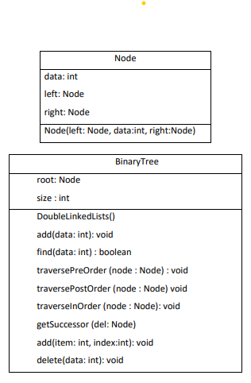

1. Buatlah class Node, BinaryTree dan BinaryTreeMain
2. Di dalam class Node, tambahkan atribut data, left dan right, serta konstruktor
default dan berparameter.

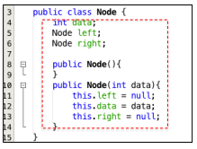

3. Di dalam class BinaryTree, tambahkan atribut root.

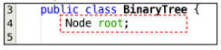

4. Tambahkan konstruktor default dan method isEmpty() di dalam class BinaryTree

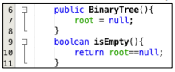

5. Tambahkan method add() di dalam class BinaryTree. Di bawah ini proses
penambahan node tidak dilakukan secara rekursif, agar lebih mudah dilihat alur
proses penambahan node dalam tree. Sebenarnya, jika dilakukan dengan proses
rekursif, penulisan kode akan lebih efisien.

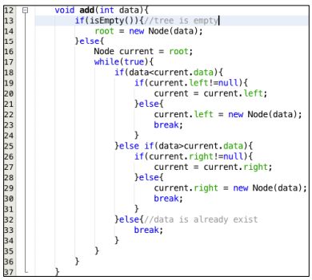

6. Tambahkan method find(


7. Tambahkan method traversePreOrder(), traverseInOrder() dan
traversePostOrder(). Method traverse digunakan untuk mengunjungi dan
menampilkan node-node dalam tree, baik dalam mode pre-order, in-order
maupun post-order.

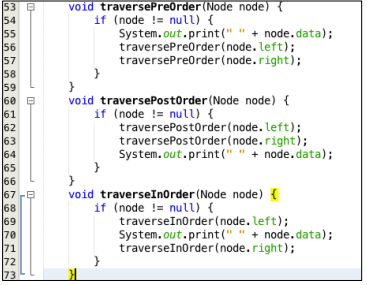

8. Tambahkan method getSuccessor(). Method ini akan digunakan ketika proses
penghapusan node yang memiliki 2 child.

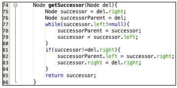

9. Tambahkan method delete().


Di dalam method delete tambahkan pengecekan apakah tree kosong, dan jika tidak
cari posisi node yang akan di hapus.

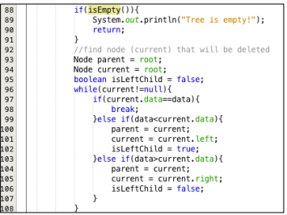

Kemudian tambahkan proses penghapusan terhadap node current yang telah
ditemukan.

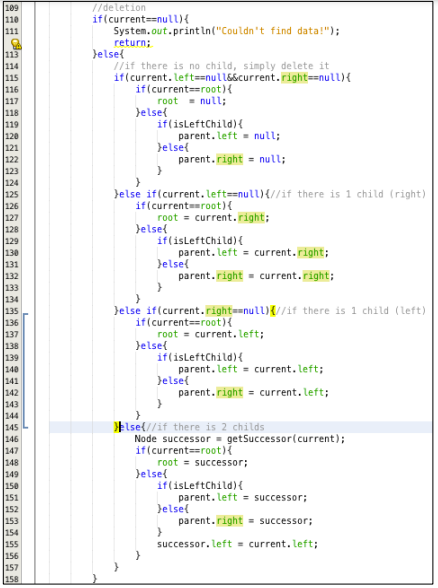

10. Buka class BinaryTreeMain dan tambahkan method main()

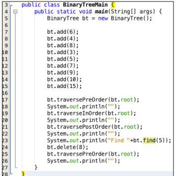

11. Compile dan jalankan class BinaryTreeMain untuk mendapatkan simulasi jalannya
program tree yang telah dibuat.
12. Amati hasil running tersebut

#### Kode Program Node.java
```java
package Praktikum_1;

public class Node {
    int data;
    Node left;
    Node right;

    public Node () {

    }

    public Node (int data) {
        this.left = null;
        this.data = data;
        this.right = null;
    }
}
```

#### Kode Program BinaryTree.java
```java
package Praktikum_1;

public class BinaryTree {
    Node root;
    int size;

    public BinaryTree() {
        root = null;
    }
    boolean isEmpty() {
        return root == null;
    }

    void add(int data) {
        if(isEmpty()) { // tree is empty
            root = new Node(data);
        } else {
            Node current = root;
            while(true) {
                if(data < current.data) {
                    if(current.left!=null) {
                        current = current.left;
                    } else {
                        current.left = new Node(data);
                        break;
                    }
                } else if (data>current.data) {
                    if(current.right!=null) {
                        current = current.right;
                    } else {
                        current.right = new Node(data);
                        break;
                    }
                } else { // data is already exist
                    break;
                }
            }
        }
    }

    boolean find(int data) {
        boolean hasil = false;
        Node current = root;
        while(current!=null) {
            if(current.data == data) {
                hasil = true;
                break;
            } else if (data < current.data) {
                current = current.left;
            } else {
                current = current.right;
            }
        }
        return hasil;
    }

    void traversePreOrder(Node node) {
        if (node != null) {
            System.out.print(" " + node.data);
            traversePreOrder(node.left);
            traversePreOrder(node.right);
        }
    }

    void traversePostOrder(Node node) {
        if (node != null) {
            traversePostOrder(node.left);
            traversePostOrder(node.right);
            System.out.print(" " + node.data);
        }
    }

    void traverseInOrder(Node node) {
        if (node != null) {
            traverseInOrder(node.left);
            System.out.print(" " + node.data);
            traverseInOrder(node.right);
        }
    }

    Node getSuccessor(Node del) {
        Node successor = del.right;
        Node successorParent = del;
        while(successor.left != null) {
            successorParent = successor;
            successor = successor.left;
        }
        if(successor != del.right) {
            successorParent.left = successor.right;
            successor.right = del.right;
        }
        return successor;
    }

    void delete(int data) {
        if(isEmpty()) {
            System.out.println("Tree is empty!");
            return;
        }
        // find node (current) that will be deleted
        Node parent = root;
        Node current = root;
        boolean isLeftChild = false;
        while(current!=null) {
            if(current.data == data) {
                break;
            } else if(data<current.data) {
                parent = current;
                current = current.left;
                isLeftChild = true;
            } else if (data>current.data) {
                parent = current;
                current = current.right;
                isLeftChild = false;
            }
        }
        //deletion
        if(current==null) {
            System.out.println("Couldn't find data!");
            return;
        } else {
            //if there is no child, simply delete it
            if(current.left == null&&current.right == null) {
                if(current==root) {
                    root = null;
                } else {
                    if(isLeftChild) {
                        parent.left = null;
                    } else {
                        parent.right = null;
                    }
                }
            } else if(current.left==null) {//if there is 1 child (right)
                if(current==root) {
                    root = current.right;
                } else {
                    if(isLeftChild) {
                        parent.left = current.left;
                    } else {
                        parent.right = current.left;
                    }
                }
            } else {// if there is 2 childs
                Node successor = getSuccessor(current);
                if(current==root) {
                    root = successor;
                } else {
                    if(isLeftChild) {
                        parent.left = successor;
                    } else {
                        parent.right = successor;
                    }
                    successor.left = current.left;
                }
            }
        }
    }
}
```

#### Kode Program BinaryTreeMain.java
```java
package Praktikum_1;

public class BinaryTreeMain {
    public static void main(String[] args) {
        BinaryTree bt = new BinaryTree();

        bt.add(6);
        bt.add(4);
        bt.add(8);
        bt.add(3);
        bt.add(5);
        bt.add(7);
        bt.add(9);
        bt.add(10);
        bt.add(15);

        bt.traversePreOrder(bt.root);
        System.out.println("");
        bt.traverseInOrder(bt.root);
        System.out.println("");
        bt.traversePostOrder(bt.root);
        System.out.println("");
        System.out.println("Find "+bt.find(5));
        bt.delete(8);
        bt.traversePreOrder(bt.root);
        System.out.println("");
    }
}
```

#### Hasil Running Praktikum1
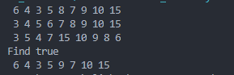

#### 2.1.2 Pertanyaan Percobaan
1. Mengapa dalam binary search tree proses pencarian data bisa lebih efektif
dilakukan dibanding binary tree biasa?

Jawab :

Karena pada bianry search tree, data di left child harus lebih kecil daripada right child dan parentnya, sehingga pencarian dapat dilakukan lebih efektif daripada binary tree biasa.

2. Untuk apakah di class Node, kegunaan dari atribut left dan right?

Jawab :

pada class node kegunaan atribut left dan right adalah, digunakan untuk menyimpan indeks yang menuju/mengarah ke left child atau nilai yang lebih kecil dari root juga indeks yang mengarah/menuju right child atau juga nilai yang lebih besar dari root.

3. a. Untuk apakah kegunaan dari atribut root di dalam class BinaryTree?

Jawab :

Digunakan untuk menyimpan data yang pertama kali dimasukkan/masuk.

b. Ketika objek tree pertama kali dibuat, apakah nilai dari root?

Jawab :

Nilai dari root adalah null.

4. Ketika tree masih kosong, dan akan ditambahkan sebuah node baru, proses apa
yang akan terjadi?

Jawab :

yakni akan mengeksekusi method add.

5. Perhatikan method add(), di dalamnya terdapat baris program seperti di bawah
ini. Jelaskan secara detil untuk apa baris program tersebut?
```java
if(data<current.data){
 if(current.left!=null){
 current = current.left;
 }else{
 current.left = new Node(data);
 break;
 }
 }
```

Jawab :

Maksudnya adalah mengecek apakah data nilainya kurang dari current.data, jika benar, maka masuk ke pengecekan apakah current.left tidak sama dengan null, jika iya, maka nilai dari current akan diberi nilai current.left atau current.left akan menjadi parent dari data yang dimasukkan , jika tidak. maka current.left akan diberi nilai dari data baru yang dimasukkan, atau menjadi left-child.

#### 2.2 Implementasi binary tree dengan array
Waktu percobaan: 45 menit

#### 2.2.1 Tahapan Percobaan
1. Di dalam percobaan implementasi binary tree dengan array ini, data tree
disimpan dalam array dan langsung dimasukan dari method main(), dan
selanjutnya akan disimulasikan proses traversal secara inOrder.
2. Buatlah class BinaryTreeArray dan BinaryTreeArrayMain
3. Buat atribut data dan idxLast di dalam class BinaryTreeArray. Buat juga method
populateData() dan traverseInOrder(). 

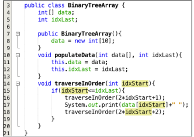

4. Kemudian dalam class BinaryTreeArrayMain buat method main() seperti gambar
berikut ini.

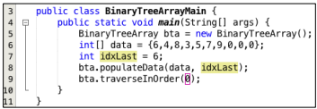

5. Jalankan class BinaryTreeArrayMain dan amati hasilnya!

#### Kode Program BinaryTreeArray.java
```java
package Praktikum_2;

public class BinaryTreeArray {
    int[] data;
    int idxLast;

    public BinaryTreeArray() {
        data = new int[10];
    }

    void populateData(int data[], int idxLast) {
        this.data = data;
        this.idxLast = idxLast;
    }

    void traverseInOrder(int idxStart) {
        if(idxStart<=idxLast) {
            traverseInOrder(2*idxStart+1);
            System.out.print(data[idxStart]+" ");
            traverseInOrder(2*idxStart+2);
        }
    }
}
```

#### Kode Program BinaryTreeArrayMain.java
```java
package Praktikum_2;

public class BinaryTreeArrayMain {
    public static void main(String[] args) {
        BinaryTreeArray bta = new BinaryTreeArray();
        int[] data = {6,4,8,3,5,7,9,0,0,0};
        int idxLast = 6;
        bta.populateData(data, idxLast);
        bta.traverseInOrder(0);
    }
}
```

#### Hasil Running Praktikum 2
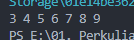

#### 13.2.1 Pertanyaan Percobaan
1. Apakah kegunaan dari atribut data dan idxLast yang ada di class
BinaryTreeArray?

Jawab :

Atribut data untuk menyimpan data array, dan atribut idxlast untuk menyimpan batas dari index.

2. Apakah kegunaan dari method populateData()?

Jawab :

Method tersebut digunakan untuk menginisialisasi atribut data dan idxlast.

3. Apakah kegunaan dari method traverseInOrder()?

Jawab :

Digunakan untuk mencetak node-node yang ada pada tree.

4. Jika suatu node binary tree disimpan dalam array indeks 2, maka di indeks berapakah posisi left child dan rigth child masin-masing?

Jawab :

- Left child berada pada indeks ke 5
- right child berada pada indeks ke 6

5. Apa kegunaan statement int idxLast = 6 pada praktikum 2 percobaan nomor4?

Jawab :

Untuk menunjukan bahwa nilai dari idxlast atau batas indeks adalah 6.


#### 13.3 Tugas Praktikum
Waktu pengerjaan: 90 menit

1. Buat method di dalam class BinaryTree yang akan menambahkan node dengan cara rekursif.

Jawab :

Kode Program Tambahan Pada BinaryTree.java
```java
 // Tugas Nomor 1
    public Node addNode(Node current, int data) {
        if (current == null) {
            return new Node(data);
        } else if (data < current.data) {
            current.left = addNode(current.left, data);
        } else if (data > current.data) {
            current.right = addNode(current.right, data);
        } else {
            return current;
        }
        return current;
    }
    public void add(int data) {
        root = addNode(root, data);
    }
```

Screenshot Hasil Running

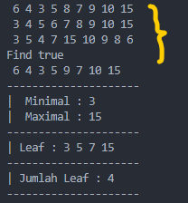

Data berhasil dimasukkan

2. Buat method di dalam class BinaryTree untuk menampilkan nilai paling kecil dan yang paling besar yang ada di dalam tree.

Jawab :

Kode Program Tambahan Pada BinaryTree.java
```java
    // Tugas Nomor 2
void max() {
        Node current = root;

        while (current.right != null) {
            current = current.right;
        }
        System.out.println(current.data);
    }

    void min() {
        Node current = root;

        while (current.left != null) {
            current = current.left;
        }
        System.out.println(current.data);
    }
```

Screenshot Hasil Running

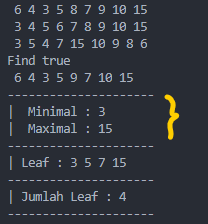

3. Buat method di dalam class BinaryTree untuk menampilkan data yang ada di leaf.

Jawab :

Kode Program Tambahan Pada BinaryTree.java
```java
// Tugas Nomor 3
    void leaf(Node root) {
        if(root == null) {
            return;
        }
        if (root.left == null && root.right == null) {
            System.out.print(root.data + " ");
            return;
        }

        if (root.left != null) {
            leaf(root.left);
        }

        if (root.right != null) {
            leaf(root.right);
        }
    }
```

Screenshot Hasil Running

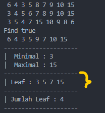

4. Buat method di dalam class BinaryTree untuk menampilkan berapa jumlahleaf yang ada di dalam tree.

Jawab :

Kode Program Tambahan Pada BinaryTree.java
```java
 // Tugas Nomor 4
    int hitungDaun() {
        return hitungDaun(root);
    }

    int hitungDaun(Node node){
        if (node == null) {
            return 0;
        }
        if (node.left == null && node.right == null) {
            return 1;
        } else {
            return hitungDaun(node.left) + hitungDaun(node.right);
        }
    }
```

Screenshot Hasil Running

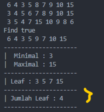

##### Kode Program Pada BinaryTreeMain.java untuk Tugas 1-4
```java
package Praktikum_1;

public class BinaryTreeMain {
    public static void main(String[] args) {
        BinaryTree bt = new BinaryTree();

        bt.add(6);
        bt.add(4);
        bt.add(8);
        bt.add(3);
        bt.add(5);
        bt.add(7);
        bt.add(9);
        bt.add(10);
        bt.add(15);

        bt.traversePreOrder(bt.root);
        System.out.println("");
        bt.traverseInOrder(bt.root);
        System.out.println("");
        bt.traversePostOrder(bt.root);
        System.out.println("");
        System.out.println("Find "+bt.find(5));
        bt.delete(8);
        bt.traversePreOrder(bt.root);
        System.out.println("");

        //tambahan untuk tugas 1-4
        System.out.println("---------------------");
        System.out.print("|  Minimal : ");
        bt.min();
        System.out.print("|  Maximal : ");
        bt.max();
        System.out.println("---------------------");
        System.out.print("| Leaf : ");
        bt.leaf(bt.root);
        System.out.println();
        System.out.println("---------------------");
        System.out.print("| Jumlah Leaf : " + bt.hitungDaun());
        System.out.println("\n---------------------");
    }
}
```

5. Modifikasi class BinaryTreeArray, dan tambahkan :
• method add(int data) untuk memasukan data ke dalam tree
• method traversePreOrder() dan traversePostOrder()

Jawab :

Kode Program Tambahan Pada BinaryTreeArray.java
```java
// Tugas no 5
    void add(int value, int id) {
        data[id] = value;
    }

    void updateData(int data[]) {
        this.data = data;
    }

    void traversePreOrder(int idxStart) {
        if (idxStart <= idxLast) {
            if (data[idxStart] == 0) {
                System.out.print(idxLast + " ");
            } else {
                System.out.print(data[idxStart] + " ");
            }
            traversePreOrder(2 * idxStart + 1);
            traversePreOrder(2 * idxStart + 2);
        }
    }

    void traversePostOrder(int idxStart) {
        if (idxStart <= idxLast) {
            traversePostOrder(2 * idxStart + 1);
            traversePostOrder(2 * idxStart + 2);
            if (data[idxStart] == 0) {
                System.out.print(idxLast + " ");
            } else {
                System.out.print(data[idxStart] + " ");
            }
        }
    }
```

Kode Program BinaryTreeArrayMain.java

```java
package Praktikum_2;
import java.util.Scanner;

public class BinaryTreeArrayMain {
    public static void main(String[] args) {
        BinaryTreeArray bta = new BinaryTreeArray();
        // int[] data = {6,4,8,3,5,7,9,0,0,0};
        // int idxLast = 6;
        // bta.populateData(data, idxLast);
        // bta.traverseInOrder(0);

        // tambahan untuk tugas no 5
        Scanner in = new Scanner(System.in);

        System.out.print("Masukkan Jumlah data : ");
        int dt = in.nextInt();
        int data[] = new int[dt];

        for (int i = 0; i < data.length; i++) {
            System.out.print("Masukkan Angka : ");
            int angka = in.nextInt();
            bta.add(angka, i);
            bta.updateData(data);
        }
        System.out.println("---------------");
        System.out.print("Pilih Angka : ");
        int idxlast = in.nextInt();
        bta.populateData(data, idxlast);
        System.out.println("InOrder   : ");
        bta.traverseInOrder(0);
        System.out.println("");
        System.out.println("PreOrder  : ");
        bta.traversePreOrder(0);
        System.out.println("");
        System.out.println("PostOrder :");
        bta.traversePostOrder(0);
        System.out.println("");

    }
}
```

Screenshot Hasil Running

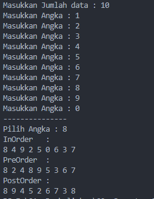


##### -------- Terimakasih --------