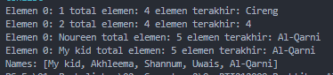
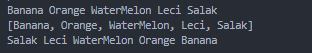
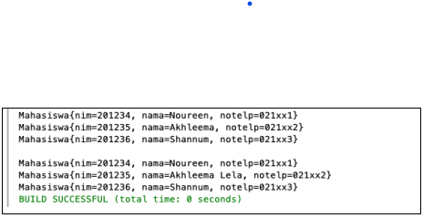

### JOBSHEET 16
### Collection

### Mohammad Izamul Fikri Fahmi
### TI-1F
### 2141720171

<hr>

#### 16.1. Tujuan Praktikum

Setelah melakukan praktikum ini, mahasiswa mampu:
1. memahami bentuk-bentuk collection dan hierarkinya;
2. menerapkan collection sesuai dengan fungsi dan jenisnya;
3. menyelesaikan kasus menggunakan collection yang sesuai.
#### 16.2. Kegiatan Praktikum 1

#### 16.2.1. Percobaan 1
Pada percobaan 1 ini akan dicontohkan penggunaan collection untuk menambahkan sebuah
elemen, mengakses elemen, dan menghapus sebuah elemen.
1. Buatlah sebuah class ContohList yang main methode berisi kode program seperti di bawah ini


2. Tambahkan kode program untuk menggunakan collection dengan aturan penulisan kode
program seperti berikut


#### Kode Program  ContohList.java
```java
package Source_Code;
import java.util.LinkedList;
import java.util.List;
import java.util.ArrayList;


public class ContohList {
    public static void main(String[] args) {
        List l = new ArrayList();
        l.add(1);
        l.add(2);
        l.add(3);
        l.add("Cireng");
        System.out.printf("Elemen 0: %d total elemen: %d elemen terakhir: %s\n", l.get(0), l.size(), l.get(l.size()-1));

        l.add(4);
        l.remove(0);
        System.out.printf("Elemen 0: %d total elemen: %d elemen terakhir: %s\n", l.get(0), l.size(), l.get(l.size()-1));

        List<String> names = new LinkedList<>();
        names.add("Noureen");
        names.add("Akhleema");
        names.add("Shannum");
        names.add("Uwais");
        names.add("Al-Qarni");
        
        System.out.printf("Elemen 0: %s total elemen: %s elemen terakhir: %s\n", names.get(0), names.size(), names.get(names.size()-1));
        names.set(0, "My kid");
        System.out.printf("Elemen 0: %s total elemen: %s elemen terakhir: %s\n", names.get(0), names.size(), names.get(names.size()-1));
        System.out.println("Names: "+ names.toString());
    }
}
```

#### 16.2.2. Verifikasi Hasil Percobaan
Verifikasi hasil kompilasi kode program Anda dengan gambar berikut ini.


#### Hasil Running Program



#### 16.2.3. Pertanyaan Percobaan
1. Perhatikan baris kode 25-36, mengapa semua jenis data bisa ditampung ke dalam sebuah Arraylist?

Jawab :

Karena arrayList bersifat dinamis dan juga ketika di instance tidak diberi kurung sudut <> yang memberikan tipe data spesifik pada arrayLIst, sehingga arrayList bisa menampung semua jenis data.

2. Modifikasi baris kode 25-36 seingga data yang ditampung hanya satu jenis atau spesifik tipe tertentu!

Jawab :

```java
package Source_Code;
import java.util.LinkedList;
import java.util.List;
import java.util.ArrayList;


public class ContohList {
    public static void main(String[] args) {
        //List l = new ArrayList(); // sebelum dimodifikasi

        // modifikasi untuk pertanyaan nomor 2 praktikum 1
        List<Integer> l = new ArrayList();
        l.add(1);
        l.add(2);
        l.add(3);
        l.add("Cireng"); // baris kode ini akan error karena bertipe data String
        System.out.printf("Elemen 0: %d total elemen: %d elemen terakhir: %s\n", l.get(0), l.size(), l.get(l.size()-1));

        l.add(4);
        l.remove(0);
        System.out.printf("Elemen 0: %d total elemen: %d elemen terakhir: %s\n", l.get(0), l.size(), l.get(l.size()-1));

        List<String> names = new LinkedList<>();
        names.add("Noureen");
        names.add("Akhleema");
        names.add("Shannum");
        names.add("Uwais");
        names.add("Al-Qarni");
        
        System.out.printf("Elemen 0: %s total elemen: %s elemen terakhir: %s\n", names.get(0), names.size(), names.get(names.size()-1));
        names.set(0, "My kid");
        System.out.printf("Elemen 0: %s total elemen: %s elemen terakhir: %s\n", names.get(0), names.size(), names.get(names.size()-1));
        System.out.println("Names: "+ names.toString());
    }
}
```

3. Ubah kode pada baris kode 38 menjadi seperti ini


Jawab :

```java
package Source_Code;
import java.util.LinkedList;
import java.util.List;
import java.util.ArrayList;


public class ContohList {
    public static void main(String[] args) {
        //List l = new ArrayList(); // sebelum dimodifikasi

        // modifikasi untuk pertanyaan nomor 2 praktikum 1
        List<Integer> l = new ArrayList();
        l.add(1);
        l.add(2);
        l.add(3);
        // l.add("Cireng"); // baris kode ini akan error karena bertipe data String
        System.out.printf("Elemen 0: %d total elemen: %d elemen terakhir: %s\n", l.get(0), l.size(), l.get(l.size()-1));

        l.add(4);
        l.remove(0);
        System.out.printf("Elemen 0: %d total elemen: %d elemen terakhir: %s\n", l.get(0), l.size(), l.get(l.size()-1));

        LinkedList<String> names = new LinkedList<>();
        names.add("Noureen");
        names.add("Akhleema");
        names.add("Shannum");
        names.add("Uwais");
        names.add("Al-Qarni");
        
        System.out.printf("Elemen 0: %s total elemen: %s elemen terakhir: %s\n", names.get(0), names.size(), names.get(names.size()-1));
        names.set(0, "My kid");
        System.out.printf("Elemen 0: %s total elemen: %s elemen terakhir: %s\n", names.get(0), names.size(), names.get(names.size()-1));
        System.out.println("Names: "+ names.toString());
    }
}
```

- Hasil Running


4. Tambahkan juga baris berikut ini, untuk memberikan perbedaan dari tampilan yang sebelumnya


Jawab :

```java
package Source_Code;
import java.util.LinkedList;
import java.util.List;
import java.util.ArrayList;


public class ContohList {
    public static void main(String[] args) {
        //List l = new ArrayList(); // sebelum dimodifikasi

        // modifikasi untuk pertanyaan nomor 2 praktikum 1
        List<Integer> l = new ArrayList();
        l.add(1);
        l.add(2);
        l.add(3);
        // l.add("Cireng"); // baris kode ini akan error karena bertipe data String
        System.out.printf("Elemen 0: %d total elemen: %d elemen terakhir: %s\n", l.get(0), l.size(), l.get(l.size()-1));

        l.add(4);
        l.remove(0);
        System.out.printf("Elemen 0: %d total elemen: %d elemen terakhir: %s\n", l.get(0), l.size(), l.get(l.size()-1));

        LinkedList<String> names = new LinkedList<>();
        names.add("Noureen");
        names.add("Akhleema");
        names.add("Shannum");
        names.add("Uwais");
        names.add("Al-Qarni");
        
        System.out.printf("Elemen 0: %s total elemen: %s elemen terakhir: %s\n", names.get(0), names.size(), names.get(names.size()-1));
        names.set(0, "My kid");
        System.out.printf("Elemen 0: %s total elemen: %s elemen terakhir: %s\n", names.get(0), names.size(), names.get(names.size()-1));
        System.out.println("Names: "+ names.toString());

        // penambahan baris kode soal nomor 4
        names.push("Mei-mei");
        System.out.printf("Elemen 0: %s total elemen: %s elemen terakhir: %s\n", names.getFirst(), names.size(), names.getLast());
        System.out.println("Names: "+ names.toString());
    }
}
```

5. Dari penambahan kode tersebut, silakan dijalankan dan apakah yang dapat Anda jelaskan!

Jawab :

dilakukan penambahan data baru String "Mei-mei" sehingga size dari names bertambah satu menjadi 6, untuk data "Mei-mei" sendiri, dimasukkan secara push alias seperti stack, sehingga menjadikan data tersebut menjadi data teratas atau indeks pertama atau indeks nol, dan data terakhir masih sama yaitu "Al=Qarni"


#### 16.3. Kegiatan Praktikum 2
#### 16.3.1. Tahapan Percobaan
Pada praktikum 2 ini akan dibuat beberapa method untuk menampilkan beberapa cara yang
dapat dilakukan untuk mengambil/menampilkan elemen pada sebuah collection. Silakan ikutilah
Langkah-langkah di bawah ini
1. Buatlah class dengan nama LoopCollection serta tambahkan method main yang isinya adalah sebagai berikut.


2. Tambahkan potongan kode berikut ini dari yang sebelumnya agar proses menampilkan
elemen pada sebuah stack bervariasi.


#### Kode Program LoopCollection.java
```java
package Source_Code;
import java.util.Iterator;
import java.util.Stack;

public class LoopCollection {
    public static void main(String[] args) {
        Stack<String> fruits = new Stack<>();
        fruits.push("Banana");
        fruits.add("Orange");
        fruits.add("WaterMelon");
        fruits.add("Leci");
        fruits.add("Salak");
    
        for(String fruit : fruits) {
            System.out.printf("%s ", fruit);
        }

        System.out.println("\n"+fruits.toString());

        while (!fruits.empty()) {
            System.out.printf("%s ", fruits.pop());
        }

        fruits.push("Melon");
        fruits.push("Durian");
        System.out.println("");
        for (Iterator<String> it = fruits.iterator(); it.hasNext();) {
            String fruit = it.next();
            System.out.printf("%s ", fruit);
        }
        System.out.println("");
        fruits.stream().forEach(e -> {
            System.out.printf("%s ", e);
        });

        System.out.println("");
        for (int i = 0; i < fruits.size(); i++) {
            System.out.printf("%s ",fruits.get(i));
        }
    }
}
```

#### 16.3.2. Verifikasi Hasil Percobaan
Verifikasi hasil kompilasi kode program Anda dengan gambar berikut ini.


#### Hasil Running Program


#### 16.3.3. Pertanyaan Percobaan
1. Apakah perbedaan fungsi push() dan add() pada objek fruits?

Jawab :

Secara generic mereka memeliki fungsi yang sama untuk menambahkan data pada stack, namun direkomendasikan untuk menggunakan push(), karena kita menggunakan stack, jadi agar tidak ada kebingungan konsep apa yang digunakan.

2. Silakan hilangkan baris 43 dan 44, apakah yang akan terjadi? Mengapa bisa demikian?

Jawab :



Karena sebelum baris 43 dan 44, objek fruits dikosongkan dengan cara di pop berulang, sehingga ketika baris 43 dan 44, maka ketika ditampilkan setelah baris 43 dan 44, maka objek fruits kosong, dan tidak ditampilkan apa apa.

3. Jelaskan fungsi dari baris 46-49?

Jawab :

iterator adalah objek pada collection java yang berfungsi untuk melakukan perhitungan pada suatu objek list collection, 

dan pada baris tersebut iterator digunakan untuk melakukan perulangan dengan melakukan iterator pada objek fruits dengan menampilkan tiap data dengan perulangan hasNext, dan membuat tipe data String fruit untuk menampung data iterator it dari fruits dan ditampilkan dengan sout. begitu seterusnya sampe data iterator sampai ujung.

4. Silakan ganti baris kode 25, Stack<String> menjadi List<String> dan apakah yang terjadi?
Mengapa bisa demikian?

Jawab :

```java
        List<String> fruits = new List<>();
```

Kode Program error, karena method List harus di instance dengan arrayList, linkedlist atau vektor, agar bisa diinstance. jUga import java.util.list belum di ketik di awal baris kode.

5. Ganti elemen terakhir dari dari objek fruits menjadi “Strawberry”!

Jawab :

```java
package Source_Code;
import java.util.Iterator;
import java.util.Stack;

public class LoopCollection {
    public static void main(String[] args) {
        // List<String> fruits = new List<>();
        Stack<String> fruits = new Stack<>();
        fruits.push("Banana");
        fruits.add("Orange");
        fruits.add("WaterMelon");
        fruits.add("Leci");
        fruits.add("Salak");
    
        for(String fruit : fruits) {
            System.out.printf("%s ", fruit);
        }

        System.out.println("\n"+fruits.toString());

        while (!fruits.empty()) {
            System.out.printf("%s ", fruits.pop());
        }

        fruits.push("Melon");
        fruits.push("Strawberry"); // untuk pertanyaan nomor 5

        System.out.println("");
        for (Iterator<String> it = fruits.iterator(); it.hasNext();) {
            String fruit = it.next();
            System.out.printf("%s ", fruit);
        }
        System.out.println("");
        fruits.stream().forEach(e -> {
            System.out.printf("%s ", e);
        });

        System.out.println("");
        for (int i = 0; i < fruits.size(); i++) {
            System.out.printf("%s ",fruits.get(i));
        }
    }
}
```

Hasil Running


6. Tambahkan 3 buah seperti “Mango”,”guava”, dan “avocado” kemudian dilakukan sorting!

Jawab :

```java
package Source_Code;
import java.util.Iterator;
import java.util.Stack;

public class LoopCollection {
    public static void main(String[] args) {
        // List<String> fruits = new List<>();
        Stack<String> fruits = new Stack<>();
        fruits.push("Banana");
        fruits.add("Orange");
        fruits.add("WaterMelon");
        fruits.add("Leci");
        fruits.add("Salak");
    
        for(String fruit : fruits) {
            System.out.printf("%s ", fruit);
        }

        System.out.println("\n"+fruits.toString());

        while (!fruits.empty()) {
            System.out.printf("%s ", fruits.pop());
        }

        fruits.push("Melon");
        fruits.push("Strawberry"); // untuk pertanyaan nomor 5

        System.out.println("");
        for (Iterator<String> it = fruits.iterator(); it.hasNext();) {
            String fruit = it.next();
            System.out.printf("%s ", fruit);
        }
        System.out.println("");
        fruits.stream().forEach(e -> {
            System.out.printf("%s ", e);
        });

        System.out.println("");
        for (int i = 0; i < fruits.size(); i++) {
            System.out.printf("%s ",fruits.get(i));
        }

        // untuk pertanyaan nomor 6
        fruits.push("Mango");
        fruits.push("Guava");
        fruits.push("Avocado");

        // Proses sort
        fruits.sort((String a, String b)->a.compareTo(b));
        System.out.println("");
        System.out.println("Data Sesudah Sorting");
        System.out.println("--------------------------");

        for(int i=0; i<fruits.size(); i++) {
            System.out.printf("%s ", fruits.get(i));
        }
    }
}
```

Hasil Running


#### 16.4. Kegiatan Praktikum 3
#### 16.4.1. Tahapan Percobaan
Pada praktikum 3 ini dilakukan uji coba untuk mengimplementasikan sebuah collection untuk
menampung objek yang dibuat sesuai kebutuhan. Objek tersebut adalah sebuah objek
mahasiswa dengan fungsi-fungsi umum seperti menambahkan, menghapus, mengubah, dan
mencari.
1. Buatlah sebuah class Mahasiswa dengan attribute, kontruktor, dan fungsi sebagai berikut.


2. Selanjutnya, buatlah sebuah class ListMahasiswa yang memiliki attribute seperti di bawah ini


3. Method tambah(), hapus(), update(), dan tampil() secara berurut dibuat agar bisa melakukan
operasi-operasi seperti yang telah disebutkan.


4. Untuk proses hapus, update membutuhkan fungsi pencarian terlebih dahulu yang potongan kode programnya adalah sebagai berikut


5. Pada class yang sama, tambahkan main method seperti potongan program berikut dan amati
hasilnya!


#### Kode Program Mahasiswa.java
```java
package Source_Code;
public class Mahasiswa {
    String nim;
    String nama;
    String notelp;

    public Mahasiswa() {
    }

    public Mahasiswa(String nim, String nama, String notelp) {
        this.nim = nim;
        this.nama = nama;
        this.notelp = notelp;
    }

    @Override
    public String toString() {
        return "Mahasiswa{" + "nim=" + nim + ", nama=" + nama + ", notelp=" + notelp + '}';
    }
}
```

#### Kode Program ListMahasiswa.java
```java
package Source_Code;
import java.util.List;
import java.util.ArrayList;
import java.util.Arrays;

public class ListMahasiswa {
    List<Mahasiswa> mahasiswas = new ArrayList<>();

    public void tambah(Mahasiswa... mahasiswa) {
        mahasiswas.addAll(Arrays.asList(mahasiswa));
    }

    public void hapus(int index) {
        mahasiswas.remove(index);
    }

    public void update(int index, Mahasiswa mhs) {
        mahasiswas.set(index, mhs);
    }

    public void tampil() {
        mahasiswas.stream().forEach(mhs -> {
            System.out.println("" + mhs.toString());
        });
    }

    int linearSearch(String nim) {
        for (int i = 0; i < mahasiswas.size(); i++) {
            if(nim.equals(mahasiswas.get(i).nim)) {
                return i;
            }
        }
        return -1;
    }

    public static void main(String[] args) {
        ListMahasiswa lm = new ListMahasiswa();
        Mahasiswa m = new Mahasiswa("201234", "Noureen", "021xx1");
        Mahasiswa m1 = new Mahasiswa("201235", "Akhleema", "021xx2");
        Mahasiswa m2 = new Mahasiswa("201236", "Shannum", "021xx3");
        // menambahkan objek mahasiswa
        lm.tambah(m, m1, m2);
        // menampilkan list mahasiswa 
        lm.tampil();
        // update mahasiswa
        lm.update(lm.linearSearch("201235"), new Mahasiswa("201235", "Akhleema Lela", "021xx2"));
        System.out.println("");
        lm.tampil();
    }
}
```

#### 16.4.2. Verifikasi Hasil Percobaan
Verifikasi hasil kompilasi kode program Anda dengan gambar berikut ini.



#### Hasil Running Program


#### 16.4.3. Pertanyaan Percobaan
1. Pada fungsi tambah() yang menggunakan unlimited argument itu menggunakan konsep apa?
Dan kelebihannya apa?

Jawab :

digunakannya parameter varargs pada objek Mahasiswa yang berfungsi ketika tidak mengetahui jumlah pasti dari data objek mahasiswa yang mana kemudian data dari mahasiswa tersebut di addAll pada objek mahasiswas dengan manampung data arrays.asList(mahasiswa).

2. Pada fungsi linearSearch() di atas, silakan diganti dengan fungsi binarySearch() dari collection!

Jawab :

Kode Program ListMahasiswa.java
```java
package Source_Code;
import java.util.List;
import java.util.ArrayList;
import java.util.Arrays;
import java.util.Comparator;
import java.util.Collections;

public class ListMahasiswa {
    List<Mahasiswa> mahasiswas = new ArrayList<>();

    public void tambah(Mahasiswa... mahasiswa) {
        mahasiswas.addAll(Arrays.asList(mahasiswa));
    }

    public void hapus(int index) {
        mahasiswas.remove(index);
    }

    public void update(int index, Mahasiswa mhs) {
        mahasiswas.set(index, mhs);
    }

    public void tampil() {
        mahasiswas.stream().forEach(mhs -> {
            System.out.println("" + mhs.toString());
        });
    }

    int linearSearch(String nim) {
        for (int i = 0; i < mahasiswas.size(); i++) {
            if(nim.equals(mahasiswas.get(i).nim)) {
                return i;
            }
        }
        return -1;
    }

    public static void main(String[] args) {
        ListMahasiswa lm = new ListMahasiswa();
        Mahasiswa m = new Mahasiswa("201234", "Noureen", "021xx1");
        Mahasiswa m1 = new Mahasiswa("201235", "Akhleema", "021xx2");
        Mahasiswa m2 = new Mahasiswa("201236", "Shannum", "021xx3");
        // menambahkan objek mahasiswa
        lm.tambah(m, m1, m2);
        // menampilkan list mahasiswa 
        lm.tampil();
        // update mahasiswa
        // lm.update(lm.linearSearch("201235"), new Mahasiswa("201235", "Akhleema Lela", "021xx2"));
        // System.out.println("");
        // lm.tampil();

        Mahasiswa key = new Mahasiswa("201235", null, null);
        lm.update(Collections.binarySearch(lm.mahasiswas, key, new MhsComparator()), new Mahasiswa("201235","Akhleema","021xx2"));
        System.out.println("");
        lm.tampil();
    }
}
```

Kode Program MhsComparator.java
```java
package Source_Code;

import java.util.Comparator;

public class MhsComparator implements Comparator<Mahasiswa> {
    public int compare(Mahasiswa mhs1, Mahasiswa mhs2) {
        if(mhs1.nim == mhs2.nim) {
            return 0;
        } else {
            return -1;
        }
    }

    @Override
    public Comparator<Mahasiswa> reversed() {
        return Comparator.super.reversed();
    }
}
```

Hasil Running Program


3. Tambahkan fungsi sorting baik secara ascending ataupun descending pada class tersebut!

Jawab :

```java
    // Nomor 3
    void ascSort() {
        this.mahasiswas.sort((Mahasiswa a1, Mahasiswa a2) -> a1.nama.compareTo(a2.nama));
    }
    void dscSort() {
        this.mahasiswas.sort((Mahasiswa a1, Mahasiswa a2) -> a2.nama.compareTo(a1.nama));
    }
```

```java
System.out.println("\n---- Soal Nomor 3 ----\n");

        System.out.println("Ascending : ");
        lm.ascSort();
        lm.tampil();

        System.out.println("");
        System.out.println("Descending : ");
        lm.dscSort();
        lm.tampil();
```

Hasil Running


#### 16.5. Tugas Praktikum
1. Implementasikan stack menggunakan collection dengan contoh kasus tumpukan daftar film sesuai dengan fitur-fitur yang ditunjukkan pada gambar di bawah ini!
Ilustrasi Program


#### Kode Program film.java
```java
package Tugas1;

public class film {
    
    int id, tahun;
    String judul, director;

    public film(int id, String judul, int tahun, String director) {
        this.id = id;
        this.judul = judul;
        this.tahun = tahun;
        this.director = director;
    }

    @Override

    public String toString() {
        return "film\n" + "id : "+id+"\njudul : "+judul+"\ntahun : "+tahun+"\ndirector : "+director;
    }
}
```

#### Kode Program mainFilm.java
```java
package Tugas1;
import java.util.Scanner;
import java.util.Stack;

public class mainFilm{
    static void menu() {
        System.out.println("+======================================+");
        System.out.println("+ Data Film Layar Lebar Izamul FIkri   +");
        System.out.println("+======================================+");
        System.out.println("|1. Input Judul Film");
        System.out.println("|2. Hapus Data Film Teratas");
        System.out.println("|3. Cek Judul Film Teratas");
        System.out.println("|4. Info Semua Judul Film");
        System.out.println("|5. Tutup Program");
        System.out.println("+======================================+");
        System.out.print("|Pilih Menu : ");
    }

    public static void main(String[] args) {
        Scanner in = new Scanner(System.in);
        Scanner sc = new Scanner(System.in);
        Scanner a = new Scanner(System.in);

        Stack <film> films = new Stack();

        char opsi;
        int pilih;

        do{
            menu();
            pilih = a.nextInt();
            switch(pilih) {
                case 1:
                    do{
                        System.out.println("+-------------------------------------------------+");
                        System.out.println("+               Menambahkan Data Film             +");
                        System.out.println("+-------------------------------------------------+");
                        System.out.print("ID Film \t: ");
                        int id = sc.nextInt();
                        System.out.print("Judul Film \t: ");
                        String judul = in.nextLine();
                        sc.nextLine();
                        System.out.print("Tahun Tayang \t: ");
                        int tahun = sc.nextInt();
                        System.out.print("Director \t: ");
                        String director = in.nextLine();

                        film f = new film(id, judul, tahun, director);
                        films.push(f);

                        System.out.println("Menambah Data Lagi ketik 'Y/y'");
                        opsi = sc.next().charAt(0);
                        System.out.println("");                        
                    } while (opsi =='y' || opsi  == 'Y');
                break;

                case 2:
                    System.out.println("+-------------------------------------------------+");
                    System.out.println("+           Menghapus Data Film Teratas           +");
                    System.out.println("+-------------------------------------------------+");
                    System.out.println(films.pop());
                    System.out.println("");
                break;

                case 3:
                    System.out.println("+-------------------------------------------------+");
                    System.out.println("+              Judul Film Teratas                 +");
                    System.out.println("+-------------------------------------------------+");
                    System.out.println(films.peek());
                    System.out.println("");
                break;
                
                case 4:
                    System.out.println("+-------------------------------------------------+");
                    System.out.println("+                 Semua Data Film                 +");
                    System.out.println("+-------------------------------------------------+");
                for(int i=0; i<films.size(); i++){
                    System.out.println(films.get(i));
                    }
                    System.out.println("");
                break;

                case 5:
                    System.out.println("");
                    System.out.println("Terimakasih.......");
                break;
            }
        }while(pilih < 5 && pilih > 0);
    }
}
```

#### Hasil Running


2. Buatlah implementasi program daftar nilai mahasiswa semester, minimal memiliki 3 class yaitu
Mahasiswa, Nilai, dan Mata Kuliah. Khusus untuk data Mahasiswa dan Mata Kuliah harus sudah
Page 7 of 18
diinisialisasi, sehingga ketika memasukkan data nilai data mahasiswa dan mata kuliah cukup
menginputkan nim ataupun kode mata kuliah. Yang paling penting adalah antara objek
mahasiswa, matakuliah, dan nilai harus saling terhubung.
Ilustrasi Program


#### Kode Program Mahasiswa.java
```java
package Tugas2;

public class Mahasiswa {
    String nim, nama, notelp;
    
    public Mahasiswa(){
        
    }
    
    public Mahasiswa(String nim, String nama, String notelp){
        this.nim = nim;
        this.nama = nama;
        this.notelp = notelp;
    }
    
    @Override
    public String toString(){
        return nim + "\t" + nama + "\t" + notelp;
    }
}
```

#### Kode Program MataKuliah.java
```java
package Tugas2;
import java.util.List;
public class MataKuliah {
    String kode, matkul;
    int sks;
    
    public MataKuliah(){
        
    }
    public MataKuliah(String kode, String matkul, int sks){
        this.kode = kode;
        this.matkul = matkul;
        this.sks = sks;
    }
    
    public String toString(){
        return kode + "\t" + matkul + "\t" + sks;
    }
}
```

#### Kode Program Nilai.java
```java
package Tugas2;
import java.util.ArrayList;
import java.util.Arrays;
import java.util.Comparator;
import java.util.List;
import java.util.Scanner;

public class Nilai {
    String kdNil;
    double nilai;
    Mahasiswa mhs;
    MataKuliah mk;
    
    public Nilai(String kdNil, double nilai, Mahasiswa mhs, MataKuliah mk){
        this.kdNil = kdNil;
        this.nilai = nilai;
        this.mhs = mhs;
        this.mk = mk;
    }
    

    // Untuk Method
    List<Mahasiswa> mhss = new ArrayList<>();
    List<MataKuliah> mks = new ArrayList<>();
    
    public void tambahMhs(Mahasiswa... Mahasiswa){
        mhss.addAll(Arrays.asList(Mahasiswa));
    }
    
    public void tambahMatkul(MataKuliah... matkul){
        mks.addAll(Arrays.asList(matkul));
    }
    
    public void tampilMhs(){
        mhss.stream().forEach(mhs -> {
                System.out.println("" + mhs.toString());
        });
    }
    
    public void tampilMatkul(){
        mks.stream().forEach(mk -> {
                System.out.println("" + mk.toString());
        });
    }
    
    int lSearchMhs(String nim){
            for(int i = 0; i < mhss.size(); i++){ 
                if(nim.equals(mhss.get(i).nim)){
                    return i;
                }
            }
            return -1;
    }
    
    int lSearchMatkul(String matkul){
            for(int i = 0; i < mks.size(); i++){ 
                if(matkul.equals(mks.get(i).kode)){
                    return i;
                }
            }
            return -1;
    }
    
    Mahasiswa cariMhs(String nim){
        for(int i = 0; i < mhss.size(); i++){
            if(nim.equals(mhss.get(i).nim)){
                return mhss.get(i);
            }
        }
        return null;
    }
    
    MataKuliah cariMatkul(String matkul){
        for(int i = 0; i < mks.size(); i++){
            if(matkul.equals(mks.get(i).kode)){
                return mks.get(i);
            }
        }
        return null;
    }
    
    public String toString(int idx1, int idx2){
        return mhss.get(idx1).nim + "\t" + mhss.get(idx1).nama + "\t" + mks.get(idx2).matkul + "\t" + mks.get(idx2).sks + "\t";
    }
    
    static Comparator<Nilai> CompNilai = (n1, n2) ->{
        if(n1.nilai < n2.nilai){
            return -1;
        } else if (n1.nilai > (n2).nilai){
            return 1;
        } else {
            return 0;
        }
    };
    


    // Main


    public static void main(String[] args){
        Scanner sc = new Scanner(System.in);
        Scanner in = new Scanner(System.in);
        
        List<Nilai> nil = new ArrayList<>();
        Nilai n = new Nilai("", 0, null, null);
        
        Mahasiswa m1 = new Mahasiswa("20001", "Sanji", "021xxx");
        Mahasiswa m2 = new Mahasiswa("20002", "Zoro", "021xxx");
        Mahasiswa m3 = new Mahasiswa("20003", "Luffy", "021xxx");
        Mahasiswa m4 = new Mahasiswa("20004", "Ace", "021xxx");
        Mahasiswa m5 = new Mahasiswa("20005", "Brook", "021xxx");
        Mahasiswa m6 = new Mahasiswa("20006", "Nami", "021xxx");
        
        n.tambahMhs(m1, m2, m3, m4, m5, m6);
        
        MataKuliah mk1 = new MataKuliah("00001", "Internet of Things\t\t", 3);
        MataKuliah mk2 = new MataKuliah("00002", "Algoritma dan Struktur Data\t", 3);
        MataKuliah mk3 = new MataKuliah("00003", "Algoritma dan Pemrograman\t", 3);
        MataKuliah mk4 = new MataKuliah("00004", "Pratikum Algoritma dan Struktur Data", 3);
        MataKuliah mk5 = new MataKuliah("00005", "Pratikum Algoritma dan Pemrograman", 3);
        
        n.tambahMatkul(mk1, mk2, mk3, mk4, mk5);
        
        Nilai n1 = null;
        String nimMhs, mkMhs;
        
        int pil = 0;
        do{
            System.out.println("+*********************************************************************+");
            System.out.println("|           SISTEM PENGOLAHAN DATA NILAI MAHASISWA SEMESTER           |");
            System.out.println("+*********************************************************************+");
            System.out.println("| 1. Input Nilai");
            System.out.println("| 2. Tampil Nilai");
            System.out.println("| 3. Mencari Nilai Mahasiwa");
            System.out.println("| 4. Urut Data Nilai");
            System.out.println("| 5. Keluar"); 
            System.out.println("+*********************************************************************+");
            System.out.print("Pilih : ");
            pil = sc.nextInt();
            System.out.println("");
            
            switch(pil){
                case 1:
                    System.out.print("Kode\t : ");
                    String kd = in.nextLine();
                    System.out.print("Nilai\t : ");
                    double nilMhs = sc.nextDouble();
                    System.out.println("");
                    
                    System.out.println("+*********************************************************************+");
                    System.out.println("|                          DAFTAR MAHASISWA                           |");
                    System.out.println("+*********************************************************************+");
                    System.out.println("NIM\tNama\tTelf");
                    n.tampilMhs();
                    System.out.print("Pilih Mahasiswa by NIM :");
                    nimMhs = in.nextLine();
                    Mahasiswa MahaSiswa;
                    MahaSiswa = n.cariMhs(nimMhs);
                    
                    System.out.println("");
                    System.out.println("+*********************************************************************+");
                    System.out.println("|                         DAFTAR MATA KULIAH                          |");
                    System.out.println("+*********************************************************************+");
                    System.out.println("Kode\tMata Kuliah\t\t\t\tSKS");
                    n.tampilMatkul();
                    System.out.print("Pilih MK by kode : ");
                    mkMhs = in.nextLine();
                    MataKuliah mks;
                    mks = n.cariMatkul(mkMhs);
                    
                    n1 = new Nilai(kd, nilMhs, MahaSiswa, mks);
                    nil.add(n1);
                    System.out.println("");
                    break;
                case 2:
                    System.out.println("+*********************************************************************+");
                    System.out.println("|                       DAFTAR NILAI MAHASISWA                        |");
                    System.out.println("+*********************************************************************+");
                    System.out.println("NIM\tNama\tMata Kuliah\t\t\t\tSKS\tNilai");
                    for (int i = 0; i < nil.size(); i++){
                        n.lSearchMhs(nil.get(i).mhs.nim);
                        n.lSearchMatkul(nil.get(i).mk.kode);
                        System.out.println(n.toString(n.lSearchMhs(nil.get(i).mhs.nim), n.lSearchMatkul(nil.get(i).mk.kode)) + nil.get(i).nilai);
                    }
                    System.out.println("");
                    break;
                case 3: 
                    System.out.println("+*********************************************************************+");
                    System.out.println("|                       DAFTAR NILAI MAHASISWA                        |");
                    System.out.println("+*********************************************************************+");
                    System.out.println("NIM\tNama\tMata Kuliah\t\t\t\tSKS\tNilai");
                    int sks = 0;
                    for (int i = 0; i < nil.size(); i++){
                        n.lSearchMhs(nil.get(i).mhs.nim);
                        n.lSearchMatkul(nil.get(i).mk.kode);
                        System.out.println(n.toString(n.lSearchMhs(nil.get(i).mhs.nim), n.lSearchMatkul(nil.get(i).mk.kode)) + nil.get(i).nilai);
                    }
                    System.out.print("Masukkan Data Mahasiswa[NIM] : ");
                    String input = in.nextLine();
                    System.out.println("");
                    for (int i = 0; i < nil.size(); i++){
                        if(input.equalsIgnoreCase(nil.get(i).mhs.nim)){
                            sks += n.mks.get(i).sks;
                            n.lSearchMhs(nil.get(i).mhs.nim);
                            n.lSearchMatkul(nil.get(i).mk.kode);
                            System.out.println(n.toString(n.lSearchMhs(nil.get(i).mhs.nim), n.lSearchMatkul(nil.get(i).mk.kode)) + nil.get(i).nilai);
                        }
                    }
                    System.out.println("Total SKS " + sks + " Telah Diambil");
                    System.out.println("");
                    break;
                case 4:
                    System.out.println("+*********************************************************************+");
                    System.out.println("|                          DAFTAR MAHASISWA                           |");
                    System.out.println("+*********************************************************************+");
                    System.out.println("NIM\tNama\tMata Kuliah\t\t\t\tSKS\tNilai");
                    nil.sort(CompNilai);
                    for (int i = 0; i < nil.size(); i++){
                        n.lSearchMhs(nil.get(i).mhs.nim);
                        n.lSearchMatkul(nil.get(i).mk.kode);
                        System.out.println(n.toString(n.lSearchMhs(nil.get(i).mhs.nim), n.lSearchMatkul(nil.get(i).mk.kode)) + nil.get(i).nilai);
                    }
                    System.out.println("");
                    break;
                case 5: 
                    System.out.println("+*********************************************************************+");
                    System.out.println("|                           T H A N K - Y O U                         |");
                    System.out.println("+*********************************************************************+");
                    break;    
            }
        } while (pil < 5 && pil > 0);
    }
}
```

#### Hasil Running


