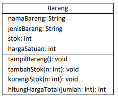
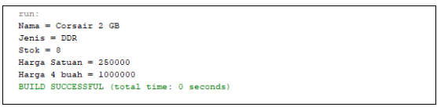
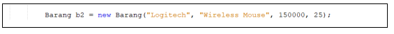

# Jobsheet 2

### Mohammad Izamul Fikri Fahmi
### TI-1F
### 2141720171

<hr>

#### 2.2 Deklarasi Class, Atribut dan Method

Waktu : 45 Menit

Perhatikan Diagram Class berikut ini:



Berdasarkan diagram class di atas, akan dibuat program class dalam Java
#### 2.2.1 Langkah-langkah Percobaan

1. Buat Project baru, dengan nama **StrukturData**. Buat paket dengan nama minggu2, buatlah class
baru dengan nama **Barang**.
2. Lengkapi class **Barang** dengan atribut dan method yang telah digambarkan di dalam diagram
class di atas, sebagai berikut:


#### kode program
```java
class Barang {
    String namaBarang, jenisBarang;
    int stok, hargaSatuan;

    void tampilBarang(){
        System.out.println("Nama = "+namaBarang);
        System.out.println("Jenis = "+jenisBarang);
        System.out.println("Stok = "+stok);
        System.out.println("Harga Satuan = "+hargaSatuan);
    }
    void tambahStok(int n){
        stok += n;
    }

    void kurangiStok(int n){
        stok -= n;
    }

    int hitungHargaTotal(int jumlah){
        return jumlah*hargaSatuan;
    }
}
```
3. Coba jalankan (Run) class Barang tersebut. Apakah bisa?
##### Jawab : tidak bisa

#### 2.2.2 Verifikasi Hasil Percobaan
Cocokkan hasil compile kode program anda dengan gambar berikut ini. 


##### jawab


#### 2.2.3 Pertanyaan

1. Sebutkan 2 karakteristik class/objek!
- memiliki dua karakteristik yang utama, yaitu atribut dan behavior. Atribut merupakan status object dan behavior merupakan tingkah laku dari object tersebut.

2. Kata kunci apakah yang digunakan untuk mendeklarasikan class?
- **class**

3. Perhatikan class Barang yang ada di Praktikum di atas, ada berapa atribut yang dimiliki oleh class
tersebut? Sebutkan! Dan pada baris berapa saja deklarasi atribut dilakukan?
- ada 4 atribut
    - namaBarang: String (line 14)
    - jenisBarang: String (line 14)
    - stok: int (line 15)
    - hargaSatuan: int (line 15)

4. Ada berapa method yang dimiliki oleh class tersebut? Sebutkan! Dan pada baris berapa saja
deklarasi method dilakukan?
- ada 4 method
    - tanpilBarang(): void (line 16)
    - tambahStok(n: int): void (line 23)
    - kurangiStok(n: int): void (line 27)
    - hitungHargaTotal(jumlah: int): int (line 31)

5. Perhatikan method **kurangiStok()** yang ada di class Barang, modifikasi isi method tersebut
sehingga proses pengurangan hanya dilakukan jika stok masih ada (masih lebih besar dari 0)

```java
    void kurangiStok(int n){
        if (stok > 0 && n <= stok){  //modifikasi
        stok -= n;
        }
    }
```
6. Menurut Anda, mengapa method **tambahStok()** dibuat dengan memiliki 1 parameter berupa
bilangan int?

Karena hanya dibutuhkan untuk menampung data variabel **n** .

7. Menurut Anda, mengapa method **hitungHargaTotal()** memiliki tipe data int?

Karena mungkin sudah diperkirakan bahwa hasil hitung total tidak akan menghasilkan bilangan desimal, alias pasti bilangan bulat.

8. Menurut Anda, mengapa method **tambahStok()** memiliki tipe data void?

karena tidak dibutuhkannya/tidak adanya nilai pengembalian dalam method ini


#### 2.3 Instansiasi Objek dan Mengakses Atribut & Method

Waktu : 45 Menit

Sampai tahap ini, kita telah membuat class Barang dengan sukses. Selanjutnya, apabila diinginkan
untuk mulai menggunakan class Barang tersebut, mengakses atribut-atribut dan method-method
yang ada di dalamnya, maka selanjutnya perlu dibuat objek/instance dari class Barang terlebih dahulu.

#### Langkah-langkah Percobaan
1. Di dalam paket minggu2, buatlah class baru dengan nama **BarangMain**. Dan di dalam class
**BarangMain** tersebut, buatlah method **main()**.
2. Di dalam method **main()**, lakukan instansiasi, dan kemudian lanjutkan dengan mengakses atribut
dan method dari objek yang telah terbentuk.


#### kode program

``` java
class BarangMain {
    public static void main(String[] args) {
        Barang b1 = new Barang();
        b1.namaBarang = "Corsair 2 GB";
        b1.jenisBarang = "DDR";
        b1.hargaSatuan = 250000;
        b1.stok = 10;
        b1.tambahStok(1);
        b1.kurangiStok(3);
        b1.tampilBarang();
        int hargaTotal = b1.hitungHargaTotal(4);
        System.out.println("Harga 4 buah = "+hargaTotal);
    }
}

```

3. Jalankan (Run) class BarangMain tersebut dan amati hasilnya


- dalam method main dilakukan instansiasi dan kemudian dilanjut dengan mengakses atribut dan method dari objek yang telah dibuat dalam class Barang()

#### 2.3.2 Verifikasi Hasil Percobaan
Cocokkan hasil compile kode program anda dengan gambar berikut ini.



hasil run sudah cocok


#### Pertanyaan
1. Pada class BarangMain, pada baris berapakah proses instansiasi dilakukan? Dan apa nama objek
yang dihasilkan?

- Instansiasi dilakukan di line(baris) 15, dengan nama **b1**.

2. Bagaimana cara mengakses atribut dan method dari suatu objek?

- Dengan memanggil nama objek disertai method serta nilai parameter jika memang ada parameternya.

#### 2.4 Membuat Konstruktor
Waktu : 45 Menit

Di dalam percobaan ini, kita akan mempraktekkan bagaimana membuat berbagai macam
konstruktor berdasarkan parameternya.

#### 2.4.1 Langkah-langkah Percobaan

1. Perhatikan kembali class Barang. Tambahkan di dalam class Barang tersebut 2 buah konstruktor. 1 konstruktor default dan 1 konstruktor berparameter.


#### hasil perubahan

```java
class Barang {
    String namaBarang, jenisBarang;
    int stok, hargaSatuan;


    // menambah 2 kontruksi
    Barang(){
    }
    Barang((String nm, String jn, int st, int hs){
        namaBarang = nm;
        jenisBarang = jn;
        stok = st;
        hargaSatuan = hs;
    }
    void tampilBarang()){
        System.out.println("Nama = "+namaBarang);
        System.out.println("Jenis = "+jenisBarang);
        System.out.println("Stok = "+stok);
        System.out.println("Harga Satuan = "+hargaSatuan);
    }
    void tambahStok(int n){
        stok += n;
    }

    void kurangiStok(int n){
        if (stok > 0 && n <= stok){  //modifikasi
        stok -= n;
        }
    }

    int hitungHargaTotal(int jumlah){
        return jumlah*hargaSatuan;
    }
}
```

2. Buka kembali class BarangMain. Dan buat sebuah objek lagi, kali ini dengan menggunakan
konstruktor berparameter

```java
class BarangMain {
    public static void main(String[] args) {
        Barang b1 = new Barang();
        b1.namaBarang = "Corsair 2 GB";
        b1.jenisBarang = "DDR";
        b1.hargaSatuan = 250000;
        b1.stok = 0;
        //b1.tambahStok(1);
        b1.kurangiStok(3);
        b1.tampilBarang();
        int hargaTotal = b1.hitungHargaTotal(4);
        System.out.println("Harga 4 buah = "+hargaTotal);
        //objek berparameter
        Barang b2 = new Barang("Logitech", "Wireless Mouse", 25, 150000);
        b2.tampilBarang();
    }
}


```

3. Jalankan kembali class BarangMain dan amati hasilnya.


karena terjadi penambahan objek baru b2 serta memiliki parameter dengan isi yang tertera, maka menghasilkan output baru setelah output objek sebelumnya, seperti screenshot di atas.

#### Verifikasi Hasil Percobaan
Cocokkan hasil compile kode program anda dengan gambar berikut ini.


**Hasil run program sudah sesuai dengan contoh di atas**


#### 2.4.3 Pertanyaan
1. Perhatikan class **Barang** yang ada di Praktikum 2.4.1, pada baris berapakah deklarasi
konstruktor berparameter dilakukan?
2. Perhatikan class **BarangMain** di Praktikum 2.4.1, apa sebenarnya yang dilakukan pada baris
program dibawah ini?



3. Coba buat objek dengan nama b3 dengan menggunakan konstruktor berparameter dari class
Barang.

#### koe program
```java
class BarangMain {
    public static void main(String[] args) {
        Barang b1 = new Barang();
        b1.namaBarang = "Corsair 2 GB";
        b1.jenisBarang = "DDR";
        b1.hargaSatuan = 250000;
        b1.stok = 0;
        //b1.tambahStok(1);
        b1.kurangiStok(3);
        b1.tampilBarang();
        int hargaTotal = b1.hitungHargaTotal(4);
        System.out.println("Harga 4 buah = "+hargaTotal);
        //objek berparameter
        Barang b2 = new Barang("Logitech", "Wireless Mouse", 25, 150000);
        b2.tampilBarang();

        //objek baru b3
        Barang b3 = new Barang("Sepatu", "Sepatu Olahraga", 5, 200000);
        b3.kurangiStok(2);
        b3.tampilBarang();
    }
}

```

#### hasil run


#### 2.5 Latihan Praktikum
Waktu : 60 Menit
1. Buat program berdasarkan diagram class berikut ini!


-  Method hitungHargaTotal() digunakan untuk menghitung harga total yang merupakan perkalian antara hargaSatuan dengan jumlah barang yang dibeli
- Method hitungDiskon() digunakan untuk menghitung diskon dengan aturan sbb:

    - Jika harga total > 100000, akan mendapat diskon 10%
    - Jika harga total mulai dari 50000 sampai 100000 akan mendapat diskon sebesar 5%
    - Jika dibawah 50000 tidak mendapat diskon
- Method hitungHargaBayar() digunakan untuk menghitung harga total setelah dikurangi diskon

##### Jawab

##### kode program Barang
``` java
public class Barang {
    String nama;
    int hargaSatuan, jumlah;

    int hitungHargaTotal(){
        int total = hargaSatuan * jumlah;
        return total;
    }
    double hitungDiskon(){
        if(hargaSatuan>100000){
            return hargaSatuan*0.1;
        } else if (hargaSatuan>=50000){
            return hargaSatuan*0.05;
        } else {
            return 0;
        }
    }
    double hitungHargaBayar(){
        return hitungHargaTotal()-hitungDiskon()*jumlah;
    }
}

```
##### kode program BarangMain
```java
public class BarangMain {
    public static void main(String[] args) {
        //barang di bawah 50000
        Barang b1 = new Barang();
        b1.nama = "kaos";
        b1.hargaSatuan = 40000;
        b1.jumlah = 10;
        System.out.println("=== harga <50000 ===");
        System.out.println("Harga total "+b1.nama+" = Rp"+b1.hitungHargaTotal());
        System.out.println("Diskon PerBarang = Rp"+b1.hitungDiskon());
        System.out.println("Harga bersih     = Rp"+b1.hitungHargaBayar());
        
        //barang di harga 50000-100000
        Barang b2 = new Barang();
        b2.nama = "Celana";
        b2.hargaSatuan = 70000;
        b2.jumlah = 5;
        System.out.println("\n=== harga 50000-100000 ===");
        System.out.println("Harga total "+b2.nama+" = Rp"+b2.hitungHargaTotal());
        System.out.println("Diskon PerBarang = Rp"+b2.hitungDiskon());
        System.out.println("Harga bersih     = Rp"+b2.hitungHargaBayar());
   
        //barang di harga >100000
        Barang b3 = new Barang();
        b3.nama = "Hoodie";
        b3.hargaSatuan = 200000;
        b3.jumlah = 4;
        System.out.println("\n=== harga >100000 ===");
        System.out.println("Harga total "+b3.nama+" = Rp"+b3.hitungHargaTotal());
        System.out.println("Diskon PerBarang = Rp"+b3.hitungDiskon());
        System.out.println("Harga bersih     = Rp"+b3.hitungHargaBayar());
    }
}

```
##### hasil run


2. Buat program berdasarkan diagram class berikut ini!


- Atribut x digunakan untuk menyimpan posisi koordinat x (mendatar) dari pacman, sedangkan
atribut y untuk posisi koordinat y (vertikal)
- Atribut width digunakan untuk menyimpan lebar dari area permainan, sedangkan height
untuk menyimpan panjang area
- Method moveLeft() digunakan untuk mengubah posisi pacman ke kiri (koordinat x akan
berkurang 1), sedangkan moveRight() untuk bergerak ke kanan (koordinat x akan bertambah
1). Perlu diperhatikan bahwa koordinat x tidak boleh lebih kecil dari 0 atau lebih besar dari
nilai width
- Method moveUp() digunakan untuk mengubah posisi pacman ke atas (koordinat y akan
berkurang 1), sedangkan moveDown() untuk bergerak ke bawah (koordinat y akan bertambah
1). Perlu diperhatikan bahwa koordinat y tidak boleh lebih kecil dari 0 atau lebih besar dari
nilai height

##### kode program
``` java
import java.util.Scanner;
public class PacMan {

    int x, y, width=20, height=40;

    void moveLeft() {
        if (x > 0) x--;
    }

    void moveRight() {
        if (x < width || !(x >= width)) x++;
    }

    void moveUp() {
        if (y > 0) y--;  
    }

    void moveDown() {
        if (y < height || !(x >= height)) y++;
    }
    void printPosition() {
        System.out.println("current possition: x " + x + " y " + y);
        for (int i = 0; i < height; i++) {
            for (int j = 0; j < width; j++) {
                if (i == 0 || i == height - 1) {
                    System.out.print(": ");
                } else if (j == 0 || j == width - 1) {
                    System.out.print(": ");
                } else {
                    if (!(i == y && j == x)) {
                        System.out.print("  ");
                    } else {
                        System.out.print("v ");
                    }

                }
            }         System.out.println();
        }
    }

    public static void main(String[] args) {

        Scanner userInput = new Scanner(System.in);
        PacMan pc = new PacMan();
        System.out.println("=============");

                pc.x = 1;
                pc.y = 1;

        do {
            System.out.println("===============");
            System.out.print("w untuk move up\n"
                    + "a untuk move left\n"
                    + "s untuk move down\n"
                    + "d untuk move right\n"
                    + "p untuk print current possition\n"
                    + "=> ");
            char opsi = userInput.next().charAt(0);
            switch (opsi) {
                case 'w':
                    pc.moveUp();
                    break;
                case 'a':
                    pc.moveLeft();
                    break;
                case 's':
                    pc.moveDown();
                    break;
                case 'd':
                    pc.moveRight();
                    break;
                case 'p':
                    pc.printPosition();
                    break;
                default:
                    System.out.println("wrong input");
                    break;
            }
        } while (true);
    }
}


```
##### Hasil Run


