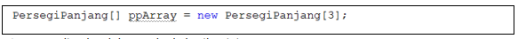
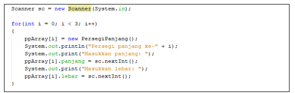
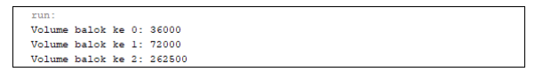

# Jobsheet 3 - Array of Objects
### Nama : Mohammad Izamul Fikri Fahmi
### Kelas : 1F-TI
### NIM : 2141720171
### Absen : 17
<hr>

#### 3.1 Tujuan Praktikum
Setelah melakukan materi praktikum ini, mahasiswa mampu:
1. Memahami dan menjelaskan fungsi array yang berisikan variabel objek.
2. Mahasiswa mampu menangkap logika tentang permasalahan array of object dalam Java
3. Mahasiswa mampu menerapkan pembuatan array of object dalam Java
#### 3.2 Membuat Array dari Object, Mengisi dan Menampilkan
Didalam praktikum ini, kita akan mempraktekkan bagaimana membuat array dari object,
kemudian mengisi dan menampilkan array tersebut.
#### 3.2.1 Langkah-langkah Percobaan
1. Buat Project baru, dengan nama “ArrayObjects”. Buat package dengan nama minggu3.
2. Buat class PersegiPanjang:

3. Pada fungsi main yaitu pada class ArrayObjects, buatlah array PersegiPanjang yang berisi 3
elemen:

4. Kemudian isikan masing-masing atributnya:

5. Cetak ke layar semua atribut dari objek ppArray:

6. Jalankan dan amati hasilnya.

##### Kode program class PersergiPanjang
```java
public class PersegiPanjang {
    public int panjang;
    public int lebar;
}
```
##### Kode program ArrayObjects
```java
public class ArrayObjects {
    public static void main(String[] args) {
        PersegiPanjang[] ppArray = new PersegiPanjang[3];

        ppArray[0] = new PersegiPanjang();
        ppArray[0].panjang = 120;
        ppArray[0].lebar = 30;

        ppArray[1] = new PersegiPanjang();
        ppArray[1].panjang = 80;
        ppArray[1].lebar = 40;

        ppArray[2] = new PersegiPanjang();
        ppArray[2].panjang = 100;
        ppArray[2].lebar = 20;

        //menampilkan
        System.out.println("Persegi Panjang ke-0, Panjang : "+ppArray[0].panjang+", Lebar : "+ppArray[0].lebar);
        System.out.println("Persegi Panjang ke-1, Panjang : "+ppArray[1].panjang+", Lebar  : "+ppArray[1].lebar);
        System.out.println("Persegi Panjang ke-2, Panjang : "+ppArray[2].panjang+", Lebar : "+ppArray[2].lebar);
    }
}
```
##### Hasil Run


#### 3.2.2 Verifikasi Hasil Percobaan


##### Jawab : Sudah Sesuai.

#### 3.2.3 Pertanyaan
1. Berdasarkan uji coba 3.2, apakah class yang akan dibuat array of object harus selalu memiliki
atribut dan sekaligus method?Jelaskan!
##### Jawab : tidak, karena pada uji coba 3.2 hanya dilakukan penyimpanan data pada atribut yang ada di PersegiPanjang, dan di ArrayObjects hanya ditampilkan saja.
2. Apakah class PersegiPanjang memiliki konstruktor?Jika tidak, kenapa dilakukan pemanggilan
konstruktur pada baris program berikut :


##### Jawab : Pada baris kode Program di atas tidak terdapat konstruktor di dalamnya, dan pembuatan kode program di maksutkan untuk melakukan pemanggilan terhadap array of object yang memiliki nama ppArray dengan infomrasi ppArray index ke-1 karena di dalam kurung siku terdapat bilangan 1
3. Apa yang dimaksud dengan kode berikut ini:


##### Jawab : Terjadi proses instansiasi array of object juga pemberian value ada berapa elemen dari array yang dibuat
4. Apa yang dimaksud dengan kode berikut ini:


##### Jawab : instansiasi object array indeks ke 1 dari class PersegiPanjang, dilanjutkan dengan pemberian nilai pada variabel dengan mengakses atribut dari class PersegiPanjang yang telah dibuat.
5. Mengapa class main dan juga class PersegiPanjang dipisahkan pada uji coba 3.2?

##### Jawab : Untuk mempermudah pemahaman, dan penulisan program jadi lebih rapi. walau class ArrayObjects bisa ditulis dalam class

#### 3.3 Menerima Input Isian Array Menggunakan Looping
Pada praktikum ini kita akan mengubah hasil program dari praktikum 3.2 sehingga program dapat
menerima input dan menggunakan looping untuk mengisikan atribut dari semua persegi panjang yang
ada di ppArray.
#### 3.3.1 Langkah-langkah Percobaan
1. Import scanner pada class ArrayObjects.  


2. Pada praktikum 3.2 poin nomor 4, ganti kodenya dengan kode berikut ini, yaitu membuat objek
Scanner untuk menerima input, kemudian melakukan looping untuk menerima input:


3. Pada praktikum 3.2 poin nomor 5, ganti kodenya dengan berikut ini, yaitu melakukan looping
untuk mengakses isi array ppArray dan menampilkannya ke layar: 


4. Jalankan dan amati hasilnya.
##### Kode Program ArrayObjects
```java
import java.util.Scanner;
public class ArrayObjects {
    public static void main(String[] args) {
    Scanner sc = new Scanner(System.in);
    PersegiPanjang[] ppArray = new PersegiPanjang[3];
    
    for (int i = 0; i < 3; i++){
        ppArray[i] = new PersegiPanjang();
        System.out.println("Persegi panjang ke-"+ i);
        System.out.print("Masukkan panjang: ");
        ppArray[i].panjang = sc.nextInt();
        System.out.print("Masukkan lebar: ");
        ppArray[i].lebar = sc.nextInt();
    }
    for (int i = 0; i < 3; i++){
    System.out.println("Persegi Panjang ke-"+ i);
    System.out.println("Panjang: "+ppArray[i].panjang+", Lebar: "+ppArray[i].lebar);
    }
    }
}
```

##### Kode program PersegiPanjang
```java
public class PersegiPanjang {
    public int panjang;
    public int lebar;
}

```

##### Hasil run


#### 3.3.2 Verifikasi Hasil Percobaan
Contoh verifikasi hasil percobaan ini.


##### Jawab : Sudah cocok

#### 3.3.3 Pertanyaan
1. Apakah array of object dapat diimplementasikan pada array 2 Dimensi?
##### Jawab : Bisa

2. Jika jawaban soal no satu iya, berikan contohnya! Jika tidak, jelaskan!
##### Jawab : 
##### Kode Program
```java
import java.util.Scanner;
public class SegitigaSamaSisi {
    public int sisi;

public class ArrayObject2D {
    public static void main(String[] args) {
        Scanner sc = new Scanner(System.in);
        SegitigaSamaSisi[][] arrayDua = new SegitigaSamaSisi[2][2];

        for (int i=0;i<2;i++){
            for (int j=0;j<2;j++){

                arrayDua[i][j] = new SegitigaSamaSisi();
                System.out.print("Masukkan sisi segitiga baris-"+i+" kolom-"+j+" =");
                arrayDua[i][j].sisi = sc.nextInt();
            }
        }
        //menampilkan
        for (int i=0;i<2;i++){
            for (int j=0;j<2;j++){

                System.out.println("sisi segitiga baris-"+i+" kolom-"+j+" ="+arrayDua[i][j].sisi);

            }
        }
    }
}
}
```

3. Jika diketahui terdapat class Persegi yang memiliki atribut sisi bertipe integer, maka kode
dibawah ini akan memunculkan error saat dijalankan. Mengapa?


##### Jawab : karena ppArray[5] belum diinstansiasi

4. Modifikasi kode program pada praktikum 3.3 agar length array menjadi inputan dengan Scanner!
##### Jawab : 
```java
import java.util.Scanner;
public class ArrayObjects {
    public static void main(String[] args) {
    Scanner sc = new Scanner(System.in);
    //menerima inputan length array
    System.out.print("Masukkan panjang array : ");
    int panjang = sc.nextInt();
    PersegiPanjang[] ppArray = new PersegiPanjang[panjang];
    
    for (int i = 0; i < panjang; i++){
        ppArray[0] = new PersegiPanjang();
        ppArray[i] = new PersegiPanjang();
        System.out.println("Persegi panjang ke-"+ i);
        System.out.print("Masukkan panjang: ");
        ppArray[i].panjang = sc.nextInt();
        System.out.print("Masukkan lebar: ");
        ppArray[i].lebar = sc.nextInt();
    }
    for (int i = 0; i < panjang; i++){
    System.out.println("Persegi Panjang ke-"+ i);
    System.out.println("Panjang: "+ppArray[i].panjang+", Lebar: "+ppArray[i].lebar);
    }
    }
}
```

5. Apakah boleh Jika terjadi duplikasi instansiasi array of objek, misalkan saja instansiasi dilakukan
pada ppArray[i] sekaligus ppArray[0]?Jelaskan !
##### Jawab : Bisa
```java
import java.util.Scanner;
public class ArrayObjects {
    public static void main(String[] args) {
    Scanner sc = new Scanner(System.in);
    //menerima inputan length array
    System.out.print("Masukkan panjang array : ");
    int panjang = sc.nextInt();
    PersegiPanjang[] ppArray = new PersegiPanjang[panjang];
    
    for (int i = 0; i < panjang; i++){
        ppArray[0] = new PersegiPanjang();//double instansiasi
        ppArray[i] = new PersegiPanjang();
        System.out.println("Persegi panjang ke-"+ i);
        System.out.print("Masukkan panjang: ");
        ppArray[i].panjang = sc.nextInt();
        System.out.print("Masukkan lebar: ");
        ppArray[i].lebar = sc.nextInt();
    }
    for (int i = 0; i < panjang; i++){
    System.out.println("Persegi Panjang ke-"+ i);
    System.out.println("Panjang: "+ppArray[i].panjang+", Lebar: "+ppArray[i].lebar);
    }
    }
}
```
walaupun terjadi double instansiasi, tetapi pada akhirnya hanya terbentu satu objek saja, karena kesamaan/duplikasi saat instansiasi

#### 3.4 Operasi Matematika Atribut Object Array
Pada praktikum ini kita akan melakukan pengoperasian matematika beberapa atribut pada
masing-masing anggota array.
#### 3.4.1 Langkah-langkah Percobaan
1. Buat package baru “ArrayBalok”.
2. Buat class Balok:


3. Pada fungsi main yaitu pada class ArrayBalok, buat array Balok yang berisi 3 elemen:


4. Kemudian tambahkan kode berikut ini untuk mengisi array blArray menggunakan konstruktor
dari class Balok:


5. Tampilkan semua volume balok tersebut dengan cara memanggil method hitungVolume() di
dalam looping seperti berikut ini:


6. Jalankan dan amati hasilnya.

##### Kode program ArrayBalok
``` java
package ArrayBalok;

public class ArrayBalok {
    public static void main(String[] args) {
        Balok[] blArray = new Balok[3];

        blArray[0] = new Balok(100,30,12);
        blArray[1] = new Balok(120,40,15);
        blArray[2] = new Balok(210,50,25);

        for (int i=0; i<3; i++)
        {
            System.out.println("Volume balok ke "+i+" : "+blArray[i].hitungVolume());
        }
    }
}
```
##### Kode program balok
```java
package ArrayBalok;

public class Balok {
    public int panjang;
    public int lebar;
    public int tinggi;

    public Balok(int p, int l, int t){
        panjang = p;
        lebar = l;
        tinggi = t;
    }

    public int hitungVolume(){
        return panjang * lebar * tinggi;
    }
}

```
##### Hasil run


#### 3.4.2 Verifikasi Hasil Percobaan
Cocokkan hasil compile kode program anda dengan gambar berikut ini.


##### Jawab : Sudah sesuai

#### 3.4.3 Pertanyaan
1. Dapatkah konstruktor berjumlah lebih dalam satu kelas? Jelaskan dengan contoh!
##### Jawab : bisa
```java
package ArrayBalok;

public class Balok {
    public int panjang;
    public int lebar;
    public int tinggi;

    public Balok(){ //konstruktor default
    }

    public Balok(int p, int l, int t){ //konstruktor berparameter
        panjang = p;
        lebar = l;
        tinggi = t;
    }

    public int hitungVolume(){
        return panjang * lebar * tinggi;
    }
}

```

2. Jika diketahui terdapat class Segitiga seperti berikut ini:

Tambahkan konstruktor pada class Segitiga tersebut yang berisi parameter int a, int t
yang masing-masing digunakan untuk mengisikan atribut alas dan tinggi.

##### Jawab :
```java
public class Segitiga {
    public int alas;
    public int tinggi;

    public Segitiga(int a, int t){
        alas = a;
        tinggi = t;
    }
}
```

3. Tambahkan method hitungLuas() dan hitungKeliling() pada class Segitiga tersebut.
```java
public class Segitiga {
    public int alas;
    public int tinggi;

    public Segitiga(int a, int t){
        alas = a;
        tinggi = t;
    }

    public double hitungLuas(){
        return (double) alas*tinggi*0.5;
    }

    //dengan asumsi segitiga ini adalah segitiga sama sisi
    public int hitungKeliling(){
        return alas*3;
    }

}
```
4. Pada fungsi main, buat array Segitiga sgArray yang berisi 4 elemen, isikan masing-masing
atributnya sebagai berikut:


```java
public class SegitigaMain {
    public static void main(String[] args) {
        Segitiga[] sgArray = new Segitiga[4];

        sgArray[0] = new Segitiga(10, 4);
        sgArray[1] = new Segitiga(20, 10);
        sgArray[2] = new Segitiga(15, 6);
        sgArray[3] = new Segitiga(25, 10);
        
    }
}

```

5. Kemudian menggunakan looping, cetak luas dan keliling dengan cara memanggil method
hitungLuas() dan hitungKeliling().

```java
public class SegitigaMain {
    public static void main(String[] args) {
        Segitiga[] sgArray = new Segitiga[4];

        sgArray[0] = new Segitiga(10, 4);
        sgArray[1] = new Segitiga(20, 10);
        sgArray[2] = new Segitiga(15, 6);
        sgArray[3] = new Segitiga(25, 10);

        for (int i=0;i<4;i++){
            System.out.println("Segitiga "+i+" memiliki luas : "+sgArray[i].hitungLuas()+" dan Keliling : "+sgArray[i].hitungKeliling());
        }
        
    }
}

```

##### hasil run


#### 3.5 Latihan Praktikum
1. Buatlah program yang dapat menghitung luas permukaan dan volume beberapa bangun ruang
(minimal 3, jenis bangun luas bebas). Buatlah 3 (tiga) class sesuai dengan jumlah jenis bangun
ruang. Dan buat satu main class untuk membuat array of objek yang menginputkan atribut-atribut
yang ada menggunakan konstruktor semua bangun ruang tersebut.
Keterangan : Buat looping untuk menginputkan masing-masing atributnya, kemudian tampilkan
luas permukaan dan volume dari tiap jenis bangun ruang tersebut.

##### Kode Program Masing-Masing Class Bangun Ruang

```java
package Latihan;

public class Bola {
    public int r;
    public double phi = 3.14;

    public Bola(int jari){
        r = jari;
    }

    public double hitungLuasPermukaan(){
        return (double) 4*phi*r*r;
    }

    public double hitungVolume(){
        return (double) 4/3*phi*r*r*r;
    }

    
}

```

```java
package Latihan;

public class Kerucut {
    public int r, t, s;
    public double phi = 3.14;

    public Kerucut(int jari, int tinggi, int sisi){
        r = jari;
        t = tinggi;
        s = sisi;
    }
    
    public double hitungLuasPermukaan(){
        return (double) phi*r*(r+s);
    }
    
    public double hitungVolume(){
        return (double) 1/3*phi*r*r*t;
    }
    
}


```

```java
package Latihan;

public class Kubus {
    public int sisi;

    public Kubus(int s){
        sisi = s;
    }

    public int hitungLuasPermukaan(){
        return sisi*sisi*6;
    }

    public int hitungVolume(){
        return sisi*sisi*sisi;
    }
}

```

##### Kode Program Main

```java
package Latihan;
import java.util.Scanner;
public class MainHitung {
    public static void main(String[] args) {
        Scanner sc = new Scanner(System.in);

        //deklarasi array
        Bola[] blArray = new Bola[100];
        Kerucut[] kcArray = new Kerucut[100];
        Kubus[] kbArray = new Kubus[100];

        System.out.println("Selamat Datang Di Program Menghitung");
        System.out.println("-------------------------------------");
        System.out.print("Jumlah Loop : ");
        int loop = sc.nextInt();

        //perulangan untuk menginput konstruksi
        for(int i=0;i<loop;i++){
            //bola
            System.out.println("==================================");
            System.out.printf("------------- BOLA %d------------\n",i+1);
            System.out.print("Masukkan jari-jari : ");
            int jari = sc.nextInt();
            blArray[i] = new Bola(jari);
            System.out.println("Volume : "+blArray[i].hitungVolume());
            System.out.println("Luas Permukaan : "+blArray[i].hitungLuasPermukaan());

            //kerucut
            System.out.println("==================================");
            System.out.printf("------------- KERUCUT %d------------\n",i+1);
            System.out.print("Masukkan jari-jari : ");
            jari = sc.nextInt();
            System.out.print("Masukkan tinggi : ");
            int tinggi = sc.nextInt();
            System.out.print("Masukkan sisi : ");
            int sisi = sc.nextInt();
            kcArray[i] = new Kerucut(jari, tinggi, sisi);
            System.out.println("Volume : "+kcArray[i].hitungVolume());
            System.out.println("Luas Permukaan : "+kcArray[i].hitungLuasPermukaan());

            //Kubus
            System.out.println("==================================");
            System.out.printf("------------- KUBUS %d------------\n",i+1);
            System.out.print("Masukkan sisi : ");
            sisi = sc.nextInt();
            kbArray[i] = new Kubus(sisi);
            System.out.println("Volume : "+kbArray[i].hitungVolume());
            System.out.println("Luas Permukaan : "+kbArray[i].hitungLuasPermukaan());
        }
    }
}

```

##### Hasil Run


2. Sebuah perusahaan jual beli tanah membutuhkan sebuah program yang dapat memberitahu luas
tanah. Program tersebut dapat menerima input jumlah tanah yang akan dihitung dan atribut 
panjang dan lebar masing-masing dari tanah yang diinputkan. Program dapat menampilkan luas
tanah masing-masing tanah yang diinputkan tadi dan juga tanah terluas dari ketiga tanah yang
ada. Contoh output program:


##### Kode Program Class Tanah

```java
package Latihan2;

public class Tanah {
    public int p, l;

    public Tanah(int panjang, int lebar){
        p = panjang;
        l = lebar;
    }

    public int hitungLuas(){
        return p*l;
    }
}

```
##### Kode Program Main Tanah 

``` java
package Latihan2;
import java.util.Scanner;
public class MainTanah {
    public static void main(String[] args) {
        Scanner sc = new Scanner(System.in);
        int panjang, lebar;

        System.out.println("Program Menghitung Luas Tanah\n==============================");
        System.out.print("Jumlah Tanah: ");
        int loop = sc.nextInt();

        System.out.println("");

         //deklarasi array tanah
         Tanah[] tArray = new Tanah[loop];
         //menampung luas
        int[] luas = new int[loop];

         for(int i=0;i<loop;i++){
             System.out.printf("Tanah %d \n",i+1);
             System.out.print("Panjang : ");
             panjang = sc.nextInt();
             System.out.print("Lebar : ");
             lebar = sc.nextInt();

             //masukkan ke kontruksi berparameter
             tArray[i] = new Tanah(panjang, lebar);
             luas[i] = tArray[i].hitungLuas();
         }

         System.out.println("");

         int banding=0;
         int max=0;
         for(int i=0;i<loop;i++){
            System.out.println("Luas Tanah "+(i+1)+": "+luas[i]);
            if (luas[i]>banding){
                banding = luas[i];
                max = i+1;

            }
         }

         System.out.println("\nTanah terluas: Tanah "+max);


    }
}

```

##### Hasil run


3. Sebuah kampus membutuhkan program untuk menampilkan informasi mahasiswa berupa nama,
nim, jenis kelamin dan juga IPK mahasiswa. Program dapat menerima input semua informasi
tersebut, kemudian menampilkanya kembali ke user. Implementasikan program tersebut jika
dimisalkan terdapat 3 data mahasiswa yang tersedia. Contoh output program:


##### Kode Program Mahasiswa

```java
package Latihan3;

public class Mahasiswa {
    public String nama;
    public int nim;
    public float ipk;
    public char gender;

    public Mahasiswa(String nm, int no, float ip, char g){
        nama = nm;
        nim = no;
        ipk = ip;
        gender = g;
    }

    public void tampilData(){
        System.out.println("Nama : "+nama );
        System.out.println("NIM : "+nim );
        System.out.println("Jenis kelamin : "+gender );
        System.out.println("Nilai IPK : "+ipk );

    }
}
```

##### Kode Program MainMahasiswa

```java
package Latihan3;
import java.util.Scanner;
public class MainMahasiswa {
    public static void main(String[] args) {
        Scanner sc = new Scanner(System.in);

        Mahasiswa[] mArray = new Mahasiswa[3];

        String nama;
        int nim;
        char kelamin;
        float ipk;

        for(int i=0;i<3;i++){
            System.out.println("");
            System.out.println("Masukkan data mahasiswa ke- "+(i+1));
            System.out.print("Masukkan nama : ");
            nama = sc.next();
            System.out.print("Masukkan nim : ");
            nim = sc.nextInt();
            System.out.print("Masukkan jenis kelamin : ");
            kelamin = sc.next().charAt(0);
            System.out.print("Masukkan IPK : ");
            ipk = sc.nextFloat();

            mArray[i] = new Mahasiswa(nama, nim, ipk, kelamin);
        }
        System.out.println("\n");
        for(int i=0;i<3;i++){
            System.out.println("Data Mahasiswa ke-"+(i+1));
            mArray[i].tampilData();
        }

    }
}
```

##### Hasil Run

