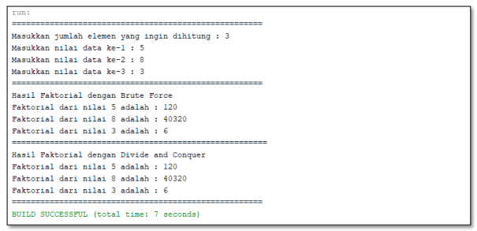
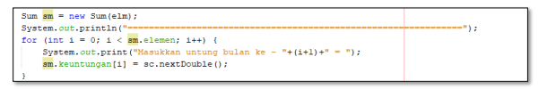
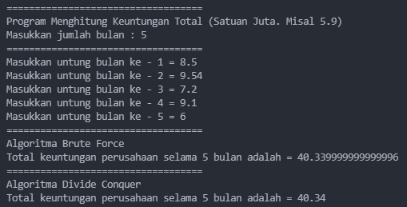
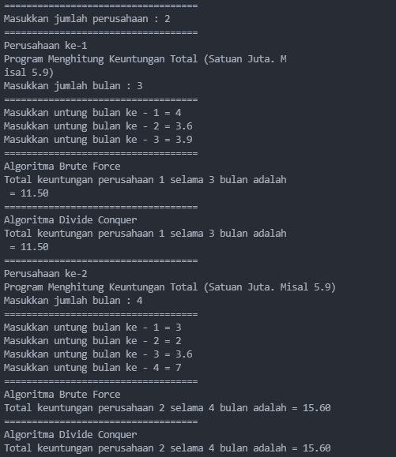

# JOBSHEET IV
# Brute Force and Divide Conquer
### Nama : Mohammad Izamul Fikri Fahmi
### Kelas/Absen : TI-1F/17
### NIM = 2141720171
<hr>

#### 4.1 Tujuan Praktikum
Setelah melakukan materi praktikum ini, mahasiswa mampu:
1. Mahasiswa mampu membuat algoritma bruteforce dan divide-conquer
2. Mahasiswa mampu menerapkan penggunaan algorima bruteforce dan divide-conquer

#### 4.2 Menghitung Nilai Faktorial dengan Algoritma Brute Force dan Divide and Conquer
Perhatikan Diagram Class berikut ini :


Berdasarkan diagram class di atas, akan dibuat program class dalam Java. Untuk menghitung nilai
faktorial suatu angka menggunakan 2 jenis algoritma, Brute Force dan Divide and Conquer. Jika
digambarkan terdapat perbedaan proses perhitungan 2 jenis algoritma tersebut sebagai berikut :
Tahapan pencarian nilai faktorial dengan algoritma Brute Force :


Tahapan pencarian nilai faktorial dengan algoritma Divide and Conquer :


#### 4.2.1 Langkah-langkah Percobaan
1. Buat Project baru, dengan nama **“BruteForceDivideConquer”**. Buat package dengan nama
minggu5.
2. Buatlah class baru dengan nama **Faktorial**
3. Lengkapi class **Faktorial** dengan atribut dan method yang telah digambarkan di dalam diagram
class di atas, sebagai berikut: 

a) Tambahkan atribut nilai


b) Tambahkan method faktorialBF() nilai


c) Tambahkan method faktorialDC() nilai


#### Kode Program Hasil Langkah-Langkah di atas :
``` java
/**
 * @author Mohammad Izamul Fikri Fahmi
 */
public class Faktorial{
    public int nilai;

    public int faktorialBF(int n){
        int fakto = 1;
        for (int i = 1; i <= n; i++){
            fakto = fakto * i;
        }
        return fakto;
    }

    public int faktorialDC(int n){
        if (n == 1) {
            return 1;
        } else {
            int fakto = n * faktorialDC(n-1);
            return fakto;
        }
    }
}
```

4. Coba jalankan (Run) class **Faktorial** dengan membuat class baru **MainFaktorial**.

a) Di dalam fungsi main sediakan komunikasi dengan user untuk menginputkan jumlah angka
yang akan dicari nilai faktorialnya


b) Buat Array of Objek pada fungsi main, kemudian inputkan beberapa nilai yang akan
dihitung faktorialnya


c) Tampilkan hasil pemanggilan method faktorialDC() dan faktorialBF()


d) Pastikan program sudah berjalan dengan baik!

#### Kode Program Hasil Langkah-Langkah di atas :
``` java
import java.util.Scanner;
/**
 * @author Mohammad Izamul Fikri Fahmi
 */

public class FaktorialMain {
    public static void main(String[] args) {
        Scanner sc = new Scanner(System.in);
        System.out.println("============================================");
        System.out.print("Input elemen yang difaktorialkan : ");
        int elemen = sc.nextInt();

        Faktorial[] fk = new Faktorial[elemen];
        for(int i = 0; i < elemen; i ++){
            fk[i] = new Faktorial();
            System.out.println("Masukkan nilai data ke-"+(i+1)+" : ");
            fk[i].nilai = sc.nextInt();
        }

        System.out.println("============================================");
        System.out.println("Hasil Faktorial dengan Brute Force");
        for (int i = 0; i < elemen; i++){
            System.out.println("Faktorial dari nilai "+fk[i].nilai+" adalah : "+fk[i].faktorialBF(fk[i].nilai));
        }

        System.out.println("============================================");
        System.out.println("Hasil Faktorial dengan Divide and Conquer");
        for (int i = 0; i < elemen; i++){
            System.out.println("Faktorial dari nilai "+fk[i].nilai+" adalah : "+fk[i].faktorialDC(fk[i].nilai));
        }
        System.out.println("============================================");

        sc.close();
    }
}
```
#### 4.2.2 Verifikasi Hasil Percobaan
Cocokkan hasil compile kode program anda dengan gambar berikut ini. 



#### Hasil Compile kode program di atas :


Hasil compile sudah cocok dan bisa dijalankan

#### 4.2.3 Pertanyaan
1. Jelaskan mengenai base line Algoritma Divide Conquer untuk melakukan pencarian nilai faktorial!

Jawab :
``` java
public int faktorialDC(int n){
        if (n == 1) {
            return 1;
        } else {
            int fakto = n * faktorialDC(n-1);
            return fakto;
        }
    }
```
base line Algoritma Divide Conquer untuk mencari nilai faktorial di atas adalah dengan dimulai pembuatan nama fungsi dengan satu parameter tipe data int, lalu di dalam fungsi masuk ke pemilihan if else, yang mana if akan mengecek apakah n dari parameter bernilai 1 , jika iya maka akan mereturn 1. namun jika tidak sesuai dengan syarat if akan masuk ke else dan melakukan perhitungan faktorial seperti kode diatas dengan melakukan pengurangan n setiap kali perhitungan juga mereturn niai fakto, sampai n bernilai 1 dan akan masuk ke if, sehingga fungsi berhenti.


2. Pada implementasi Algoritma Divide and Conquer Faktorial apakah lengkap terdiri dari 3 tahapan
divide, conquer, combine? Jelaskan masing-masing bagiannya pada kode program!

Jawab :
Iya, lengkap.

a. Divide adalah membagi masalah menjadi beberapa upa-masalah yang memiliki kemiripan dengan masalahsemula namun berukuran lebih kecil (idealnya berukuran hampir sama).

- dalam fungsi di atas divide ditunjukkan dengan adanya if dan else, yang if adalah base case yang akan menghentikan program, dan else adalah rekursif call yang akan melakukan proses hitung faktorial
- code :

``` java
 if (n == 1) {
            return 1;
        } else {
            int fakto = n * faktorialDC(n-1);
            return fakto;
        }
```

b. Conquer adalah memecahkan (menyelesaikan) masing-masing upa-masalah (secara rekursif).

- dalam fungsi di atas conquer ditandai dengan else, yang mana dalam else akan melakukan perhitungan upa-masalah perkalian sendiri-sendiri.
- code :
``` java
  int fakto = n * faktorialDC(n-1);
```

c. Combine adalah mengabungkan solusi masing-masing upa-masalah sehingga membentuk solusi masalah semula.

- dalam kodingan fungsi masalah di atas, combine ditandai dengan adanya pengembalian nilai dalam else dan if, berupa return fakto, dan return 1 ketika n sudah bernilai 1, dan menghasilkan satu hasil hitung faktorial.
- code :
``` java
return 1;
// dan
 return fakto;
```

3. Apakah memungkinkan perulangan pada method **faktorialBF()** dirubah selain menggunakan
for?Buktikan!

Bisa, selama itu berupa perulangan maka akan bisa dilakukan.
disini saya membuktikan dengan menggunakan while.
```java
 // contoh dengan perulangan while
        int i = 1;
        while(i<=n){
            fakto = fakto * i;
            i++;
        }
```
Hasil Run :


4. Tambahkan pengecekan waktu eksekusi kedua jenis method tersebut!

Jawab :

mengambil waktu eksekusi brute force
``` java
System.out.println("Hasil Faktorial dengan Brute Force");
        long startTime = System.currentTimeMillis(); // mengambil waktu mulai eksekusi
        for (int i = 0; i < elemen; i++){
            System.out.println("Faktorial dari nilai "+fk[i].nilai+" adalah : "+fk[i].faktorialBF(fk[i].nilai));
        }
        long endTime = System.currentTimeMillis(); // mengambil waktu akhir eksekusi
        System.out.println("Waktu eksekusi program BF dalam milidetik : "+(endTime-startTime)); // menampilkan waktu eksekusi
```

mengambil waktu eksekusi divide and conquer
``` java
 System.out.println("Hasil Faktorial dengan Divide and Conquer");
        long startTime1 = System.currentTimeMillis(); // mengambil waktu mulai eksekusi
        for (int i = 0; i < elemen; i++){
            System.out.println("Faktorial dari nilai "+fk[i].nilai+" adalah : "+fk[i].faktorialDC(fk[i].nilai));
        }
        long endTime1 = System.currentTimeMillis(); // mengambil waktu akhir eksekusi
        System.out.println("Waktu eksekusi program DC dalam milidetik : "+(endTime1-startTime1)); // menampilkan waktu eksekusi
```

5. Buktikan dengan inputan elemen yang di atas 20 angka, apakah ada perbedaan waktu eksekusi?

Jawab :


Kesimpulan : Untuk menghitung faktorial dengan elemen lebih besar Divide and Conquer lebih cepat waktu eksekusinya daripada Brute Force.

#### 4.3 Menghitung Hasil Pangkat dengan Algoritma Brute Force dan Divide and Conquer
Pada praktikum ini kita akan membuat program class dalam Java. Untuk menghitung nilai pangkat
suatu angka menggunakan 2 jenis algoritma, Brute Force dan Divide and Conquer. 

#### 4.3.1 Langkah-langkah Percobaan
1. Di dalam paket minggu5, buatlah class baru dengan nama Pangkat. Dan di dalam class Pangkat
tersebut, buat atribut angka yang akan dipangkatkan sekaligus dengan angka pemangkatnya


2. Pada class Pangkat tersebut, tambahkan method PangkatBF()


3. Pada class Pangkat juga tambahkan method PangkatDC()


4. Perhatikan apakah sudah tidak ada kesalahan yang muncul dalam pembuatan class Pangkat

#### Kode Program Hasil Langkah-Langkah di atas :
``` java
/**
 * @author Mohammad Izamul Fikri Fahmi
 */
public class Pangkat {
    int nilai, pangkat;

    int pangkatBF(int a, int n){
        int hasil = 1;
        for(int i = 0; i < n; i++){
            hasil *= a;
        }
        return hasil;
    }

    int pangkatDC(int a, int n){
        if(n == 0){
            return 1;
        }
        else {
            if(n%2 == 1){
                return (pangkatDC(a,n/2)*pangkatDC(a,n/2)*a);
            } else {
                return (pangkatDC(a,n/2)*pangkatDC(a,n/2));
            }
        }
    }
}

```

5. Selanjutnya buat class baru yang di dalamnya terdapat method main. Class tersebut dapat
dinamakan MainPangkat. Tambahkan kode pada class main untuk menginputkan jumlah nilai
yang akan dihitung pangkatnya.


6. Nilai pada tahap 5 selanjutnya digunakan untuk instansiasi array of objek. Di dalam Kode berikut
ditambahkan proses pengisian beberapa nilai yang akan dipangkatkan sekaligus dengan
pemangkatnya.


7. Kemudian, panggil hasil nya dengan mengeluarkan return value dari method PangkatBF() dan
PangkatDC().


#### Kode Program Hasil Langkah-Langkah di atas :
``` java
import java.util.Scanner;

/**
 * @author Mohammad Izamul Fikri Fahmi
 */
public class PangkatMain {
    public static void main(String[] args) {
        Scanner sc = new Scanner(System.in);
        System.out.println("========================================");
        System.out.print("Masukkan jumlah elemen yang dihitung : ");
        int elemen = sc.nextInt();

        Pangkat[] png = new Pangkat[elemen];
        for(int i = 0; i < elemen; i++){
            png[i] = new Pangkat();
            System.out.print("Masukkan nilai yang akan dipangkatkan ke-"+(i+1)+" : ");
            png[i].nilai = sc.nextInt();
            System.out.print("Masukkan nilai pemangkat ke-"+(i+1)+" : ");
            png[i].pangkat = sc.nextInt();
        }

        System.out.println("========================================");
        System.out.println("Hasil pangkat dengan Brute Force");
        for(int i = 0; i < elemen ; i++){
            System.out.println("Nilai "+png[i].nilai+" pangkat "+png[i].pangkat+" adalah " + png[i].pangkatBF(png[i].nilai, png[i].pangkat));
        }

        System.out.println("========================================");
        System.out.println("Hasil pangkat dengan Divide Conquer");
        for(int i = 0; i < elemen ; i++){
            System.out.println("Nilai "+png[i].nilai+" pangkat "+png[i].pangkat+" adalah " + png[i].pangkatDC(png[i].nilai, png[i].pangkat));
        }
        System.out.println("========================================");
        
        sc.close();
    }
    
}
```

#### 4.3.2 Verifikasi Hasil Percobaan
Pastikan output yang ditampilkan sudah benar seperti di bawah ini.


#### Hasil compile program pangkat di atas


Dan sudah sesuai.

#### 4.3.3 Pertanyaan
1. Jelaskan mengenai perbedaan 2 method yang dibuat yaitu **PangkatBF()** dan **PangkatDC()**!

Jawab :

- Pada method PangkatBF() menggunakan metode algoritmna brute force, yang didalamnya melakukan proses hitung pangkat menggunakan for sebagai perulangan hitungan bilangan berpangkat.

- sedangkan pada method PangkatDC menggunakan metode divide and conquer, dengan membagi proses hitung pangkat dengan if else, lalo dicaombine pada return.

2. Pada method **PangkatDC()** terdapat potongan program sebagai berikut:


Jelaskan arti potongan kode tersebut

- pada if, mengecek apakah pangkat n adalah bilangan ganjil, jika iya maka keluaran hasilnya adalah (pangkatDC(a,n/2)*pangkatDC(a, n/2)*a)

- namun jika tidak atau else, maka keluaran kembalian hasilnya adalah (pangkatDC(a,n/2)*pangkatDC(a, n/2))

3. Apakah tahap combine sudah termasuk dalam kode tersebut?Tunjukkan!

Jawab :

Sudah termasuk, ditunjukkan dengan sintax return(pengembalian nilai), dimana hasil dari conquer direturnkan semua, dan dalam tahap combine dilakukan pemanggilan hasil dari hitung pangkat tersebut

4. Modifikasi kode program tersebut, anggap proses pengisian atribut dilakukan dengan
konstruktor.

- class Pangkat
``` java
/**
 * @author Mohammad Izamul Fikri Fahmi
 */
public class Pangkat {
    int nilai, pangkat;

    //modifikasi menambah konstruktor
    public Pangkat(int a, int n){
        nilai = a;
        pangkat = n;
    }
    //baris akhir modifikasi


    int pangkatBF(int a, int n){
        int hasil = 1;
        for(int i = 0; i < n; i++){
            hasil *= a;
        }
        return hasil;
    }

    int pangkatDC(int a, int n){
        if(n == 0){
            return 1;
        }
        else {
            if(n%2 == 1){
                return (pangkatDC(a,n/2)*pangkatDC(a,n/2)*a);
            } else {
                return (pangkatDC(a,n/2)*pangkatDC(a,n/2));
            }
        }
    }
}

```

- class PangkatMain
```java
import java.util.Scanner;

/**
 * @author Mohammad Izamul Fikri Fahmi
 */
public class PangkatMain {
    public static void main(String[] args) {
        Scanner sc = new Scanner(System.in);
        System.out.println("========================================");
   /*      System.out.print("Masukkan jumlah elemen yang dihitung : ");
        int elemen = sc.nextInt(); */

      /*   Pangkat[] png = new Pangkat[elemen];
        for(int i = 0; i < elemen; i++){
            png[i] = new Pangkat();
            System.out.print("Masukkan nilai yang akan dipangkatkan ke-"+(i+1)+" : ");
            png[i].nilai = sc.nextInt();
            System.out.print("Masukkan nilai pemangkat ke-"+(i+1)+" : ");
            png[i].pangkat = sc.nextInt();
        } */

        //modifikasi pemberian nilai dengan konstrukto
        Pangkat[] png = new Pangkat[5];
        png[0] = new Pangkat(5, 3);
        png[1] = new Pangkat(4, 5);
        png[2] = new Pangkat(6, 2);
        png[3] = new Pangkat(7, 3);
        png[4] = new Pangkat(2, 6);


        System.out.println("========================================");
        System.out.println("Hasil pangkat dengan Brute Force");
        for(int i = 0; i < 5 ; i++){
            System.out.println("Nilai "+png[i].nilai+" pangkat "+png[i].pangkat+" adalah " + png[i].pangkatBF(png[i].nilai, png[i].pangkat));
        }

        System.out.println("========================================");
        System.out.println("Hasil pangkat dengan Divide Conquer");
        for(int i = 0; i < 5 ; i++){
            System.out.println("Nilai "+png[i].nilai+" pangkat "+png[i].pangkat+" adalah " + png[i].pangkatDC(png[i].nilai, png[i].pangkat));
        }
        System.out.println("========================================");
        
        sc.close();
    }
    
}

```

- Hasil compile dan run program


5. Tambahkan menu agar salah satu method yang terpilih saja yang akan dijalankan!

- kode program modified pada main
```java
import java.util.Scanner;

/**
 * @author Mohammad Izamul Fikri Fahmi
 */
public class PangkatMain {
    public static void main(String[] args) {
        Scanner sc = new Scanner(System.in);
        int opsi;

        do{
        System.out.println("Program Menghitung Pangkat Dengan Brute Force atau Divide Conquer");
        System.out.println("========================================");
        System.out.print("Masukkan jumlah elemen yang dihitung : ");
        int elemen = sc.nextInt(); 

        Pangkat[] png = new Pangkat[elemen];
        for(int i = 0; i < elemen; i++){
            png[i] = new Pangkat();
            System.out.print("Masukkan nilai yang akan dipangkatkan ke-"+(i+1)+" : ");
            png[i].nilai = sc.nextInt();
            System.out.print("Masukkan nilai pemangkat ke-"+(i+1)+" : ");
            png[i].pangkat = sc.nextInt();
        }
        System.out.println("_________________________________________________________________");
        System.out.println("pilih menu 1-3");
        System.out.println("1. Hitung Pangkat Metode Brute Force");
        System.out.println("2. Hitung Pangkat Metode Brute Divide and Conquer");
        System.out.println("3. Keluar");
        System.out.print("masukkan pilihanmu : ");
        opsi = sc.nextInt();

        switch(opsi){
            case 1 :
            System.out.println("========================================");
            System.out.println("Hasil pangkat dengan Brute Force");
            for(int i = 0; i < elemen ; i++){
                System.out.println("Nilai "+png[i].nilai+" pangkat "+png[i].pangkat+" adalah " + png[i].pangkatBF(png[i].nilai, png[i].pangkat));
            }
            break;
            case 2 :
            System.out.println("========================================");
            System.out.println("Hasil pangkat dengan Divide Conquer");
            for(int i = 0; i < elemen ; i++){
                System.out.println("Nilai "+png[i].nilai+" pangkat "+png[i].pangkat+" adalah " + png[i].pangkatDC(png[i].nilai, png[i].pangkat));
            }
            System.out.println("========================================");
            break;
            case 3 :
            System.out.println("anda keluar dari program");
            break;
            default :
            System.out.println("Pilihan yang anda masukkan salah, pilih ulang");
            break;
        }
        }while(opsi!=3&&opsi!=1&&opsi!=2);
/* 
        //modifikasi pemberian nilai dengan konstruktor
        Pangkat[] png = new Pangkat[5];
        png[0] = new Pangkat(5, 3);
        png[1] = new Pangkat(4, 5);
        png[2] = new Pangkat(6, 2);
        png[3] = new Pangkat(7, 3);
        png[4] = new Pangkat(2, 6); */

        System.out.println("---- Terimakasih ----");
        sc.close();
    }
    
}

```

- hasil compile dan run program


#### 4.4.1 Langkah-langkah Percobaan
1. Pada paket minggu5. Buat class baru yaitu class Sum. DI salam class tersebut terdapat beberapa
atribut jumlah elemen array, array, dan juga total. Tambahkan pula konstruktor pada class Sum.


2. Tambahkan method TotalBF() yang akan menghitung total nilai array dengan cara iterative.


3. Tambahkan pula method TotalDC() untuk implementasi perhitungan nilai total array
menggunakan algoritma Divide and Conquer


#### Kode program sum diatas
```java
/**
 * @author Mohammad Izamul Fikri Fahmi
 */
public class Sum {
    
    public int elemen;
    public double keuntungan[];
    public double total;

    //konstruktor
    Sum(int elemen){
        this.elemen = elemen;
        this.keuntungan = new double[elemen];
        this.total = 0;
    }

    //method BF
    double totalBF(double arr[]){
        for (int i = 0; i < elemen; i++){
            total += arr[i];
        }
        return total;
    }

    //method DC
    double totalDC(double arr[], int l, int r){
        if(l==r){
            return arr[l];
        } else if (l<r){
            int mid = (l+r)/2;
            double lsum=totalDC(arr, l, mid-1);
            double rsum=totalDC(arr, mid+1, r);
            return lsum+rsum+arr[mid];
        }
        return 0;
    }
}

```

4. Buat class baru yaitu MainSum. Di dalam kelas ini terdapat method main. Pada method ini user
dapat menuliskan berapa bulan keuntungan yang akan dihitung. Dalam kelas ini sekaligus dibuat
instansiasi objek untuk memanggil atribut ataupun fungsi pada class Sum


5. Karena yang akan dihitung adalah total nilai keuntungan, maka ditambahkan pula pada method
main mana array yang akan dihitung. Array tersebut merupakan atribut yang terdapat di class
Sum, maka dari itu dibutuhkan pembuatan objek Sum terlebih dahulu.



6. Tampilkan hasil perhitungan melalui objek yang telah dibuat untuk kedua cara yang ada (Brute
Force dan Divide and Conquer)


#### Kode program SumMain di atas
```java
import java.util.Scanner;
/**
 * @author Mohammad Izamul Fikri Fahmi
 */

public class SumMain {
    public static void main(String[] args) {
        Scanner sc = new Scanner(System.in);
        System.out.println("===================================");
        System.out.println("Program Menghitung Keuntungan Total (Satuan Juta. Misal 5.9)");
        System.out.print("Masukkan jumlah bulan : ");
        int elm = sc.nextInt();

        Sum sm = new Sum(elm);
        System.out.println("===================================");
        for (int i = 0; i < sm.elemen ; i++){
            System.out.print("Masukkan untung bulan ke - "+(i+1)+" = ");
            sm.keuntungan[i] = sc.nextDouble();
        }

        System.out.println("===================================");
        System.out.println("Algoritma Brute Force");
        System.out.println("Total keuntungan perusahaan selama "+ sm.elemen + " bulan adalah = "+sm.totalBF(sm.keuntungan));

        System.out.println("===================================");
        System.out.println("Algoritma Divide Conquer");
        System.out.println("Total keuntungan perusahaan selama "+ sm.elemen + " bulan adalah = "+sm.totalDC(sm.keuntungan, 0, sm.elemen-1));
        
        sc.close();
    }
}

```

#### 4.4.2 Verifikasi Hasil Percobaan
Cocokkan hasil compile kode program anda dengan gambar berikut ini.


#### hasil compile sudah sesuai



#### 4.4.3 Pertanyaan
1. Berikan ilustrasi perbedaan perhitungan keuntungan dengan method TotalBF() ataupun
TotalDC()

Jawab :

a. TotalBF()

Pada method ini menggunakan fungsi iterative/perulangan yang mana melakukan perhitungan semua elemen array[i] dan setiap penjumlahan elemen tersebut ditambahkan ke total, sampai semua elemen array[i] terhitung semua, dan kemudia direturnkan nilai totalnya.

b. totalDC()

pada method ini proses perhitungan menggunakan fungsi rekursif, yang mana melakukan proses divide atau pembagian dengan if-else if yang bertujuan untuk membagi masalah menjadi upa-masalah lalu melakukan conquer untuk setiap upa-masalah, jika l==r akan mereturn arr[l], namun jika tidak akan mengecek apakah l < r, jika iya maka ada variable baru mid untuk menghitung bagian tengah, dan kemudian mereturnkan lsum+rsum+arr[mid] , namun jika tidak keduanya akan return 0.

2. Perhatikan output dari kedua jenis algoritma tersebut bisa jadi memiliki hasil berbeda di
belakang koma. Bagaimana membatasi output di belakang koma agar menjadi standar untuk
kedua jenis algoritma tersebut.

jawab :

Benar adanya, terjadi perbedaan jumlah angka di belakang koma.

berikut perubahan yang saya lakukan pada **SumMain** untuk melakukan standard sama pada kedua output.
```java
import java.util.Scanner;
/**
 * @author Mohammad Izamul Fikri Fahmi
 */

public class SumMain {
    public static void main(String[] args) {
        Scanner sc = new Scanner(System.in);
        System.out.println("===================================");
        System.out.println("Program Menghitung Keuntungan Total (Satuan Juta. Misal 5.9)");
        System.out.print("Masukkan jumlah bulan : ");
        int elm = sc.nextInt();

        Sum sm = new Sum(elm);
        System.out.println("===================================");
        for (int i = 0; i < sm.elemen ; i++){
            System.out.print("Masukkan untung bulan ke - "+(i+1)+" = ");
            sm.keuntungan[i] = sc.nextDouble();
        }

        System.out.println("===================================");
        System.out.println("Algoritma Brute Force");
        System.out.printf("Total keuntungan perusahaan selama "+ sm.elemen + " bulan adalah = %.2f",sm.totalBF(sm.keuntungan)); //perubahan output %.2f untuk standard sama
        System.out.println("");

        System.out.println("===================================");
        System.out.println("Algoritma Divide Conquer");
        System.out.printf("Total keuntungan perusahaan selama "+ sm.elemen + " bulan adalah = %.2f",sm.totalDC(sm.keuntungan, 0, sm.elemen-1)); //perubahan output %.2f untuk standard sama
        System.out.println("");

        sc.close();
    }
}
```
 Hasil Run

 

Kesimpulan

Saya menggunakan printf dan %.2f dengan maksud membatasi dua angka di belakang koma, dan alhasil setiap angka yang lebih dari 2 angka belakang koma akan dibulatkan, sehingga kedua keluaran menjadi sama.

3. Mengapa terdapat formulasi return value berikut?Jelaskan!


Jawab :

untuk mereturnkan hasil setiap perhitungan dari r/right/kanan, l/left/kiri, dan kemudian mid tengah, semuanya ditambah untuk mendapatkan keluaran yang mana adalah keuntungan perusahan dalam rentan bulan n.

4. Kenapa dibutuhkan variable mid pada method TotalDC()?

jawab :

karena diperlukan untuk menghitung bagian tengah, misal ada array yang berisikan 1,2,3,4,5 . Maka l(kiri) digunakan untuk menghitung indeks ke 0, dan r(kiri) digunakan untuk menghitung indeks ke 4, dan mid adalah hasil dari (l+r)/2, karena l belum samadengan r maka l akan melakukan hitung dimulai dari indeks 0 sampai mid-1, sedangkan r dari mid sampai indek 4, terus menerus dibagi 2 sampai indeks l==r dan mereturnkan nilai arr[l].

5. Program perhitungan keuntungan suatu perusahaan ini hanya untuk satu perusahaan saja.
Bagaimana cara menghitung sekaligus keuntungan beberapa bulan untuk beberapa
perusahaan.(Setiap perusahaan bisa saja memiliki jumlah bulan berbeda-beda)? Buktikan
dengan program!

Jawab :

Mari modifikasi SumMain seperti berikut ini
```java
import java.util.Scanner;
/**
 * @author Mohammad Izamul Fikri Fahmi
 */

public class SumMain {
    public static void main(String[] args) {
        Scanner sc = new Scanner(System.in);

        System.out.println("===================================");
        System.out.print("Masukkan jumlah perusahaan : ");
        int pr = sc.nextInt();
        Sum arPr[] = new Sum[pr];
        int elm[] = new int[pr];
        for(int j = 0; j<arPr.length; j++){

            System.out.println("===================================");
            System.out.println("Perusahaan ke-"+(j+1));
            System.out.println("Program Menghitung Keuntungan Total (Satuan Juta. Misal 5.9)");
            System.out.print("Masukkan jumlah bulan : ");
            elm[j] = sc.nextInt();
            
            arPr[j] = new Sum(elm[j]);
//            Sum sm = new Sum(elm[j]);
            System.out.println("===================================");
            for (int i = 0; i < arPr[j].elemen ; i++){
                System.out.print("Masukkan untung bulan ke - "+(i+1)+" = ");
                arPr[j].keuntungan[i] = sc.nextDouble();
            }
    
            System.out.println("===================================");
            System.out.println("Algoritma Brute Force");
            System.out.printf("Total keuntungan perusahaan " +(j+1)+ " selama "+ arPr[j].elemen + " bulan adalah = %.2f",arPr[j].totalBF(arPr[j].keuntungan)); //perubahan output %.2f untuk standard sama
            System.out.println("");
    
            System.out.println("===================================");
            System.out.println("Algoritma Divide Conquer");
            System.out.printf("Total keuntungan perusahaan " +(j+1)+ " selama "+ arPr[j].elemen + " bulan adalah = %.2f",arPr[j].totalDC(arPr[j].keuntungan, 0, arPr[j].elemen-1)); //perubahan output %.2f untuk standard sama
            System.out.println("");

        }
        
    }
}
```

Hasil Compile dan Run program Hasil modifikasi



#### 4.5 Latihan Praktikum
1. Suatu Perguruan Tinggi di kota Malang sedang mengadakan pemilihan suara untuk memilih ketua
BEM tahun 2022. Jika jumlah suara yang terkumpul diumpamakan selalu genap. Maka dengan
inputan kandidat terpilih, carilah mayoritas jumlah suara untuk masing-masing kandidat. (Jumlah
elemen array dan hasil pemilhan suara merupakan inputan user).


##### Elemen Mayoritas : Elemen mayoritas di dalam A adalah elemen yang terdapat pada lebih dari n/2 posisi. Contohnya, jika n=6 atau n=7 maka nilai mayoritas paling sedikit adalah 4. Berasal dari (7/2)+1 atau (6/2)+1). 


Nilai mayoritas berbeda konsep dengan menghitung total suara terbanyak kandidat terpilih !  

Contoh : Hasil pemilihan suara sebagai berikut (m adalah mayoritas, nm adalah no mayoritas)


Karena n = 8, nilai mayoritas paling sedikit sejumlah 5 (8/2+1)
Keterangan : Warna Biru adalah proses divide, warna kuning dimulainya proses conquer, warna
hijau dimulainya proses combine

##### Jawaban :

###### kode program ZamLatihan.java
```java
import java.util.Scanner;
/**
 * @author Mohammad Izamul Fikri Fahmi
 */
public class ZamLatihan {
    public Scanner sc = new Scanner(System.in);
    public int jSuara;
    public int[] arrSuara = new int[999];
    public String nmKandidat[] = new String[999];
    public String kandidat[] = new String[999];

    void inputNama(){
        for(int i=0; i < jSuara; i++){

            System.out.print("Suara ke-"+(i+1)+" Memilih kandidat bernama : ");
            nmKandidat[i] = sc.nextLine();
                
                    for(int j = 0; j <jSuara; j++){
                    if(nmKandidat[i]!=kandidat[j]&&kandidat[j]==null){
                    kandidat[j] = nmKandidat[i];
                    break;
            }
            }
            

        }
    }

    void cekNama(){
        for(int i=0; i < jSuara; i++){
            arrSuara[i] = 1;
            for(int j = i+1; j < jSuara; j++){
                if(kandidat[i].equalsIgnoreCase(nmKandidat[j])){
                    arrSuara[i] += 1;
                }
            }
        } 
    }

    int cekMenang(){
        int mayoritas = jSuara/2+1;
        for(int i=0;i<jSuara;i++){
            if(mayoritas==arrSuara[i]){
                System.out.println("Jumlah Suara Mayoritas-"+mayoritas+"\nDimenangkan oleh : "+kandidat[i]);
            return 0;
            } else {
                System.out.println("Tidak ada pemenang suara mayoritas");
                return arrSuara[i];
            }
        }
        return 0;
    }
    
}

```

##### kode program ZamLatihanMain.java
```java
import java.util.Scanner;
/**
 * @author Mohammad Izamul Fikri Fahmi
 */
public class ZamLatihanMain {
    public static void main(String[] args) {
        Scanner sc = new Scanner(System.in);
        
        System.out.println("=======================================");
        System.out.println("=      Hitung Mayoritas Suara         =");
        System.out.println("=======================================\n");

        System.out.print("Masukkan Jumlah Suara Terkumpul (harus genap) : ");
        int suara = sc.nextInt();
        if (suara%2==1&&suara%2!=0){
            System.out.println("Anda Menginputkan bilangan ganjil/inputan yang tidak sesuai");
            return;
        }
        ZamLatihan objekMayo = new ZamLatihan();
        objekMayo.jSuara = suara;

        objekMayo.inputNama();
        objekMayo.cekNama();
        objekMayo.cekMenang();

    }
}

```

##### hasil compile dan run


