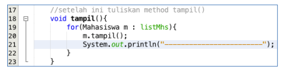

# JOBSHEET V
# SORTING (BUBBLE, SELECTION, DAN INSERTION SORT)
### Nama : Mohammad Izamul Fikri Fahmi
### Kelas/Absen : TI-1F/17
### NIM : 2141720171

#### 5.1 Tujuan Praktikum
Setelah melakukan praktikum ini diharapkan mahasiswa mampu:

a. Mahasiswa mampu membuat algoritma searching bubble sort, selection sort dan
insertion sort

b. Mahasiswa mampu menerapkan algoritma searching bubble sort, selection sort
dan insertion sort pada program

#### 5.2 Mengurutkan Data Mahasiswa Berdasarkan IPK Menggunakan Bubble Sort
Perhatikan diagram class Mahasiswa di bawah ini! Diagram class ini yang selanjutnya
akan dibuat sebagai acuan dalam membuat kode program class Mahasiswa.

Berdasarkan class diagram di atas, kita akan membuat sebuah class Mahasiswa yang
berfunsi untuk membuat objek mahasiswa yang akan dimasukan ke dalam sebuah array.
Terdapat sebuah konstruktor berparameter dan juga fungsi tampil() untuk menampilkan
semua attribute yang ada.

Selanjutnya class diagram di atas merupakan representasi dari sebuah class yang
berfungsi untuk melakukan operasi-operasi dari objek array mahasiswa, misalkan untuk menambahkan objek mahasiswa, menampilkan semua data mahasiswa, dan juga untuk
mengurutkan menggunakan Teknik bubble sort berdasarkan nilai IPK mahasiswa.

#### 5.2.1 Langkah-langkah Percobaan
1. Buat project baru dengan nama “bubble-selection-insertion”, kemudian buat package
dengan nama “jobsheet6”.
2. Buatlah sebuah class dengan nama Mahasiswa
3. Sesuaikan class Mahasiswa dengan melihat class diagram di atas dengan menambahkan
attribute, konstruktor, dan fungsi atau method. Untuk lebih jelasnya class tersebut dapat
dilihat pada potongan kode di bawah ini

4. Buat class DaftarMahasiswaBerprestasi seperti di bawah ini!

5. Tambahkan method tambah() di dalam class tersebut! Method tambah() digunakan
untuk menambahkan objek dari class Mahasiswa ke dalam atribut listMhs

6. Tambahkan method tampil() di dalam class tersebut! Method tampil() digunakan untuk
menampilkan semua data mahasiswa-mahasiswa yang ada di dalam class tersebut!
Perhatikan penggunaan sintaks for yang agak berbeda dengan for yang telah dipelajari
sebelumnya, meskipun secara konsep sebenarnya mirip

7. Tambahkan method bubbleSort() di dalam class tersebut!

8. Buat class Main dan didalamnya buat method main() seperti di bawah ini!

9. Di dalam method main(), buatlah sebuah objek DaftarMahasiswaBerprestasi dan
buatlah 5 objek mahasiswa kemudian tambahkan semua objek mahasiswa tersebut
dengan memanggil fungsi tambah pada objek DaftarMahasiswaBerprestasi. Silakan
dipanggil fungsi tampil() untuk melihat semua data yang telah dimasukan, urutkan data
tersebut dengan memanggil fungsi bubbleSort() dan yang terakhir panggil fungsi tampil
kembali.

