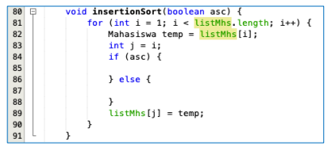
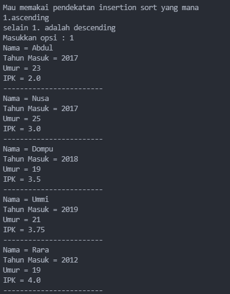

# JOBSHEET V
# SORTING (BUBBLE, SELECTION, DAN INSERTION SORT)
### Nama : Mohammad Izamul Fikri Fahmi
### Kelas/Absen : TI-1F/17
### NIM : 2141720171
<hr>

#### 5.1 Tujuan Praktikum
Setelah melakukan praktikum ini diharapkan mahasiswa mampu:

a. Mahasiswa mampu membuat algoritma searching bubble sort, selection sort dan
insertion sort

b. Mahasiswa mampu menerapkan algoritma searching bubble sort, selection sort
dan insertion sort pada program

#### 5.2 Mengurutkan Data Mahasiswa Berdasarkan IPK Menggunakan Bubble Sort
Perhatikan diagram class Mahasiswa di bawah ini! Diagram class ini yang selanjutnya
akan dibuat sebagai acuan dalam membuat kode program class Mahasiswa.


Berdasarkan class diagram di atas, kita akan membuat sebuah class Mahasiswa yang
berfunsi untuk membuat objek mahasiswa yang akan dimasukan ke dalam sebuah array.
Terdapat sebuah konstruktor berparameter dan juga fungsi tampil() untuk menampilkan
semua attribute yang ada.


Selanjutnya class diagram di atas merupakan representasi dari sebuah class yang
berfungsi untuk melakukan operasi-operasi dari objek array mahasiswa, misalkan untuk menambahkan objek mahasiswa, menampilkan semua data mahasiswa, dan juga untuk
mengurutkan menggunakan Teknik bubble sort berdasarkan nilai IPK mahasiswa.

#### 5.2.1 Langkah-langkah Percobaan
1. Buat project baru dengan nama “bubble-selection-insertion”, kemudian buat package
dengan nama “jobsheet6”.
2. Buatlah sebuah class dengan nama Mahasiswa
3. Sesuaikan class Mahasiswa dengan melihat class diagram di atas dengan menambahkan
attribute, konstruktor, dan fungsi atau method. Untuk lebih jelasnya class tersebut dapat
dilihat pada potongan kode di bawah ini


kode dari langkah di atas
```java
package jobsheet;

public class Mahasiswa {
    String nama;
    int thnMasuk, umur;
    double ipk;

    Mahasiswa(String n, int t, int u, double i){
        nama = n;
        thnMasuk = t;
        umur = u;
        ipk = i;
    }

    void tampil(){
        System.out.println("Nama = "+nama);
        System.out.println("Tahun Masuk = "+thnMasuk);
        System.out.println("Umur = " +umur);
        System.out.println("IPK = "+ipk);
    }
}

```

4. Buat class DaftarMahasiswaBerprestasi seperti di bawah ini!


5. Tambahkan method tambah() di dalam class tersebut! Method tambah() digunakan
untuk menambahkan objek dari class Mahasiswa ke dalam atribut listMhs


6. Tambahkan method tampil() di dalam class tersebut! Method tampil() digunakan untuk
menampilkan semua data mahasiswa-mahasiswa yang ada di dalam class tersebut!
Perhatikan penggunaan sintaks for yang agak berbeda dengan for yang telah dipelajari
sebelumnya, meskipun secara konsep sebenarnya mirip


7. Tambahkan method bubbleSort() di dalam class tersebut!


kode dari langkah di atas
```java
package jobsheet;

public class DaftarMahasiswaBerprestasi {
    Mahasiswa listMhs[] = new Mahasiswa[5];
    int idx;

    //method tambah
    void tambah(Mahasiswa m){
        if(idx<listMhs.length){
            listMhs[idx] = m;
            idx++;
        }else{
            System.out.println("data sudah penuh!!");
        }
    }

    //method tampil
    void tampil(){
        for(Mahasiswa m : listMhs){
            m.tampil();
            System.out.println("------------------------");
        }
    }

    //method bubblesort
    void bubbleSort(){
        for(int i=0; i<listMhs.length-1;i++){
            for(int j=1; j<listMhs.length-i;j++){
                if(listMhs[j].ipk>listMhs[j-1].ipk){
                    //di bawah ini proses swap atau penukaran
                    Mahasiswa tmp = listMhs[j];
                    listMhs[j] = listMhs[j-1];
                    listMhs[j-1] = tmp;
                }
            }
        }
    }
}
```

8. Buat class Main dan didalamnya buat method main() seperti di bawah ini!


9. Di dalam method main(), buatlah sebuah objek DaftarMahasiswaBerprestasi dan
buatlah 5 objek mahasiswa kemudian tambahkan semua objek mahasiswa tersebut
dengan memanggil fungsi tambah pada objek DaftarMahasiswaBerprestasi. Silakan
dipanggil fungsi tampil() untuk melihat semua data yang telah dimasukan, urutkan data
tersebut dengan memanggil fungsi bubbleSort() dan yang terakhir panggil fungsi tampil
kembali.


hasil langkah langkah kode di atas
```java
package jobsheet;

import java.util.Scanner;

public class Main {
    public static void main(String[] args) {
        DaftarMahasiswaBerprestasi list = new DaftarMahasiswaBerprestasi();
        Mahasiswa m1 = new Mahasiswa("Nusa", 2017, 25, 3);
        Mahasiswa m2 = new Mahasiswa("Rara", 2012, 19, 4);
        Mahasiswa m3 = new Mahasiswa("Dompu", 2018, 19, 3.5);
        Mahasiswa m4 = new Mahasiswa("Abdul", 2017, 23, 2);
        Mahasiswa m5 = new Mahasiswa("Ummi", 2019, 21, 3.75);

        list.tambah(m1);
        list.tambah(m2);
        list.tambah(m3);
        list.tambah(m4);
        list.tambah(m5);

        System.out.println("Data mahasiswa sebelum sorting = ");
        list.tampil();
        
        System.out.println("Data mahasiswa setelah sorting desc berdasarkan ipk");
        list.bubbleSort();
        list.tampil();
    }
}
```
#### 5.2.2 Verifikasi Hasil Percobaan

Cocokan hasilnya dengan yang terdapat pada tampilan di bawah ini


Hasil compile program yang telah dibuat


#### 5.2.3 Pertanyaan
1. Terdapat di method apakah proses bubble sort?

jawab :

teradapat pada method bubblesort di class DaftarMahasiswaBerprestasi.

Berikut kodenya
```java
//method bubblesort
    void bubbleSort(){
        for(int i=0; i<listMhs.length-1;i++){
            for(int j=1; j<listMhs.length-i;j++){
                if(listMhs[j].ipk>listMhs[j-1].ipk){
                    //di bawah ini proses swap atau penukaran
                    Mahasiswa tmp = listMhs[j];
                    listMhs[j] = listMhs[j-1];
                    listMhs[j-1] = tmp;
                }
            }
        }
    }
```

2. Terdapat di method apakah proses selection sort?

jawab :

Untuk proses selection sort masih belum ditambahkan, alias pada sub bab 5.3 di bawah nanti baru akan dijelaskan langkahnya.

3. Apakah yang dimaksud proses swap? Tuliskan potongan program untuk melakukan
proses swap tersebut!

jawab :

Pada program tersebut berfungsi untuk melakukan perpindahan posisi dengan menggunakan tmp sebagai penampung data sementara, agar bisa terjadi perpindahan data di array terkait.

```java
//di bawah ini proses swap atau penukaran
Mahasiswa tmp = listMhs[j];
listMhs[j] = listMhs[j-1];
listMhs[j-1] = tmp;
```

4. Di dalam method bubbleSort(), terdapat baris program seperti di bawah ini:


Untuk apakah proses tersebut?

jawab :

pada baris program tersebut, terjadi proses pengecekan if apakah array listMhs index ke j dengan data ipk lebih besar dari data array index j-1 pada listMhs, jika iya, maka akan lanjut ke proses swap seperti yang disebut pada proses soal nomor 3 sebelumnya.   

5. Perhatikan perulangan di dalam bubbleSort() di bawah ini:


a. Apakah perbedaan antara kegunaan perulangan i dan perulangan j?

jawab :

perulangan i, digunakan untuk melakukan perpindahan indeks, sedangkan j untuk melakukan proses perbandingan antar data pada indeks.

b. Mengapa syarat dari perulangan i adalah i<listMhs.length-1 ?

jawab : 

karena proses perulangan untuk i hanya sampai batas length -1, misal length array adalah 5, karena akan digunakan untuk mengurangi length si perulangan j.

c. Mengapa syarat dari perulangan j adalah j<listMhs.length-i ?

jawab : 
berhubungan dengan perulangan i, dengan demikian mengapa menggunakan kurang dari i,

karena pada bubble sort, length setiap terjadinya suatu step proses pengurutan, akan mengabaikan bagian terkanan dan seterusnya sampai selesai, jadi fungsi i, untuk membatasi proses itu tadi, sehingga proses bubble sort dapat terjadi.

d. Jika banyak data di dalam listMhs adalah 50, maka berapakali perulangan i akan
berlangsung? Dan ada berapa Tahap bubble sort yang ditempuh?

jawab :

perulangan i akan dilakukan sebanyak 49 kali karena ini array, dan akan terjadi proses bubblesort dengan penempuhan sebanyak 1275 kali.
terhitung dengan setiap perhitungan pada perulangan j-i, yang hanya mentok sampai 1 bukan 0. sehingga terjadi 50 proses(dari 1-50) dengan total penempuhan 1275 kali itu tadi.

#### 5.3 Mengurutkan Data Mahasiswa Berdasarkan IPK Menggunakan Selection Sort
Jika pada praktikum yang sebelumnya kita telah mengurutkan data mahasiwa
berdasarkan IPK menggunakan Bubble Sort secara descending, pada kali ini kita akan
mencoba untuk menambahkan fungsi pengurutan menggunakan Selection Sort

#### 5.3.1. Langkah-langkah Percobaan.
1. Lihat kembali class DaftarMahasiswaBerprestasi, dan tambahkan method selectionSort()
di dalamnya! Method ini juga akan melakukan proses sorting secara ascending, tetapi
menggunakan pendekatan selection sort.


Hasil penulisan program langkah di atas
```java
package jobsheet;

public class DaftarMahasiswaBerprestasi {
    Mahasiswa listMhs[] = new Mahasiswa[5];
    int idx;

    //method tambah
    void tambah(Mahasiswa m){
        if(idx<listMhs.length){
            listMhs[idx] = m;
            idx++;
        }else{
            System.out.println("data sudah penuh!!");
        }
    }

    //method tampil
    void tampil(){
        for(Mahasiswa m : listMhs){
            m.tampil();
            System.out.println("------------------------");
        }
    }

    //method bubblesort
    void bubbleSort(){
        for(int i=0; i<listMhs.length-1;i++){
            for(int j=1; j<listMhs.length-i;j++){
                if(listMhs[j].ipk>listMhs[j-1].ipk){
                    //di bawah ini proses swap atau penukaran
                    Mahasiswa tmp = listMhs[j];
                    listMhs[j] = listMhs[j-1];
                    listMhs[j-1] = tmp;
                }
            }
        }
    }

    //setelah ini tuliskan method selectionSort()
    void selectionSort(){
        for(int i=0; i<listMhs.length-1; i++){
            int idxMin = i;
            for(int j=i+1; j<listMhs.length; j++){
                if(listMhs[j].ipk < listMhs[idxMin].ipk){
                    idxMin = j;
                }
            }
             //swap
            Mahasiswa tmp = listMhs[idxMin];
            listMhs[idxMin] = listMhs[i];
            listMhs[i] = tmp;
        }
    }
}
```

2. Setelah itu, buka kembali class Main, dan di dalam method main() tambahkan baris
program untuk memanggil method selectionSort() tersebut!


Hasil penulisan program langkah di atas
```java
package jobsheet;

import java.util.Scanner;

public class Main {
    public static void main(String[] args) {
        DaftarMahasiswaBerprestasi list = new DaftarMahasiswaBerprestasi();
        Mahasiswa m1 = new Mahasiswa("Nusa", 2017, 25, 3);
        Mahasiswa m2 = new Mahasiswa("Rara", 2012, 19, 4);
        Mahasiswa m3 = new Mahasiswa("Dompu", 2018, 19, 3.5);
        Mahasiswa m4 = new Mahasiswa("Abdul", 2017, 23, 2);
        Mahasiswa m5 = new Mahasiswa("Ummi", 2019, 21, 3.75);

        list.tambah(m1);
        list.tambah(m2);
        list.tambah(m3);
        list.tambah(m4);
        list.tambah(m5);

        System.out.println("Data mahasiswa sebelum sorting = ");
        list.tampil();
        
        System.out.println("Data mahasiswa setelah sorting desc berdasarkan ipk");
        list.bubbleSort();
        list.tampil();

        //selection sort
        System.out.println("Data mahasiswa setelah sorting asc berdasarkan ipk");
        list.selectionSort();
        list.tampil();
    }
}
```

3. Coba jalankan kembali class Main, dan amati hasilnya! Apakah kini data mahasiswa telah
tampil urut menaik berdasar ipk?


iya sudah tampil urut atau ascending berdasarkan ipk

#### 5.3.2. Verifikasi Hasil Percobaan
Pastikan output yang ditampilkan sudah benar seperti di bawah ini


Hasil compile program dengan modifikasi tambahan di percobaan ini


ouput bagian selection sort


#### 5.3.3. Pertanyaan
Di dalam method selection sort, terdapat baris program seperti di bawah ini:


Untuk apakah proses tersebut, jelaskan!

jawab :

pada baris program tersebut, terjadi pemberian nilai idxMin dengan i, lanjut ke prulangan j dengan pemberian nilai awal j i+1, lanjut ke pengecekan if apakah index ke j kurang besar dari idxMin, jika iya maka idxMin akan berganti data menjadi j. yang akan dipergunakan pada proses swap di baris kode program selanjutnya, di method yang sama.

#### 5.4 Mengurutkan Data Mahasiswa Berdasarkan IPK Menggunakan Insertion Sort
Yang terakhir akan diimplementasikan Teknik sorting menggunakan Insertion Sort,
dengan mengurutkan IPK mahasiswa secara ascending.

#### 5.4.1 Langkah-langkah Percobaan
1. Lihat kembali class DaftarMahasiswaBerprestasi, dan tambahkan method insertionSort() di
dalamnya. Method ini juga akan melakukan proses sorting secara ascending, tetapi
menggunakan pendekatan Insertion Sort.


hasil penulisan kode berdasarkan langkah di atas
```java
package jobsheet;

public class DaftarMahasiswaBerprestasi {
    Mahasiswa listMhs[] = new Mahasiswa[5];
    int idx;

    //method tambah
    void tambah(Mahasiswa m){
        if(idx<listMhs.length){
            listMhs[idx] = m;
            idx++;
        }else{
            System.out.println("data sudah penuh!!");
        }
    }

    //method tampil
    void tampil(){
        for(Mahasiswa m : listMhs){
            m.tampil();
            System.out.println("------------------------");
        }
    }

    //method bubblesort
    void bubbleSort(){
        for(int i=0; i<listMhs.length-1;i++){
            for(int j=1; j<listMhs.length-i;j++){
                if(listMhs[j].ipk>listMhs[j-1].ipk){
                    //di bawah ini proses swap atau penukaran
                    Mahasiswa tmp = listMhs[j];
                    listMhs[j] = listMhs[j-1];
                    listMhs[j-1] = tmp;
                }
            }
        }
    }

    //setelah ini tuliskan method selectionSort()
    void selectionSort(){
        for(int i=0; i<listMhs.length-1; i++){
            int idxMin = i;
            for(int j=i+1; j<listMhs.length; j++){
                if(listMhs[j].ipk < listMhs[idxMin].ipk){
                    idxMin = j;
                }
            }
             //swap
            Mahasiswa tmp = listMhs[idxMin];
            listMhs[idxMin] = listMhs[i];
            listMhs[i] = tmp;
        }
    }

     //setelah ini tuliskan method insertionSort()
    void intertionSort(){
        for(int i = 1; i < listMhs.length; i++){
            Mahasiswa temp = listMhs[i];
            int j = i;
            while (j > 0 && listMhs[j-1].ipk > temp.ipk) {
                listMhs[j] = listMhs[j-1];
                j--;
            }
            listMhs[j] = temp;
        }
    }
}
```

2. Setelah itu, buka kembali class Main, dan di dalam method main() tambahkan baris program
untuk memanggil method insertionSort() tersebut!


hasil penulisan kode program seperti langkah di atas
```java
package jobsheet;

import java.util.Scanner;

public class Main {
    public static void main(String[] args) {
        DaftarMahasiswaBerprestasi list = new DaftarMahasiswaBerprestasi();
        Mahasiswa m1 = new Mahasiswa("Nusa", 2017, 25, 3);
        Mahasiswa m2 = new Mahasiswa("Rara", 2012, 19, 4);
        Mahasiswa m3 = new Mahasiswa("Dompu", 2018, 19, 3.5);
        Mahasiswa m4 = new Mahasiswa("Abdul", 2017, 23, 2);
        Mahasiswa m5 = new Mahasiswa("Ummi", 2019, 21, 3.75);

        list.tambah(m1);
        list.tambah(m2);
        list.tambah(m3);
        list.tambah(m4);
        list.tambah(m5);

        System.out.println("Data mahasiswa sebelum sorting = ");
        list.tampil();
        
        System.out.println("Data mahasiswa setelah sorting desc berdasarkan ipk");
        list.bubbleSort();
        list.tampil();

        //selection sort
        System.out.println("Data mahasiswa setelah sorting asc berdasarkan ipk");
        list.selectionSort();
        list.tampil();

        //insertion sort
        System.out.println("Data mahasiswa setelah sorting asc berdasarkan ipk");
        list.intertionSort();
        list.tampil();
    }
}
```

3. Coba jalankan kembali class Main, dan amati hasilnya! Apakah kini data mahasiswa telah
tampil urut menaik berdasar ipk?

sudah tampil urut


#### 5.4.2 Verifikasi Hasil Percobaan
Pastikan output yang ditampilkan sudah benar seperti di bawah ini


Hasil compile program dengan modifikasi tambahan di percobaan ini


ouput bagian insertion sort


Dan sudah sesuai


#### 5.4.3 Pertanyaan
Ubahlah fungsi pada InsertionSort sehingga fungsi ini dapat melaksanakan proses sorting
dengan cara ascending atau decending, anda dapat melakukannya dengan menambahkan
parameter pada pemanggilan fungsi insertionSort.



Kode program DaftarMahasiswaBerprestasi.java
```java
package jobsheet;

public class DaftarMahasiswaBerprestasi {
    Mahasiswa listMhs[] = new Mahasiswa[5];
    int idx;

    //method tambah
    void tambah(Mahasiswa m){
        if(idx<listMhs.length){
            listMhs[idx] = m;
            idx++;
        }else{
            System.out.println("data sudah penuh!!");
        }
    }

    //method tampil
    void tampil(){
        for(Mahasiswa m : listMhs){
            m.tampil();
            System.out.println("------------------------");
        }
    }

    //method bubblesort
    void bubbleSort(){
        for(int i=0; i<listMhs.length-1;i++){
            for(int j=1; j<listMhs.length-i;j++){
                if(listMhs[j].ipk>listMhs[j-1].ipk){
                    //di bawah ini proses swap atau penukaran
                    Mahasiswa tmp = listMhs[j];
                    listMhs[j] = listMhs[j-1];
                    listMhs[j-1] = tmp;
                }
            }
        }
    }

    //setelah ini tuliskan method selectionSort()
    void selectionSort(){
        for(int i=0; i<listMhs.length-1; i++){
            int idxMin = i;
            for(int j=i+1; j<listMhs.length; j++){
                if(listMhs[j].ipk < listMhs[idxMin].ipk){
                    idxMin = j;
                }
            }
             //swap
            Mahasiswa tmp = listMhs[idxMin];
            listMhs[idxMin] = listMhs[i];
            listMhs[i] = tmp;
        }
    }

    // void intertionSort(){
    //     for(int i = 1; i < listMhs.length; i++){
    //         Mahasiswa temp = listMhs[i];
    //         int j = i;
    //         while (j > 0 && listMhs[j-1].ipk < temp.ipk) {
    //             listMhs[j] = listMhs[j-1];
    //             j--;
    //         }
    //         listMhs[j] = temp;
    //     }
    // }


    //modifikasi method insertion seperti pertanyaan yang diminta
    void intertionSort(boolean asc){
        for(int i = 1; i < listMhs.length; i++){
            Mahasiswa temp = listMhs[i];
            int j=i;
            if(asc){
                while (j > 0 && listMhs[j-1].ipk > temp.ipk) {
                listMhs[j] = listMhs[j-1];
                j--;
                }
            }else {
                while (j > 0 && listMhs[j-1].ipk < temp.ipk) {
                    listMhs[j] = listMhs[j-1];
                    j--;
                    }
            }
            listMhs[j] = temp;
        }
    }
}

```

Kode program Main.java dengan modifikasi untuk melakukan pemilihan opsi 

```java
package jobsheet;

import java.util.Scanner;

public class Main {
    public static void main(String[] args) {
        Scanner sc = new Scanner(System.in);

        DaftarMahasiswaBerprestasi list = new DaftarMahasiswaBerprestasi();
        Mahasiswa m1 = new Mahasiswa("Nusa", 2017, 25, 3);
        Mahasiswa m2 = new Mahasiswa("Rara", 2012, 19, 4);
        Mahasiswa m3 = new Mahasiswa("Dompu", 2018, 19, 3.5);
        Mahasiswa m4 = new Mahasiswa("Abdul", 2017, 23, 2);
        Mahasiswa m5 = new Mahasiswa("Ummi", 2019, 21, 3.75);

        list.tambah(m1);
        list.tambah(m2);
        list.tambah(m3);
        list.tambah(m4);
        list.tambah(m5);

        System.out.println("Data mahasiswa sebelum sorting = ");
        list.tampil();
        
        System.out.println("Data mahasiswa setelah sorting desc berdasarkan ipk");
        list.bubbleSort();
        list.tampil();

        //selection sort
        System.out.println("Data mahasiswa setelah sorting asc berdasarkan ipk");
        list.selectionSort();
        list.tampil();

        //insertion sort dengan opsi
        System.out.println("Mau memakai pendekatan insertion sort yang mana\n1.ascending\nselain 1. adalah descending");
        System.out.print("Masukkan opsi : ");
        int opsi = sc.nextInt();
        list.intertionSort(opsi==1);
        list.tampil();
    }
}
```

Hasil compile

Ascending



Descending


#### 5.5 Latihan Praktikum
Sebuah yang bergerak dalam bidang penjualan tiket pesawat sedang mengembangkan
backend untuk sistem pemesanan tiket, salah satu fiturnya adalah menampilkan daftar tiket
yang tersedia berdasarkan pilihan filter yang diinginkan user. Daftar tiket ini harus dapat di
sorting berdasarkan harga dimulai dari harga termurah ke harga tertinggi.
Implementasikanlah class diagram berikut ini kedalam bahasa pemrograman java kemudian
buatlah proses sorting data untuk harga tiket menggunakan algoritma bubble sort dan
selection sort. 


##### Kode program Tiket.java
```java
package jobsheet;

public class Tiket {
    String maskapai, tujuan, asal;
    int harga;

    Tiket(String m, String a, String t,int h){
        maskapai = m;
        asal = a;
        tujuan = t;
        harga = h;
    }

    void tampil(){
        System.out.println("==============================");
        System.out.println("|   Izamul Fikri TiketStore  |");
        System.out.println("==============================");
        System.out.println("Maskapai     : " + maskapai);
        System.out.println("Asal         : " + asal);
        System.out.println("Tujuan       : " + tujuan);
        System.out.println("Harga        : Rp." + harga+",-");
    }
}
```

##### Kode program DaftarTiket.java
```java
package jobsheet;

public class DaftarTiket {
    

    Tiket tk[] = new Tiket[6];
    int tik;

    // method tambah
    void tambah(Tiket mskp){
        if(tik<tk.length){
            tk[tik]=mskp;
            tik++;
        } else{
            System.out.println("data sudah penuh!!");
        }
    }

    //method tampil
    void tampil(){
        for (Tiket mskp : tk){
            mskp.tampil();
        }
    }

    //method bubblesort
    void bubbleSort(){
        for (int i = 0; i < tk.length; i++){
            for (int j = 1; j < tk.length; j++){
                if (tk[j].harga < tk[j-1].harga){
                    //proses swap
                    Tiket tmp = tk[j];
                    tk[j] = tk[j-1];
                    tk[j-1] = tmp;
                }
            }
        }
    }

    //method selectionsort
    void selecionSort(){
        for (int i = 0; i < tk.length; i++){
        int idxMin = i;

        for (int j = i + 1; j < tk.length; j++) {
            if (tk[j].harga < tk[idxMin].harga) {
                idxMin = j;
            }

            // swap
            Tiket zam = tk[idxMin];
            tk[idxMin] = tk[i];
            tk[i] = zam;
        }       
    }
    }
}
```

##### Kode program TiketMain.java
```java
package jobsheet;
import java.util.Scanner;

public class TiketMain {
    
    public static void main(String[] args) {
        Scanner sc = new Scanner(System.in);
        DaftarTiket list = new DaftarTiket();

        // Data ini hanya fiktif, keperluan rancangan saja
        Tiket t1 = new Tiket("Zam Air", "Banyuwangi", "Malang", 1200000);
        Tiket t2 = new Tiket("Fikri Air", "Bali", "Surabaya", 1900000);
        Tiket t3 = new Tiket("Angel Wings", "Banyuwangi", "Medan", 2500000);
        Tiket t4 = new Tiket("Berkah Udara", "Jakarta", "Mekah", 10000000);
        Tiket t5 = new Tiket("Izamul AirAsia", "Bali", "Tokyo", 5000000);
        Tiket t6 = new Tiket("Garuda jayalangit", "Nusantara", "Moskow", 7000000);

        list.tambah(t1);
        list.tambah(t2);
        list.tambah(t3);
        list.tambah(t4);
        list.tambah(t5);
        list.tambah(t6);
        System.out.println("------------------------");
        System.out.println("| Data Sebelum Sorting |");
        System.out.println("------------------------");
        list.tampil();
        System.out.println();


        System.out.println("> Harga Termurah ke Termahal <");
        System.out.println("---------------------------------------------------");
        System.out.println("| Data Penerbangan Sorting Asc dengan Bubble sort |");
        System.out.println("---------------------------------------------------");
        list.bubbleSort();;
        list.tampil();


        System.out.println("> Harga Termurah ke Termahal <");
        System.out.println("---------------------------------------------------");
        System.out.println("| Data Penerbangan Sorting Asc dengan Selection sort |");
        System.out.println("---------------------------------------------------");
        list.selecionSort();
        list.tampil();
    }
}
```

##### Hasil Compile Program


