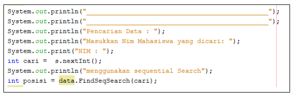
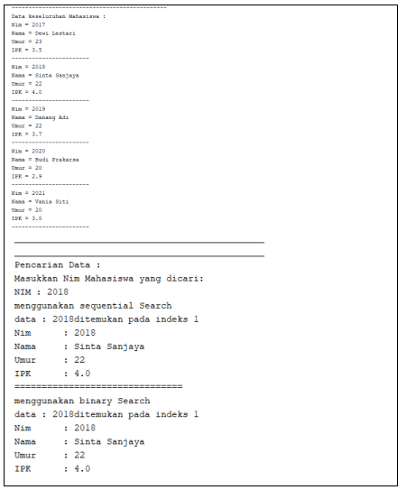
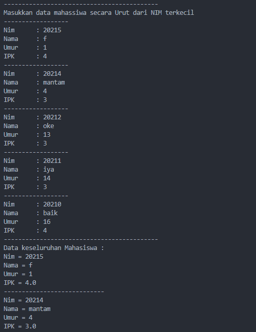

## JOBSHEET VI
## SEARCHING

### Mohammad Izamul Fikri Fahmi
### TI-1F/17
### 2141720171

<hr>

#### 6.1. Tujuan Praktikum
Setelah melakukan materi praktikum ini, mahasiswa mampu:
1. Menjelaskan mengenai algoritma Searching.
2. Membuat dan mendeklarasikan struktur algoritma Searching.
3. Menerapkan dan mengimplementasikan algoritma Searching.

#### 6.2. Searching / Pencarian Menggunakan Agoritma Sequential Search
Perhatikan diagram class Mahasiswa di bawah ini! Diagram class ini yang selanjutnya akan
dibuat sebagai acuan dalam membuat kode program class Mahasiswa.


Berdasarkan class diagram di atas, akan dibuat class Mahasiswa yang berfunsi untuk
membuat objek mahasiswa yang akan dimasukan ke dalam sebuah array. Terdapat sebuah
konstruktor berparameter dan juga fungsi tampil() untuk menampilkan semua attribute yang ada.


Selanjutnya class diagram di atas merupakan representasi dari sebuah class yang berfungsi
untuk melakukan operasi-operasi dari objek array mahasiswa, misalkan untuk menambahkan objek
mahasiswa, menampilkan semua data mahasiswa, untuk melakukan pencarian berdasarkan NIM
menggunakan algoritma Sequential Search, menampilkan posisi dari data yang dicari, serta
menampilkan data mahasiswa yang dicari.

#### 6.2.1. Langkah-langkah Percobaan Sequential Search

1. Buatlah Project baru pada Netbeans dengan nama TestSearching.
2. Kemuadian buat packages baru dengan nama minggu7.
3. Buat class Mahasiswa, kemudian deklarasikan atribut berikut ini:


4. Buatlah konstruktor dengan nama Mahasiswa dengan parameter (int ni, String n,
int u, double i) kemudian Isi konstruktor tersebut dengan kode berikut!


5. Buatlah method tampil bertipe void.


6. Buat class baru dengan nama PencarianMhs seperti di bawah ini!


7. Tambahkan method tambah() di dalam class tersebut! Method tambah() digunakan untuk
menambahkan objek dari class Mahasiswa ke dalam atribut listMhs.


8. Tambahkan method tampil() di dalam class PencarianMhs! Method tampil()
digunakan untuk menampilkan semua data mahasiswa-mahasiswa yang ada di dalam class
tersebut! Perhatikan penggunaan sintaks for yang agak berbeda dengan for yang telah dipelajari
sebelumnya, meskipun secara konsep sebenarnya mirip.


9. Tambahkan method FindSeqSearch bertipe integer dengan parameter cari bertipe integer.
Kemudian Deklarasikan isi method FindSeqSearch dengan algoritma pencarian data
menggunakan teknik sequential searching.


10. Buatlah method Tampilpoisisi bertipe void dan Deklarasikan isi dari method
Tampilpoisisi.


11. Buatlah method TampilData bertipe void dan Deklarasikan isi dari method TampilData.


12. Buatlah class baru dengan nama MahasiswaMain tambahkan method main seperti pada
gambar berikut!


13. Di dalam method main(), buatlah sebuah objek PencarianMhs dan buatlah 5 objek
mahasiswa kemudian tambahkan semua objek mahasiswa tersebut dengan memanggil fungsi
tambah pada objek PencarianMhs. 


14. Panggil method tampil() untuk melihat semua data yang telah dimasukan.


15. Untuk melakukan pencarian berdasarkan NIM mahasiswa. Buatlah variable cari yang dapat
menampung masukan dari keyboard lalu panggil method FindSeqSearch dengan isi
parameternya adalah variable cari.



16. Lakukan pemanggilan method Tampilposisi dari class PencarianMhs.


17. Lakukan pemanggilan method TampilData dari class PencarianMhs.


18. Jalankan dan amati hasilnya. 


#### Hasil Coding program di atas

##### Mahasiswa.java
```java
package minggu7;

// Mohammad Izamul FIkri Fahmi  

public class Mahasiswa {
    int nim;
    String nama;
    int umur;
    double ipk;

    Mahasiswa(int ni, String n, int  u, double i){
        nim = ni;
        nama = n;
        umur = u;
        ipk = i;
    }

    void tampil(){
        System.out.println("Nim = " + nim);
        System.out.println("Nama = " + nama);
        System.out.println("Umur = " + umur);
        System.out.println("IPK = " + ipk);
    }
}
```
##### PencarianMhs.java
```java
package minggu7;

// Mohammad Izamul FIkri Fahmi  

public class PencarianMhs {
    Mahasiswa listMHs[] = new Mahasiswa[5];
    int idx;

    
    void tambah(Mahasiswa m){
        if(idx < listMHs.length){
        listMHs[idx] = m;
        idx++;
        }else{
        System.out.println("Data sudah penuh !!");
        }
    }

    void tampil(){
        for(Mahasiswa m : listMHs){
            m.tampil();;
            System.out.println("----------------------------");
        }
    }

    public int FindSeqSearch(int cari){
        int posisi = -1;
        for (int j = 0; j < listMHs.length; j++){
            if(listMHs[j].nim==cari){
                posisi = j;
                break;
            }
        }
        return posisi;
    }

    public void Tampilposisi(int x, int pos){
        if(pos!=-1){
            System.out.println("data\t : " + x + " ditemukan pada indeks "+ pos);
        } else {
            System.out.println("data\t : " + x + "tidak ditemukan");
        }
    }

    public void TampilData(int x, int pos){
        if(pos!= -1){
            System.out.println("Nim\t : " + x);
            System.out.println("Nama\t : "+listMHs[pos].nama);
            System.out.println("Umur\t : "+listMHs[pos].umur);
            System.out.println("IPK\t : "+listMHs[pos].ipk);
        } else {
            System.out.println("data "+ x + " tidak ditemukan");
        }
    }
}
```
##### MahasiswaMain.java
```java
package minggu7;
import java.util.Scanner;

// Mohammad Izamul FIkri Fahmi  

public class MahasiswaMain {
    public static void main(String[] args) {
        Scanner s = new Scanner(System.in);
        Scanner s1 = new Scanner(System.in);

        PencarianMhs data = new PencarianMhs();
        int jumMHs = 5;

        System.out.println("-------------------------------------------");
        System.out.println("Masukkan data mahassiwa secara Urut dari NIM terkecil");
        for(int i = 0; i < jumMHs; i++){
            System.out.println("------------------");
            System.out.print("Nim\t : ");
            int nim = s.nextInt();
            System.out.print("Nama\t : ");
            String nama = s1.nextLine();
            System.out.print("Umur\t : ");
            int umur = s.nextInt();
            System.out.print("IPK\t : ");
            double ipk = s.nextDouble();

            Mahasiswa m = new Mahasiswa(nim, nama, umur, ipk);
            data.tambah(m);
        }

        System.out.println("-------------------------------------------");
        System.out.println("Data keseluruhan Mahasiswa : ");
        data.tampil();

        System.out.println("___________________________________________");
        System.out.println("___________________________________________");
        System.out.println("Pencarian Data : ");
        System.out.println("Masukkan NIM Mahasiswa yang dicari: ");
        System.out.print("NIM : ");
        int cari = s.nextInt();
        System.out.println("menggunakan sequential search");
        int posisi = data.FindSeqSearch(cari);

        data.Tampilposisi(cari, posisi);

        data.TampilData(cari, posisi);
    }
}
```


#### 6.2.2. Verifikasi Hasil Percobaan
Cocokkan hasil kode program anda dengan gambar berikut ini.


##### Hasil Compile dan Run program


Dan sudah sesuai outputnya

#### 6.2.3. Pertanyaan
1. Jelaskan perbedaan method TampilData dan Tampilposisi pada class PencarianMhs.

Jawab : 

Pada method Tampilposisi parameter pos digunakan untuk menampilkan nilai indek, dan menunjukan apakah suatu data yang dicari tadi, ada dan berada di posisi dimana atau justru data tersebut tidak ditemukan sehingga posisinya tidak dapat dicari.


Berbeda dengan method Tampilposisi, method TampilData menggunakan parameter pos untuk menunjunkan data yang ada dalam objek array dengan indeks yang bernilai pos, lalu menampilkannya data dalam objek array indeks pos itu, jika memang ditemukan data yang dicari, atau tidak ditemukannya data yang dicari.


2. Jelaskan fungsi break pada kode program dibawah ini!


Jawab :

Jika data NIM yang dicari sudah sesuai, atau ditemukan, maka posisi akan bernilai j, dan fungsi **break**, adalah agar proses pencarian kecocokan data ini berhenti, sehingga nilai dalam posisi tidak berubah lagi.

3. Jika Data Nim yang dimasukkan tidak terurut dari kecil ke besar. Apakah program masih dapat
berjalan? Apakah hasil yang dikeluarkan benar? Mengapa demikian!

Jawab :

walau data NIM tidak terurut, masih dapat dilakukan pencarian data NIM, dan program berjalan dengan normal, juga keluarannya sesuai.

mengapa?, karena kita menggunakan metode pencarian sequential search. yang mana sequential search melakukan pencarian dengan membandingkan satu persatu suatu data, sehingga tidak perlu diurutkan.


#### 6.3. Searching / Pencarian Menggunakan Binary Search
#### 6.3.1. Langkah-langkah Percobaan Binary Search
1. Pada percobaan 6.2.1 (sequential search) tambahkan method FindBinarySearch bertipe
integer pada class PencarianMhs. Kemudian Deklarasikan isi method FindBinarySearch
dengan algoritma pencarian data menggunakan teknik binary searching.


2. Panggil method FindBinarySearch terdapat pada class PencarianMhs di kelas
Mahasiswamain. Kemudia panggil method tampilposisi dan tampilData


3. Jalankan dan amati hasilnya. 

PencarianMhs.java
```java
package minggu7;

// Mohammad Izamul FIkri Fahmi  

public class PencarianMhs {
    Mahasiswa listMHs[] = new Mahasiswa[5];
    int idx;

    
    void tambah(Mahasiswa m){
        if(idx < listMHs.length){
        listMHs[idx] = m;
        idx++;
        }else{
        System.out.println("Data sudah penuh !!");
        }
    }

    void tampil(){
        for(Mahasiswa m : listMHs){
            m.tampil();;
            System.out.println("----------------------------");
        }
    }

    public int FindSeqSearch(int cari){
        int posisi = -1;
        for (int j = 0; j < listMHs.length; j++){
            if(listMHs[j].nim==cari){
                posisi = j;
                break;
            }
        }
        return posisi;
    }

    public void Tampilposisi(int x, int pos){
        if(pos!=-1){
            System.out.println("data\t : " + x + " ditemukan pada indeks "+ pos);
        } else {
            System.out.println("data\t : " + x + "tidak ditemukan");
        }
    }

    public void TampilData(int x, int pos){
        if(pos!= -1){
            System.out.println("Nim\t : " + x);
            System.out.println("Nama\t : "+listMHs[pos].nama);
            System.out.println("Umur\t : "+listMHs[pos].umur);
            System.out.println("IPK\t : "+listMHs[pos].ipk);
        } else {
            System.out.println("data "+ x + " tidak ditemukan");
        }
    }

    // modifikasi penambahan percobaan 6.3 Binary Search
    public int FindBinarySearch(int cari, int left, int right){
        int mid;
        if ( right >= left){
            mid = (left + right) / 2;
            if (cari == listMHs[mid].nim){
                return (mid);
            } else if (listMHs[mid].nim > cari){
                return FindBinarySearch(cari, left, mid-1);
            } else {
                return FindBinarySearch(cari, mid+1, right);
            }
        }
        return -1;
    }
}
```

MahasiswaMain
```java
package minggu7;
import java.util.Scanner;

// Mohammad Izamul FIkri Fahmi  

public class MahasiswaMain {
    public static void main(String[] args) {
        Scanner s = new Scanner(System.in);
        Scanner s1 = new Scanner(System.in);

        PencarianMhs data = new PencarianMhs();
        int jumMHs = 5;

        System.out.println("-------------------------------------------");
        System.out.println("Masukkan data mahassiwa secara Urut dari NIM terkecil");
        for(int i = 0; i < jumMHs; i++){
            System.out.println("------------------");
            System.out.print("Nim\t : ");
            int nim = s.nextInt();
            System.out.print("Nama\t : ");
            String nama = s1.nextLine();
            System.out.print("Umur\t : ");
            int umur = s.nextInt();
            System.out.print("IPK\t : ");
            double ipk = s.nextDouble();

            Mahasiswa m = new Mahasiswa(nim, nama, umur, ipk);
            data.tambah(m);
        }

        System.out.println("-------------------------------------------");
        System.out.println("Data keseluruhan Mahasiswa : ");
        data.tampil();

        System.out.println("___________________________________________");
        System.out.println("___________________________________________");
        System.out.println("Pencarian Data : ");
        System.out.println("Masukkan NIM Mahasiswa yang dicari: ");
        System.out.print("NIM : ");
        int cari = s.nextInt();
        System.out.println("menggunakan sequential search");
        int posisi = data.FindSeqSearch(cari);

        data.Tampilposisi(cari, posisi);

        data.TampilData(cari, posisi);

        // modifikasi penambahan percobaan 6.3 Binary Search
        System.out.println("===========================================");
        System.out.println("menggunakan binary Search");
        posisi = data.FindBinarySearch(cari, 0, jumMHs - 1);
        data.Tampilposisi(cari, posisi);
        data.TampilData(cari, posisi);
    }
}
```

#### 6.3.2. Verifikasi Hasil Percobaan
Cocokkan hasil kode program anda dengan gambar berikut ini.




Hasil compile and run program


Sudah sesuai

#### 6.3.3. Pertanyaan
1. Tunjukkan pada kode program yang mana proses divide dijalankan!

Jawab :

Proses divide adalah proses dimana pembagian dilakukan. ditunjukkan dengan code berikut 
```java
  mid = (left + right) / 2;
```

2. Tunjukkan pada kode program yang mana proses conquer dijalankan!

Jawab : 

adalah proses penyelesaian, yang mana ya itu proses pencarian binary search dilakukan. ditunjukkan dengan code berikut
```java
} else if (listMHs[mid].nim > cari){
    return FindBinarySearch(cari, left, mid-1);
} else {
    return FindBinarySearch(cari, mid+1, right);
}
```

3. Jika data Nim yang dimasukkan tidak urut. Apakah program masih dapat berjalan? Mengapa
demikian!

Jawab :

bisa, namun jika data yang dicari tidak terdapat di tengah, maka data yang dicari tidak akan ditemukan, karena syarat pencarian binary search adalah data harus ke sorting dengan baik.

4. Jika Nim yang dimasukkan dari NIM terbesar ke terkecil (missal : 20215, 20214, 20212, 20211, 20210) dan elemen yang dicari adalah 20210. Bagaimana hasil dari binary search? Apakah
sesuai? Jika tidak sesuai maka ubahlah kode program binary seach agar hasilnya sesuai.

Jawab :

Tidak sesuai, data tidak ditemukan, padahal data ada.


Perubahan yang dilakukan
```java
 if (cari == listMHs[mid].nim){
                return (mid);
            } else if (listMHs[mid].nim < cari){ // perubahan untuk soal nomor 4 percobaan 2
                return FindBinarySearch(cari, left, mid-1); 
            } else {
                return FindBinarySearch(cari, mid+1, right);
            }
```

karena pengurutan data menggunakan descending, maka disini perlu merubah perbandingan dalam else if, yang sebelumnya listMHs[mid].nim > cari  ==> menjadi listMHs[nim].nim < cari  .. sehingga data dapat ditemukan

Bukti program berjalan sesuai :




5. Modifikasilah program diatas yang mana jumlah mahasiswa yang di inputkan sesuai dengan
masukan dari keyboard.

jawab :

program main untuk inputan
```java
package minggu7;
import java.util.Scanner;

// Mohammad Izamul FIkri Fahmi  

public class MahasiswaMain {
    public static void main(String[] args) {
        Scanner s = new Scanner(System.in);
        Scanner s1 = new Scanner(System.in);

        PencarianMhs data = new PencarianMhs();

        System.out.print("Masukkan jumlah mahasiswa : "); //inputan
        int jumlah = s.nextInt();
        Mahasiswa[] a = new Mahasiswa[jumlah];
        data.listMHs = a;

        System.out.println("-------------------------------------------");
        System.out.println("Masukkan data mahasiswa secara Urut dari NIM terkecil");
        for(int i = 0; i < jumlah; i++){
            System.out.println("------------------");
            System.out.print("Nim\t : ");
            int nim = s.nextInt();
            System.out.print("Nama\t : ");
            String nama = s1.nextLine();
            System.out.print("Umur\t : ");
            int umur = s.nextInt();
            System.out.print("IPK\t : ");
            double ipk = s.nextDouble();

            Mahasiswa m = new Mahasiswa(nim, nama, umur, ipk);
            data.tambah(m);
        }

        System.out.println("-------------------------------------------");
        System.out.println("Data keseluruhan Mahasiswa : ");
        data.tampil();

        System.out.println("___________________________________________");
        System.out.println("___________________________________________");
        System.out.println("Pencarian Data : ");
        System.out.println("Masukkan NIM Mahasiswa yang dicari: ");
        System.out.print("NIM : ");
        int cari = s.nextInt();
        System.out.println("menggunakan sequential search");
        int posisi = data.FindSeqSearch(cari);

        data.Tampilposisi(cari, posisi);

        data.TampilData(cari, posisi);

        // modifikasi penambahan percobaan 6.3 Binary Search
        System.out.println("===========================================");
        System.out.println("menggunakan binary Search");
        posisi = data.FindBinarySearch(cari, 0, jumlah - 1);
        data.Tampilposisi(cari, posisi);
        data.TampilData(cari, posisi);
    }
}
```

PencarianMhs untuk inputan

```java
package minggu7;

// Mohammad Izamul FIkri Fahmi  

public class PencarianMhs {
    Mahasiswa listMHs[];
    int idx;

    
    void tambah(Mahasiswa m){
        if(idx < listMHs.length){
        listMHs[idx] = m;
        idx++;
        }else{
        System.out.println("Data sudah penuh !!");
        }
    }

    void tampil(){
        for(Mahasiswa m : listMHs){
            m.tampil();;
            System.out.println("----------------------------");
        }
    }

    public int FindSeqSearch(int cari){
        int posisi = -1;
        for (int j = 0; j < listMHs.length; j++){
            if(listMHs[j].nim==cari){
                posisi = j;
                break;
            }
        }
        return posisi;
    }

    public void Tampilposisi(int x, int pos){
        if(pos!=-1){
            System.out.println("data\t : " + x + " ditemukan pada indeks "+ pos);
        } else {
            System.out.println("data\t : " + x + "tidak ditemukan");
        }
    }

    public void TampilData(int x, int pos){
        if(pos!= -1){
            System.out.println("Nim\t : " + x);
            System.out.println("Nama\t : "+listMHs[pos].nama);
            System.out.println("Umur\t : "+listMHs[pos].umur);
            System.out.println("IPK\t : "+listMHs[pos].ipk);
        } else {
            System.out.println("data "+ x + " tidak ditemukan");
        }
    }

    // modifikasi penambahan percobaan 6.3 Binary Search
    public int FindBinarySearch(int cari, int left, int right){
        int mid;
        if ( right >= left){
            mid = (left + right) / 2;
            if (cari == listMHs[mid].nim){
                return (mid);
            } else if (listMHs[mid].nim < cari){ // perubahan untuk soal nomor 4 percobaan 2
                return FindBinarySearch(cari, left, mid-1); 
            } else {
                return FindBinarySearch(cari, mid+1, right);
            }
        }
        return -1;
    }
}

```

Bukti program berjalan dengan sesuai


#### 6.4. Percobaan Pengayaan Divide and Conquer
#### 6.4.1. Langkah-langkah Percobaan Merge Sort
1. Buatlah Package baru pada NetBeans dengan nama MergeSortTest
2. Tambahkan class MergeSorting pada package tersebut
3. Pada class MergeSorting buatlah method mergeSort yang menerima parameter data array
yang akan diurutkan


4. Buatlah method merge untuk melakukan proses penggabungan data dari bagian kiri dan kanan.


5. Implementasikan proses merge sebagai berikut. 


6. Buatlah method sort


7. Implementasikan kode berikut pada method sort


8. Pada method mergeSort, panggil method sort dengan parameter data yang ingin diurutkan
serta range data awal sampai dengan akhir.
9. Tambahkan method printArray


10. Sebagai langkah terakhir, deklarasikan data yang akan diurutkan kemudian panggil proses
sorting pada class SortMain


##### Hasil penulisan kode program langkah-langkah di atas
MergeSorting.java
```java
package MergeSortTest;

public class MergeSorting{
    
    public void mergeSort(int[] data){
        this.sort(data, 0, data.length -1);
    }
    
    public void merge(int data[], int left, int middle, int right){
        int[] temp = new int[data.length];
        for (int i = left; i <= right; i++){
            temp[i] = data[i];
        }
        int a = left;
        int b = middle + 1;
        int c = left;
    
        //membandingkan setiap bagian
        while (a <= middle && b <= right){
            if (temp[a] <= temp[b]){
                data[c] = temp[a];
                a++;
            } else {
                data[c] = temp[b];
                b++;
            }
            c++;
        }
        int s = middle - a;
        for (int i = 0; i <= s; i++){
            data[c + i] = temp[a + i];
        }
    }
    
    private void sort(int data[], int left, int right){
        if (left < right){
            int middle = (left + right) / 2;
            sort(data, left, middle);
            sort(data, middle + 1, right);
            merge(data, left, middle, right);
        }
    }
    
    public void printArray(int arr[]){
        int n = arr.length;
        for (int i = 0; i < n; i++)
        {
            System.out.print(arr[i]+" ");
        }
        System.out.println();
    }
}
```

SortMain.java
```java
package MergeSortTest;

public class SortMain {
    public static void main(String[] args) {
        
        int data[] = {10,40,30,50,70,20,100,90};
        System.out.println("sorting dengan merge sort");
        MergeSorting mSort = new MergeSorting();
        System.out.println("data awal");
        mSort.printArray(data);
        mSort.mergeSort(data);
        System.out.println("setelah diurutkan");
        mSort.printArray(data);
    }
}
```

#### 6.4.2. Verifikasi Hasil Percobaan
Cocokkan hasil compile kode program anda dengan gambar berikut ini.


Hasil compile dan run


Hasil program sudah sesuai

#### 6.5. Latihan Praktikum
1. Modifikasi percobaan searching diatas dengan ketentuan berikut ini
- Sebelum dilakukan searching dengan binary search data harus dilakukan pengurutan dengan
menggunakan algoritma sorting (pilih salah satu algoritma sorting dari pertemuan
sebelumnya)

jawab :

disini saya menggunakan selection sort descending untuk mengurutkan data

##### PencarianMhs.java
```java
package minggu7;

// Mohammad Izamul FIkri Fahmi  

public class PencarianMhs {
    Mahasiswa listMHs[];
    int idx;

    
    void tambah(Mahasiswa m){
        if(idx < listMHs.length){
        listMHs[idx] = m;
        idx++;
        }else{
        System.out.println("Data sudah penuh !!");
        }
    }

    void tampil(){
        for(Mahasiswa m : listMHs){
            m.tampil();;
            System.out.println("----------------------------");
        }
    }

    public int FindSeqSearch(int cari){
        int posisi = -1;
        for (int j = 0; j < listMHs.length; j++){
            if(listMHs[j].nim==cari){
                posisi = j;
                break;
            }
        }
        return posisi;
    }

    public void Tampilposisi(int x, int pos){
        if(pos!=-1){
            System.out.println("data\t : " + x + " ditemukan pada indeks "+ pos);
        } else {
            System.out.println("data\t : " + x + "tidak ditemukan");
        }
    }

    public void TampilData(int x, int pos){
        if(pos!= -1){
            System.out.println("Nim\t : " + x);
            System.out.println("Nama\t : "+listMHs[pos].nama);
            System.out.println("Umur\t : "+listMHs[pos].umur);
            System.out.println("IPK\t : "+listMHs[pos].ipk);
        } else {
            System.out.println("data "+ x + " tidak ditemukan");
        }
    }

    // menambahkan metode sorting dengan selection sort descending
    public void selectionSort(){
        for (int i=0; i<listMHs.length; i++){
            int idxMin = i;
            for (int j=i+1; j < listMHs.length; j++){
                if (listMHs[j].nim > listMHs[idxMin].nim){
                    idxMin = j;
                }
            }
            //swap proses
            Mahasiswa tmp = listMHs[idxMin];
            listMHs[idxMin] = listMHs[i];
            listMHs[i] = tmp;
        }
    }

    // modifikasi penambahan percobaan 6.3 Binary Search
    public int FindBinarySearch(int cari, int left, int right){
        int mid;
        if ( right >= left){
            mid = (left + right) / 2;
            if (cari == listMHs[mid].nim){
                return (mid);
            } else if (listMHs[mid].nim < cari){ // perubahan untuk soal nomor 4 percobaan 2
                return FindBinarySearch(cari, left, mid-1); 
            } else {
                return FindBinarySearch(cari, mid+1, right);
            }
        }
        return -1;
    }
}
```

##### MahasiswaMain.java
```java
package minggu7;
import java.util.Scanner;

// Mohammad Izamul FIkri Fahmi  

public class MahasiswaMain {
    public static void main(String[] args) {
        Scanner s = new Scanner(System.in);
        Scanner s1 = new Scanner(System.in);

        PencarianMhs data = new PencarianMhs();

        System.out.print("Masukkan jumlah mahasiswa : ");
        int jumlah = s.nextInt();
        Mahasiswa[] a = new Mahasiswa[jumlah];
        data.listMHs = a;

        System.out.println("-------------------------------------------");
   //     System.out.println("Masukkan data mahasiswa secara Urut dari NIM terkecil");
   System.out.println("Masukkan data mahasiswa (nim tidak harus urut)"); //modfikasi tugas 1
        for(int i = 0; i < jumlah; i++){
            System.out.println("------------------");
            System.out.print("Nim\t : ");
            int nim = s.nextInt();
            System.out.print("Nama\t : ");
            String nama = s1.nextLine();
            System.out.print("Umur\t : ");
            int umur = s.nextInt();
            System.out.print("IPK\t : ");
            double ipk = s.nextDouble();

            Mahasiswa m = new Mahasiswa(nim, nama, umur, ipk);
            data.tambah(m);
        }

        System.out.println("-------------------------------------------");
        System.out.println("Data keseluruhan Mahasiswa : ");
        data.tampil();

        System.out.println("___________________________________________");
        //modfikasi keperluan tugas 1
        System.out.println("data setelah diurutkan dengan selection sort descending");
        data.selectionSort();
        data.tampil();
        //akhir dari modifikasi tugas 1
        System.out.println("___________________________________________");
        System.out.println("Pencarian Data : ");
        System.out.println("Masukkan NIM Mahasiswa yang dicari: ");
        System.out.print("NIM : ");
        int cari = s.nextInt();
        System.out.println("menggunakan sequential search");
        int posisi = data.FindSeqSearch(cari);

        data.Tampilposisi(cari, posisi);

        data.TampilData(cari, posisi);

        // modifikasi penambahan percobaan 6.3 Binary Search
        System.out.println("===========================================");
        System.out.println("menggunakan binary Search");
        posisi = data.FindBinarySearch(cari, 0, jumlah - 1);
        data.Tampilposisi(cari, posisi);
        data.TampilData(cari, posisi);
    }
}
```

2. Modifikasi percobaan searching diatas dengan ketentuan berikut ini
- Pencarian dilakukan berdasarkan Nama Mahasiswa (gunakan Algoritma Sequential Search)

Jawab :

##### Kode program modifikasi PencarianMhs.java
```java
package minggu7;

// Mohammad Izamul FIkri Fahmi  

public class PencarianMhs {
    Mahasiswa listMHs[];
    int idx;

    
    void tambah(Mahasiswa m){
        if(idx < listMHs.length){
        listMHs[idx] = m;
        idx++;
        }else{
        System.out.println("Data sudah penuh !!");
        }
    }

    void tampil(){
        for(Mahasiswa m : listMHs){
            m.tampil();;
            System.out.println("----------------------------");
        }
    }

    // mengubah int cari menjadi String cari untuk tugas nomor 2

    public int FindSeqSearch(String cari){ 
        int posisi = -1;
        for (int j = 0; j < listMHs.length; j++){
            // modifikasi keperluan tugas nomor 2
            if(listMHs[j].nama.equals(cari)){   // mengganti if(listMHs[j].nim==cari) menjadi if(listMHs[j].nama.equals(cari)
                posisi = j;
                break;
            }
        }
        return posisi;
    }

    public void Tampilposisi(String x, int pos){
        if(pos!=-1){
            System.out.println("data\t : " + x + " ditemukan pada indeks "+ pos);
        } else {
            System.out.println("data\t : " + x + "tidak ditemukan");
        }
    }

    public void TampilData(String x, int pos){
        if(pos!= -1){
            System.out.println("Nim\t : " + x);
            System.out.println("Nama\t : "+listMHs[pos].nama);
            System.out.println("Umur\t : "+listMHs[pos].umur);
            System.out.println("IPK\t : "+listMHs[pos].ipk);
        } else {
            System.out.println("data "+ x + " tidak ditemukan");
        }
    }

    // menambahkan metode sorting dengan selection sort descending
    public void selectionSort(){
        for (int i=0; i<listMHs.length; i++){
            int idxMin = i;
            for (int j=i+1; j < listMHs.length; j++){
                if (listMHs[j].nim > listMHs[idxMin].nim){
                    idxMin = j;
                }
            }
            //swap proses
            Mahasiswa tmp = listMHs[idxMin];
            listMHs[idxMin] = listMHs[i];
            listMHs[i] = tmp;
        }
    }

    // Dijadikan komentar karena untuk keperluan tugas soal nomor 2, yang hanya meminta penggunaan sequential search

    // modifikasi penambahan percobaan 6.3 Binary Search
    // public int FindBinarySearch(int cari, int left, int right){
    //     int mid;
    //     if ( right >= left){
    //         mid = (left + right) / 2;
    //         if (cari == listMHs[mid].nim){
    //             return (mid);
    //         } else if (listMHs[mid].nim < cari){ // perubahan untuk soal nomor 4 percobaan 2
    //             return FindBinarySearch(cari, left, mid-1); 
    //         } else {
    //             return FindBinarySearch(cari, mid+1, right);
    //         }
    //     }
    //     return -1;
    // }
}
```

##### Kode program modifikasi MahasiswaMain.java
```java
package minggu7;
import java.util.Scanner;

// Mohammad Izamul FIkri Fahmi  

public class MahasiswaMain {
    public static void main(String[] args) {
        Scanner s = new Scanner(System.in);
        Scanner s1 = new Scanner(System.in);

        PencarianMhs data = new PencarianMhs();

        System.out.print("Masukkan jumlah mahasiswa : ");
        int jumlah = s.nextInt();
        Mahasiswa[] a = new Mahasiswa[jumlah];
        data.listMHs = a;

        System.out.println("-------------------------------------------");
   //     System.out.println("Masukkan data mahasiswa secara Urut dari NIM terkecil");
   System.out.println("Masukkan data mahasiswa (nim tidak harus urut)"); //modfikasi tugas 1
        for(int i = 0; i < jumlah; i++){
            System.out.println("------------------");
            System.out.print("Nim\t : ");
            int nim = s.nextInt();
            System.out.print("Nama\t : ");
            String nama = s1.nextLine();
            System.out.print("Umur\t : ");
            int umur = s.nextInt();
            System.out.print("IPK\t : ");
            double ipk = s.nextDouble();

            Mahasiswa m = new Mahasiswa(nim, nama, umur, ipk);
            data.tambah(m);
        }

        System.out.println("-------------------------------------------");
        System.out.println("Data keseluruhan Mahasiswa : ");
        data.tampil();

        System.out.println("___________________________________________");
        //modfikasi keperluan tugas 1
        System.out.println("data setelah diurutkan dengan selection sort descending");
        data.selectionSort();
        data.tampil();
        //akhir dari modifikasi tugas 1
        System.out.println("___________________________________________");
        System.out.println("Pencarian Data : ");
        System.out.println("Masukkan Nama Mahasiswa yang dicari: ");
        System.out.print("Nama : ");
        String cari = s1.nextLine();
        System.out.println("menggunakan sequential search");
        int posisi = data.FindSeqSearch(cari);

        data.Tampilposisi(cari, posisi);

        data.TampilData(cari, posisi);

        //untuk keperluan tugas nomor 2 , maka bagian ini tidak ditampilkan

        // modifikasi penambahan percobaan 6.3 Binary Search
        // System.out.println("===========================================");
        // System.out.println("menggunakan binary Search");
        // posisi = data.FindBinarySearch(cari, 0, jumlah - 1);
        // data.Tampilposisi(cari, posisi);
        // data.TampilData(cari, posisi);
    }
}
```

##### hasil compile and run


- Jika terdapat nama yang sama? Bagaimana keluaran dari kode program ketika pencarian
dilakukan pada nama yang sama!

jawab :

Hanya akan menampilkan indeks yang pertama kali ditemukan

##### hasil pengujian


3. Terdapat sebuah data array 1 dimensi sebagai berikut 


Buatlah program untuk mengurutkan array tersebut (boleh memilih metode pengurutan)
selanjutnya lakukan pencarian dan mencetak isi array yang nilainya terbesar, dan mencetak ada
berapa buah nilai terbesar tersebut serta berada dilokasi mana saja nilai terbesar tersebut!
(menggunakan binary search)

##### Kode program Latihan3
```java
package minggu7;

// Mohammad Izamul FIkri Fahmi  

public class Latihan3 {
        int[] data;
        int max = 0;
        int posisi;
        int jumlah = 0;

        Latihan3(int d[]){
            data = d;
        }

        void tampil(){
            for (int i = 0; i < data.length; i++){
                System.out.print(data[i]+" | ");
            }
        }

        void bubblesort() {
            for (int i = 0; i < data.length - 1; i++) {
                for (int j = 1; j < data.length - i; j++) {
                    if (data[j] < data[j - 1]) {
                        int tmp = data[j];
                        data[j] = data[j - 1];
                        data[j - 1] = tmp;
                    }
                }
            }
        }

        void nilaiTerbesar(){
            for (int i = 0; i < data.length; i++) {
                if (data[i] > max) {
                    max = data[i];
                }
            }
            System.out.println("\nNilai Terbesar : " + max);
        }

        void tampilPosisi() {
            for (int i = 0; i < data.length; i++) {
                if (data[i] == max) {
                    jumlah++;
                }
            }
            System.out.println("Jumlah Nilai Terbesar : " + jumlah);
            posisi = max;
            for (int i = 0; i < data.length; i++) {
                if (posisi == data[i]) {
                    System.out.println("Data ditemukan pada indeks ke-" + i);
                }
            }
        }
}

```

##### Kode Program Latihan3Main.java
```java
package minggu7;

// Mohammad Izamul FIkri Fahmi

public class Latihan3Main {
    public static void main(String[] args) {
        int data[] = {12, 17, 2, 1, 70, 50, 90, 17, 2, 90};
        Latihan3 arr = new Latihan3(data);

        System.out.println("=== Data Array 1 Dimensi ===");
        arr.tampil();
        arr.bubblesort();
        System.out.println("\n=== Data Array 1 Dimensi Setelah Sorting ===");
        arr.tampil();
        arr.nilaiTerbesar();
        arr.tampilPosisi();
    }
}

```

##### Hasil Run
