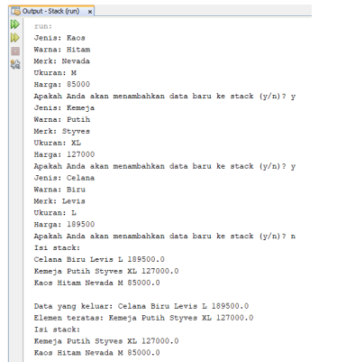

## JOBSHEET VII
## STACK

#### Nama : Mohammad Izamul Fikri Fahmi
#### Kelas : TI-1F
#### Absen : 17
#### NIM : 2141720171
<hr>

#### 7.1 Tujuan Praktikum
Setelah melakukan materi praktikum ini, mahasiswa mampu:
1. Mengenal struktur data Stack
2. Membuat dan mendeklarasikan struktur data Stack
3. Menerapkan algoritma Stack dengan menggunakan array

#### 7.2 Praktikum 1
**Waktu percobaan : 45 menit**

Pada percobaan ini, kita akan membuat program yang mengilustrasikan tumpukan pakaian yang
disimpan ke dalam stack. Karena sebuah pakaian mempunyai beberapa informasi, maka implementasi
Stack dilakukan dengan menggunakan array of object untuk mewakili setiap elemennya.

#### 7.2.1 Langkah-langkah Percobaan

1. Perhatikan Diagram Class Pakaian berikut ini:


Berdasarkan diagram class tersebut, akan dibuat program class Pakaian dalam Java.

2. Buat package dengan nama Praktikum1, kemudian buat class baru dengan nama Pakaian.

3. Tambahkan atribut-atribut Pakaian seperti pada Class Diagram Pakaian, kemudian tambahkan
pula konstruktornya seperti gambar berikut ini.


4. Setelah membuat class Pakaian, selanjutnya perlu dibuat class Stack yang berisi atribut dan
method sesuai diagram Class Stack berikut ini:


Keterangan: Tipe data pada variabell data menyesuaikan dengan data yang akan akan disimpan
di dalam Stack. Pada praktikum ini, data yang akan disimpan merupakan array of object dari
Pakaian, sehingga tipe data yang digunakan adalah Pakaian

5. Buat class baru dengan nama Stack. Kemudian tambahkan atribut dan konstruktor seperti
gambar berikut ini.


6. Buat method IsEmpty bertipe boolean yang digunakan untuk mengecek apakah stack kosong.


7. Buat method IsFull bertipe boolean yang digunakan untuk mengecek apakah stack sudah terisi
penuh.


8. Buat method push bertipe void untuk menambahkan isi elemen stack dengan parameter pkn
yang berupa object Pakaian


9. Buat method Pop bertipe void untuk mengeluarkan isi elemen stack. Karena satu elemen stack
terdiri dari beberapa informasi (jenis, warna, merk, ukuran, dan harga), maka ketika mencetak
data juga perlu ditampilkan semua informasi tersebut


10. Buat method peek bertipe void untuk memeriksa elemen stack pada posisi paling atas.


11. Buat method print bertipe void untuk menampilkan seluruh elemen pada stack.


12. Buat method clear bertipe void untuk menghapus seluruh isi stack.


13. Selanjutnya, buat class baru dengan nama StackMain. Buat fungsi main, kemudian lakukan
instansiasi objek dari class Stack dengan nama stk dan nilai parameternya adalah 5.


14. Deklarasikan Scanner dengan nama sc

15. Tambahkan kode berikut ini untuk menerima input data Pakaian, kemudian semua informasi
tersebut dimasukkan ke dalam stack


16. Lakukan pemanggilan method print, method pop, dan method peek dengan urutan sebagai
berikut.


17. Compile dan jalankan class StackMain, kemudian amati hasilnya.

##### hasil kodingan program di atas

Pakaian.java
```java
package Praktikum1;

public class Pakaian {
    String jenis, warna, merk, ukuran;
    double harga;

    Pakaian(String jenis, String warna, String merk, String ukuran, double harga){
        this.jenis = jenis;
        this.warna = warna;
        this.merk = merk;
        this.ukuran = ukuran;
        this.harga = harga;
    }
}
```
Stack.java
```java
package Praktikum1;

public class Stack {
    int size;
    int top;
    Pakaian data[];

    public Stack(int size){
        this.size = size;
        data = new Pakaian[size];
        top = -1;
    }

    public boolean IsEmpty(){
        if (top == -1) {
            return true;
        } else {
            return false;
        } 
    }

    public boolean IsFull() {
        if (top == size -1) {
            return true;
        } else {
            return false;
        }
    }

    public void push (Pakaian pkn) {
        if (!IsFull()) {
            top++;
            data[top] = pkn;
        } else {
            System.out.println("Isi stack penuh!");
        }
    }

    public void pop() {
        if (!IsEmpty()) {
            Pakaian x = data[top];
            top--;
            System.out.println("Data yang keluar: " + x.jenis + " " + x.warna + " " + x.merk + " " + x.ukuran + " " + x.harga);
        } else {
            System.out.println("Stack masih kosong");
        }
    }

    public void peek() {
        System.out.println("Elemen teratas: " + data[top].jenis + " " + data[top].warna + " " + data[top].merk + " " + data[top].merk + " " + data[top].ukuran + " " + data[top].harga);
    }

    public void print() {
        System.out.println("Isi stack: ");
        for (int i = top; i >= 0; i--) {
            System.out.println(data[i].jenis + " " + data[i].warna + " " + data[i].merk + " " + data[i].merk + " " + data[i].ukuran + " " + data[i].harga + " ");
        }
        System.out.println("");
    }

    public void Clear() {
        if(!IsEmpty()) {
            for (int i = top; i >= 0; i--) {
                top--;
            }
            System.out.println("Stack sudah dikosongkan");
        }else {
            System.out.println(" Stack masih kosong");
        }
    }
    
}
```

StackMain.java
```java
package Praktikum1;
import java.util.Scanner;

public class StackMain {
    public static void main(String[] args) {
        Stack stk = new Stack(5);
        Scanner sc = new Scanner(System.in);
    
        char pilih;
        do {
            System.out.print("Jenis: ");
            String jenis = sc.nextLine();
            System.out.print("Warna: ");
            String warna = sc.nextLine();
            System.out.print("Merk: ");
            String merk = sc.nextLine();
            System.out.print("Ukuran: ");
            String ukuran = sc.nextLine();
            System.out.print("Harga: ");
            double harga = sc.nextDouble();

            Pakaian p = new Pakaian(jenis, warna, merk, ukuran, harga);
            System.out.print("Apakah Anda akan menambahkan data baru ke stack (y/n)? ");
            pilih = sc.next().charAt(0);
            sc.nextLine();
            stk.push(p);
        } while (pilih == 'y');
        stk.print();
        stk.pop();
        stk.peek();
        stk.print();
    }
}
```

#### 7.2.2 Verifikasi Hasil Percobaan


##### hasil percobaan


Sudah sesuai

#### 7.2.3 Pertanyaan
1. Berapa banyak data pakaian yang dapat ditampung di dalam stack? Tunjukkan potongan kode
program untuk mendukung jawaban Anda tersebut!

Jawab :

Maksimal 5 data, ditunjukkan di StackMain.java dengan baris kode program berikut
```java
Stack stk = new Stack(5);
```

2. Perhatikan class StackMain, pada saat memanggil fungsi push, parameter yang dikirimkan adalah
p. Data apa yang tersimpan pada variabel p tersebut?


Jawab :

Adalah data objek dari class Pakaian.java , yang sebelumnya telah diinputkan nilai-nilai atributnya pada main, dan pada pembuatan objek disertai parameter yang akan memberikan nilai langsung pada kontrukstor di class Pakaian.java

3. Apakah fungsi penggunaan do-while yang terdapat pada class StackMain?

Jawab :

Di gunakan untuk melakukan perulangan untuk menginput atribut yang ada, dan akan terus melakukan perulangan selama while kondisi "y" dan akan berhenti jika tampungan sudah penuh atau ketika while tidak sama dengan "y".

4. Modifikasi kode program pada class StackMain sehingga pengguna dapat memilih operasioperasi pada stack (push, pop, peek, atau print) melalui pilihan menu program dengan
memanfaatkan kondisi IF-ELSE atau SWITCH-CASE!

Jawab :

Di sini saya menggunakan switch case perubahan pada StackMain
```java
package Praktikum1;
import java.util.Scanner;

public class StackMain1 {
    public static void main(String[] args) {
        Stack1 stk = new Stack1(5);
        Scanner sc = new Scanner(System.in);

        char opsi;
        char pilih;
        //perulangan memilih menu
        do {
            System.out.println("+---------------------------+");
            System.out.println("1. Melakukan push");
            System.out.println("2. Melakukan pop");
            System.out.println("3. Melakukan peek");
            System.out.println("4. Melakukan print");
            System.out.println("5. Keluar");
            System.out.print("Silahkan pilih opsi : ");
            opsi = sc.next().charAt(0);
            sc.nextLine();
            System.out.println("+---------------------------+");
            switch(opsi){
                case '1':
                do {
                System.out.println("Menu Push");
                System.out.println("________________");
                    System.out.print("Jenis: ");
                    String jenis = sc.nextLine();
                    System.out.print("Warna: ");
                    String warna = sc.nextLine();
                    System.out.print("Merk: ");
                    String merk = sc.nextLine();
                    System.out.print("Ukuran: ");
                    String ukuran = sc.nextLine();
                    System.out.print("Harga: ");
                    double harga = sc.nextDouble();
                    Pakaian1 p = new Pakaian1(jenis, warna, merk, ukuran, harga);
                    System.out.print("Apakah Anda akan menambahkan data baru ke stack (y/n)? ");
                    pilih = sc.next().charAt(0);
                    sc.nextLine();
                    stk.push(p);
                } while (pilih == 'y');
                break;
    
                case '2':
                System.out.println("________________");
                System.out.println("Menu Pop");
                System.out.println("________________");
                stk.pop();
                break;
    
                case '3':
                System.out.println("________________");
                System.out.println("Menu Peek");
                System.out.println("________________");
                stk.peek();
                break;
    
                case '4':
                System.out.println("________________");
                System.out.println("Menu Print");
                System.out.println("________________");
                stk.print();
                break;

                case '5':
                System.out.println("________________");
                System.out.println("Terimakasih sudah menggunakan program kami");
                break;

                default:
                System.out.println("________________");
                System.out.println("Inputan anda salah");
                System.out.println("________________");
                break;
            }

        } while (opsi!='5');
    }
}
```

Hasil Run


#### 7.3 Praktikum 2
**Waktu percobaan : 30 menit**

Pada percobaan ini, kita akan membuat program untuk melakukan konversi notasi infix menjadi
notasi postfix

#### 7.3.1 Langkah-langkah Percobaan
1. Perhatikan Diagram Class berikut ini:


Berdasarkan diagram class tersebut, akan dibuat program class Postfix dalam Java

2. Buat package dengan nama Praktikum2, kemudian buat class baru dengan nama Postfix.
Tambahkan atribut n, top, dan stack sesuai diagram class Postfix tersebut.

3. Tambahkan pula konstruktor berparameter seperti gambar berikut ini.


4. Buat method push dan pop bertipe void.


5. Buat method IsOperand dengan tipe boolean yang digunakan untuk mengecek apakah elemen
data berupa operand.


6. Buat method IsOperator dengan tipe boolean yang digunakan untuk mengecek apakah elemen
data berupa operator.


7. Buat method derajat yang mempunyai nilai kembalian integer untuk menentukan derajat
operator.


8. Buat method konversi untuk melakukan konversi notasi infix menjadi notasi postfix dengan cara
mengecek satu persatu elemen data pada String Q sebagai parameter masukan.


9. Selanjutnya, buat class baru dengan nama PostfixMain tetap pada package Praktikum2. Buat
class main, kemudian buat variabel P dan Q. Variabel P digunakan untuk menyimpan hasil akhir
notasi postfix setelah dikonversi, sedangkan variabel Q digunakan untuk menyimpan masukan
dari pengguna berupa ekspresi matematika dengan notasi infix. Deklarasikan variabel Scanner
dengan nama sc, kemudian panggil fungsi built-in trim yang digunakan untuk menghapus adanya
spasi di depan atau di belakang teks dari teks persamaan yang dimasukkan oleh pengguna.


Penambahan string “)” digunakan untuk memastikan semua simbol/karakter yang masih berada
di stack setelah semua persamaan terbaca, akan dikeluarkan dan dipindahkan ke postfix.

10. Buat variabel total untuk menghitung banyaknya karaketer pada variabel Q.


11. Lakukan instansiasi objek dengan nama post dan nilai parameternya adalah total. Kemudian
panggil method konversi untuk melakukan konversi notasi infix Q menjadi notasi postfix P.


12. Compile dan jalankan class PostfixMain dan amati hasilnya.

#### 7.3.2 Verifikasi Hasil Percobaan


Hasil Run


Sudah sesuai

#### 7.3.3 Pertanyaan
1. Perhatikan class Postfix, jelaskan alur kerja method derajat!

Jawab :

pada method derajat digunakan untuk mereturn nilai int yang mana memberikan nilai derajat atau integer lebih tinggi pada suatu operator matematika, untuk membedakan kekuatan diantara mereka, dengan menggunakan switch case.
jika ^ maka mereturn 3, jika %,*,/ maka mereturn 2, jika +,- maka mereturn 1. dan 0 jika tidak ada yang terpenuhi di case.

2. Apa fungsi kode program berikut?


Jawab :

Untuk memberikan nilai pada char c dengan mengambil data dari line Q character ke i.

3. Jalankan kembali program tersebut, masukkan ekspresi 3*5^(8-6)%3. Tampilkan hasilnya!

Jawab :


4. Pada soal nomor 3, mengapa tanda kurung tidak ditampilkan pada hasil konversi? Jelaskan!

Jawab :

Karena pada method konversi, tanda kurung akan dipop, sehingga tidak ditambahkan di String P, alhasil ketika print P, maka tanda kurung tidak tampak.


#### 7.4 Tugas
1. Perhatikan dan gunakan kembali kode program pada Praktikum 1. Tambahkan method getMin
pada class Stack yang digunakan untuk mencari dan menampilkan data pakaian dengan harga
terendah dari semua data pakaian yang tersimpan di dalam stack!

Jawab :

Disini saya melakukan perubahan di class yang sudah termodifikasi di pertanyaan praktikum sebelumnya

##### StackMain1.java
```java
package Praktikum1;
import java.util.Scanner;

public class StackMain1 {
    public static void main(String[] args) {
        Stack1 stk = new Stack1(5);
        Scanner sc = new Scanner(System.in);

        char opsi;
        char pilih;
        //perulangan memilih menu
        do {
            System.out.println("+---------------------------+");
            System.out.println("1. Melakukan push");
            System.out.println("2. Melakukan pop");
            System.out.println("3. Melakukan peek");
            System.out.println("4. Melakukan print");
            System.out.println("5. Mencari yang murah");
            System.out.println("6. Keluar");
            System.out.print("Silahkan pilih opsi : ");
            opsi = sc.next().charAt(0);
            sc.nextLine();
            System.out.println("+---------------------------+");
            switch(opsi){
                case '1':
                do {
                System.out.println("Menu Push");
                System.out.println("________________");
                    System.out.print("Jenis: ");
                    String jenis = sc.nextLine();
                    System.out.print("Warna: ");
                    String warna = sc.nextLine();
                    System.out.print("Merk: ");
                    String merk = sc.nextLine();
                    System.out.print("Ukuran: ");
                    String ukuran = sc.nextLine();
                    System.out.print("Harga: ");
                    double harga = sc.nextDouble();
                    Pakaian1 p = new Pakaian1(jenis, warna, merk, ukuran, harga);
                    System.out.print("Apakah Anda akan menambahkan data baru ke stack (y/n)? ");
                    pilih = sc.next().charAt(0);
                    sc.nextLine();
                    stk.push(p);
                } while (pilih == 'y');
                break;
    
                case '2':
                System.out.println("________________");
                System.out.println("Menu Pop");
                System.out.println("________________");
                stk.pop();
                break;
    
                case '3':
                System.out.println("________________");
                System.out.println("Menu Peek");
                System.out.println("________________");
                stk.peek();
                break;
    
                case '4':
                System.out.println("________________");
                System.out.println("Menu Print");
                System.out.println("________________");
                stk.print();
                break;

                case '5':
                System.out.println("________________");
                System.out.println("Harga Termurah adalah");
                stk.getMin();
                break;

                case '6':
                System.out.println("________________");
                System.out.println("Terimakasih sudah menggunakan program kami");
                break;

                default:
                System.out.println("________________");
                System.out.println("Inputan anda salah");
                System.out.println("________________");
                break;
            }

        } while (opsi!='6');
    }
}
```

##### Stack1.java
```java
package Praktikum1;

public class Stack1 {
    int size;
    int top;
    Pakaian1 data[];

    public Stack1(int size){
        this.size = size;
        data = new Pakaian1[size];
        top = -1;
    }

    public boolean IsEmpty(){
        if (top == -1) {
            return true;
        } else {
            return false;
        } 
    }

    public boolean IsFull() {
        if (top == size -1) {
            return true;
        } else {
            return false;
        }
    }

    public void push (Pakaian1 pkn) {
        if (!IsFull()) {
            top++;
            data[top] = pkn;
        } else {
            System.out.println("Isi stack penuh!");
        }
    }

    public void pop() {
        if (!IsEmpty()) {
            Pakaian1 x = data[top];
            top--;
            System.out.println("Data yang keluar: " + x.jenis + " " + x.warna + " " + x.merk + " " + x.ukuran + " " + x.harga);
        } else {
            System.out.println("Stack masih kosong");
        }
    }

    public void peek() {
        System.out.println("Elemen teratas: " + data[top].jenis + " " + data[top].warna + " " + data[top].merk + " " + data[top].merk + " " + data[top].ukuran + " " + data[top].harga);
    }

    public void print() {
        System.out.println("Isi stack: ");
        for (int i = top; i >= 0; i--) {
            System.out.println(data[i].jenis + " " + data[i].warna + " " + data[i].merk + " " + data[i].merk + " " + data[i].ukuran + " " + data[i].harga + " ");
        }
        System.out.println("");
    }

    public void Clear() {
        if(!IsEmpty()) {
            for (int i = top; i >= 0; i--) {
                top--;
            }
            System.out.println("Stack sudah dikosongkan");
        }else {
            System.out.println(" Stack masih kosong");
        }
    }
    
    public void getMin() {
        double min = data[0].harga;
        int posisi = 0;
        for (int i = top; i >= 0; i--) {
            if (data[i].harga < min){
                min = data[i].harga;
                posisi = i;
            }
        }
        System.out.println(data[posisi].jenis + " " + data[posisi].warna + " " + data[posisi].merk + " " + data[posisi].merk + " " + data[posisi].ukuran + " " + data[posisi].harga + " ");

    }
}
```

##### Hasil Run


2. Setiap hari Minggu, Dewi pergi berbelanja ke salah satu supermarket yang berada di area
rumahnya. Setiap kali selesai berbelanja, Dewi menyimpan struk belanjaannya di dalam laci.
Setelah dua bulan, ternyata Dewi sudah mempunyai delapan struk belanja. Dewi berencana
mengambil lima struk belanja untuk ditukarkan dengan voucher belanja.
Buat sebuah program stack untuk menyimpan data struk belanja Dewi, kemudian lakukan juga
proses pengambilan data struk belanja sesuai dengan jumlah struk yang akan ditukarkan dengan
voucher. Informasi yang tersimpan pada struk belanja terdiri dari:
    - Nomor transaksi
    - Tanggal pembelian
    - Jumlah barang yang dibeli
    - Total harga bayar
Tampilkan informasi struk belanja yang masih tersimpan di dalam stack!

Jawab :

##### Kode Program Struk.java
```java
package Tugas2;

public class Struk {
    
    int no_tx, jum;
    String tgl;
    double total_byr;

    Struk(int no_tx, int jum, String tgl, double total_bayar){
        this.no_tx = no_tx;
        this.jum = jum;
        this.tgl = tgl;
        this.total_byr = total_bayar;
    }
}
```
##### Kode Program Stack.java
```java
package Tugas2;

public class Stack {
    int size, top;
    Struk data[];

    public Stack(int size){
        this.size = size;
        data = new Struk[size];
        top = -1;
    }

    // mengecek kekosongan atau kepenuhan
    public boolean IsEmpty(){
        if (top == -1) {
            return true;
        } else {
            return false;
        } 
    }

    public boolean IsFull() {
        if (top == size -1) {
            return true;
        } else {
            return false;
        }
    }
    // end line mengecek kekosongan atau kepenuhan

    public void push (Struk sk) {
        if (!IsFull()) {
            top++;
            data[top] = sk;
        } else {
            System.out.println("Isi stack penuh!");
        }
    }

    public void pop() {
        if (!IsEmpty()) {
            Struk x = data[top];
            top--;
            System.out.println("Struk yang diambil : " + x.no_tx + " " + x.tgl + " " + x.jum + " " + x.total_byr);
        } else {
            System.out.println("Stack masih kosong");
        }
    }

    public void print() {
        System.out.println("Isi stack: ");

        System.out.println("--------------------------------------");
        for (int i = top; i >= 0; i--) {
        System.out.println("No Transaksi       : "+data[i].no_tx);
        System.out.println("Tanggal            : "+data[i].tgl);
        System.out.println("Jumlah Barang      : "+data[i].jum);
        System.out.println("Total Bayar        : "+data[i].total_byr);
        System.out.println("--------------------------------------");
        }
        System.out.println("");
    }

}
```
##### Kode Program StackMain.java
```java
package Tugas2;
import java.util.Scanner;

public class StackMain {
    
    public static void main(String[] args) {
        Scanner sc = new Scanner(System.in);

        Stack s = new Stack(8);

        System.out.println("+-----------------------+");
        System.out.println("| Masukkan 8 Data Struk |");
        System.out.println("+-----------------------+");
        for(int i=0; i<8; i++){
            System.out.print("No Transaksi         : ");
            int transaksi = sc.nextInt();
            sc.nextLine();
            System.out.print("Tanggal (Minggu-n)   : ");
            String tanggal = sc.nextLine();
            System.out.print("Jumlah Barang        : ");
            int barang = sc.nextInt();
            System.out.print("Total Harga          : ");
            int total = sc.nextInt();
            System.out.println("________________________");
           
            Struk sk = new Struk(transaksi, barang, tanggal, total);
            sc.nextLine();
            s.push(sk);
        }

        System.out.println("\n");
        System.out.println("+-----------------------+");
        System.out.println("| 5 Data Yang Di Ambil  |");
        System.out.println("+-----------------------+");

        // batasnya 5
        for(int j=0; j<5; j++){
            s.pop();
        }

        // menampilkan keseluruhan
        System.out.println("+-----------------------+");
        System.out.println("|  Data Yang Tersisa  |");
        System.out.println("+-----------------------+");

        s.print();
    }
}
```

##### Hasil Run
 <p>
 <p>
